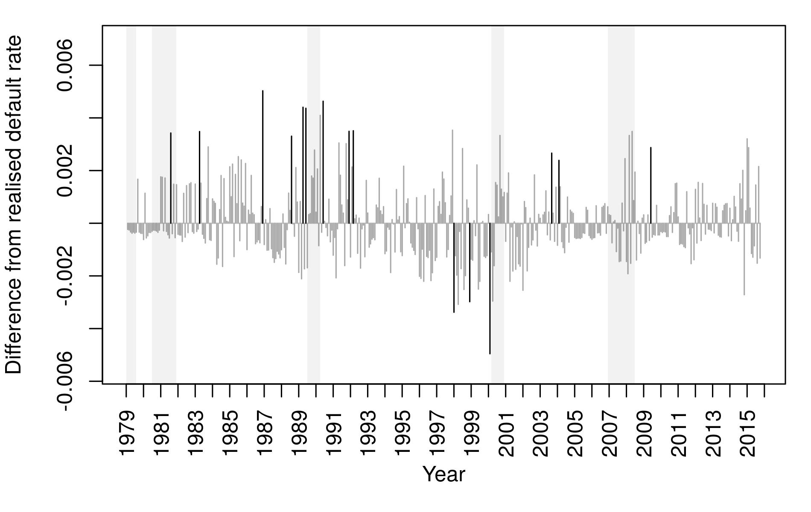
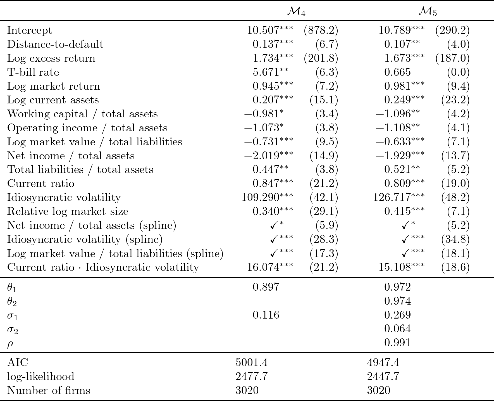
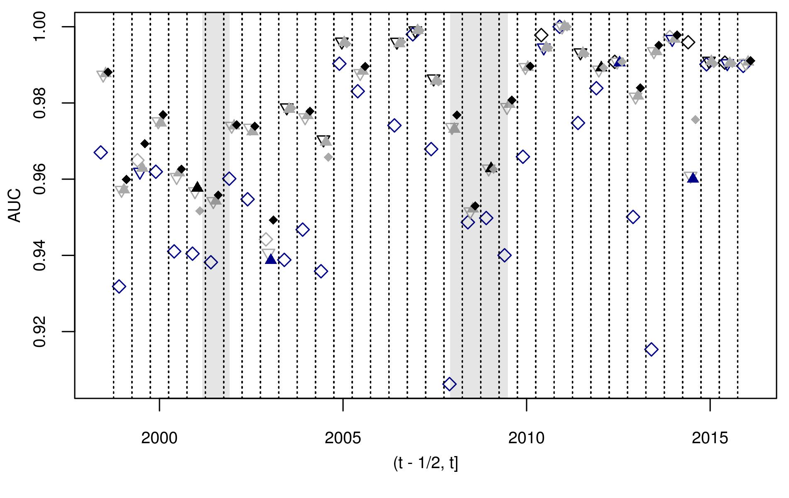

```{r setup, include=FALSE}
knitr::opts_chunk$set(echo = TRUE)
```

## dummy slide

<!--html_preserve-->
<script>
(function() {
  document.getElementById("dummy-slide").remove(); 
  
  var front_div = document.getElementsByTagName("section")[0];
  front_div.classList.add("front");
  front_div.classList.add("center");
  
  // add second header
  var second_head = document.createElement("p");
  var node = document.createTextNode("with multivariate latent factors");
  second_head.appendChild(node);
  second_head.style.lineHeight = "1.02em";
  front_div.appendChild(second_head);
  
  // add author 
  var credit_div = document.createElement('div');
  credit_div.innerHTML += "<div class='w-small'><p>Benjamin Christoffersen</p><p class='smallish'>KI, Department of Medical Epidemiology and Biostatistics, <a href='mailto:benjamin.christoffersen@ki.se'>benjamin.christoffersen@ki.se</a></p><p class='smallish'>KTH, Division of Robotics, Perception and Learning, <a href='mailto:benchr@kth.se'>benchr@kth.se</a></p><br><p>Rastin Matin</p><p class='smallish'>Danmarks Nationalbank</p></div>";
  credit_div.classList.add("authors");
  front_div.appendChild(credit_div);
})();
</script>
<!--end dummy slide-->

</section>

<section>
<section class="large-first center slide level2">
<h1>Motivation</h1>

<!--/html_preserve-->

<div style="display: none;">
$$
\definecolor{gray}{RGB}{192,192,192}
\def\vect#1{\boldsymbol #1}
\def\bigO#1{\mathcal{O}(#1)}
\def\Cond#1#2{\left(#1 \mid #2\right)}
\def\diff{{\mathop{}\!\mathrm{d}}}
$$
</div>

<!-- there is a end tag from the previous slide -->
<!-- </section> -->

## Motivation {data-transition="slide-in none"}

Want to model the loss distribution of <i>b</i> banks. 

## Motivation {data-transition="fade-in none"}

Want to model the loss distribution of <i>b</i> banks. 

<div>
Loss is given by

$$
L_{bt} = \sum_{i\in R_{bt}} E_{bit}G_{bit}Y_{it}
$$

$R_{bt}$: risk set, $E_{bit}\in (0,\infty)$: exposure, $G_{bit}\in[0,1]$: 
loss-given-default, and $Y_{it}\in\{0,1\}$: default indicator. 
</div>

## Motivation {data-transition="fade-in slide-out"}

Want to model the loss distribution of <i>b</i> banks. 

<div>
Loss is given by

$$
L_{bt} = \sum_{i\in R_{bt}} \color{gray}{E_{bit}G_{bit}}Y_{it}
$$

<span class="gray">$R_{bt}$: risk set, $E_{bit}\in (0,\infty)$: exposure, $G_{bit}\in[0,1]$: 
loss-given-default, and</span> $Y_{it}\in\{0,1\}$: default indicator. 
</div>

Focus on $Y_{it}$.

## First Idea
Assume conditional independence and e.g. let the default intensity be

$$\log\lambda_{it} = \vect\beta^\top \vect x_{it} + \vect\gamma^\top \vect z_t$$

<div class="fragment">
So the probability of default is

$$
\begin{multline*}
P(Y_{it}=1\mid Y_{i1}=\cdots=Y_{i,t-1}=0) = 1 - \exp\left(-\lambda_{it}\right)
\end{multline*}
$$

<p class="fragment">Poor choice for tail risk if invalid.</p>
</div>

<!--html_preserve-->
</section>
<section class="center-horiz">
<h2>Aggregate Fit</h2>

<!--/html_preserve-->


In-sample predicted less realized default rate. Black bars are outside 90 pct. 
confidence intervals.

## Add Frailty
@Duffie09 suggest to generalize to

$$
\begin{aligned}
\log\lambda_{it} &= \vect\beta^\top \vect x_{it} + \vect\gamma^\top \vect z_t + A_t \\
A_t &\sim \theta A_{t-1} + \epsilon_t \\ 
\epsilon_t&\sim N(0,\sigma^2)
\end{aligned}    
$$

The auto-regressive frailty, $A_k$, captures excess clustering.

## Remarks

<div class="w-small fragment">
Only time-varying intercept? 
<p class="smallish">Findings in @David13, @Filipe16, and @Jensen17 suggest not.
</p></div>

<div class="w-small fragment">
Only linear effects on the log hazard scale?
<p class="smallish">Findings in @Daniel07, @Christoffersen18, and the ML 
literature suggest not.</p>
</div>

## Generalize {data-transition="slide-in none"}

$$
\begin{aligned}
\log\lambda_{it} &= \vect\beta^{(1)\top}\vect x_{it}^{(1)} +  
    \vect\gamma^\top \vect z_t + 
    \vect\beta^{(2)\top} \vect f(\vect x_{it}^{(2)}) + 
    \vect A_t^\top\vect u_{it} \\
\vect A_t &\sim F\vect A_{t-1} + \vect \epsilon_t \\ 
\vect \epsilon_t&\sim \vect N(\vect 0, Q) \\
\vect x_{it} &= 
     \left(\vect x_{it}^{(1)\top}, \vect x_{it}^{(2)\top}\right)^\top
\end{aligned}    
$$

$\vect A_t \in \mathbb{R}^p$ is low dimensional and some elements in $\vect u_{it}$ and 
$\vect x_{it}$ may match.

## Generalize {data-transition="fade-in slide-out"}

$$
\begin{aligned}
\log\lambda_{it} &= \color{gray}{\vect\beta^{(1)\top}\vect x_{it}^{(1)} +  
    \vect\gamma^\top \vect z_t} + 
    \vect\beta^{(2)\top} \vect f(\vect x_{it}^{(2)}) + 
    \vect A_t^\top\vect u_{it} \\
\color{gray}{\vect A_t} &\sim F \color{gray}{\vect A_{t-1} + \vect \epsilon_t} \\ 
\color{gray}{\vect \epsilon_t}
    &\color{gray}\sim \color{gray}{\vect N(\vect 0, }Q\color{gray}) \\
\color{gray}{\vect x_{it}} & \color{gray}= \color{gray}{ 
    \left(\vect x_{it}^{(1)\top}, \vect x_{it}^{(2)\top}\right)^\top}
\end{aligned}    
$$

<p class="gray">$\vect A_t \in \mathbb{R}^p$ is low dimensional and some elements in $\vect u_{it}$ and 
$\vect x_{it}$ may match.</p>

<!--html_preserve-->
</section>
<!-- need extra end tag before next section -->
</section>


<section>
<section class = "center">
<h1>Talk Overview</h1>

<div class="w-small">
Estimation method
<p class="smallish">Brief description of the <code>dynamichazard</code> and <code>mssm</code> package.
</p></div>

<div class="w-small fragment">
Analysis and results
</div>
</section>
</section>


<section>
<section class="large-first center">
<h1>Estimation Method</h1>

<!-- there is a end tag from the previous slide -->
<!-- </section> -->
<!--/html_preserve-->

## Marginal Likelihood

$$
\begin{aligned}
L &= \int_{\mathbb R^{pd}} \mu_0(\vect A_1)g_1\Cond{\vect y_1}{\vect A_1} \\
&\hspace{30pt}\cdot\prod_{t=2}^d g_t\Cond{\vect y_t}{\vect A_t}
    f\Cond{\vect A_t}{\vect A_{t-1}}\mathrm{d}A_{1:d} \\
\vect y_t &= \{y_{it}\}_{i\in \mathcal{O}_t}
\end{aligned}
$$

$\mathcal{O}_t$ is the risk set and $g_t$ is a conditional density.

## Monte Carlo Method
Use Monte Carlo expectation maximization (EM). 

<p class="fragment">
Approximate E-step with a particle smoother.</p>

<p class="fragment">
Get arbitrary precision.</p>

## Particle Smoother
Implemented the generalized two-filter smoother suggested
by @Briers09. 

<div class="w-small fragment">
Method is $\bigO{N^2}$
<p class="smallish">where $N$ is the number of particles. 
Not a problem for $N<2000$. Can be reduced to an average case 
$\bigO{N\log N}$ with a dual k-d tree approximation the `mssm` package.</p>
</div>

<div class="w-small fragment">
Implemented the particle smoother suggested by @Fearnhead10.
<p class="smallish">$\bigO{N}$ with some extra overhead per 
particle.</p>
</div>

## Features 

<div class="w-small">
Few options for conditional model given state variables. 
<p class="smallish">
Discrete time models with logit and cloglog link function and log link
in continuous time.
</p></div>

<div class="w-small fragment">
Implemented approximate gradient and observed information matrix. 
<p class="smallish">
Both method suggested by @Poyiadjis11 and method mentioned in @Cappe05.
The  the `mssm` package has a dual k-d tree approximation for these methods.
</p></div>

<p class="fragment">
Implemented in C++ and supports computation in parallel.</p>

## More Software

`rollRegres` package: fast rolling regression. 

`DtD` package: fast estimation of the Merton model.

<!--html_preserve-->
</section>
<!-- need extra end tag before next section -->
</section>


<section>
<section class="large-first center">
<h1>Analysis and Results</h1>

<!-- there is a end tag from the previous slide -->
<!-- </section> -->
<!--/html_preserve-->

## Summary

Add covariates, non-linear effects, and a random slope 
to model in @Duffie07 and @Duffie09.

<div class="w-small fragment">
Find less evidence of time-varying intercept.
<p class="smallish">
As shown by @Lando10.
</p></div>

<p class="fragment">Provide evidence of time-varying size slope.</p>

<p class="fragment">Show improved firm-level performance and industry-level
performance.</p>

## Data Source
From? 

Like? 

## Additions

* Working capital to size.
* Operating income / size.
* Market value / total liabilities.
* Net income / size.
* Total liabilities / size.
* Current ratio.
* Log relative market size.
* Idiosyncratic volatility.

<div class="w-small">
<p>All have been used previously. </p>
<p class="smallish">E.g., see @Shumway01 and @Chava04. Size is defined as 50 
pct. total assets and 50 pct. market value.</p>
</div>

<!--html_preserve-->
</section>
<section class="center-horiz" data-transition="slide-in fade-out">
<h2>Estimates without Random Effects</h2>

<!--/html_preserve-->

<p class="smallish" style="text-align: left;">The figures in the parentheses are Wald $\chi^2$ 
statistics. $\mathcal{M_1}$: model similar to @Duffie07, 
$\mathcal{M_2}$: model with additional variables, and 
$\mathcal{M_3}$: model with non-linear effects and an interaction.</p>

<!--html_preserve-->
</section>
<section class="center-horiz slide level2" data-transition="fade-in slide-out">
<h2>Estimates without Random Effects</h2>

<!--/html_preserve-->

<div class="w-small" style="text-align: left;">
<p>Large difference in log-likelihood.</p>
<p class="smallish">Similar to evidence by @Lando10 and @Bharath08.</p>

## Splines

## Adding Time-Varying Coefficient {data-transition="slide-in fade-out"}

$$\begin{aligned}
\vec z_{it} &= (\vec x_{it}^\top, \vec m_t^\top, u_{it}, \alpha_t, b_t)^\top \\
g(P(Y_{it} = 1 \mid \vec z_{it})) &= 
  \vec \beta^\top\vec f(\vec x_{it}) + \vec\gamma^\top\vec m_t + \alpha_t + b_tu_{it} \\
  \begin{pmatrix}\alpha_t \\ b_t \end{pmatrix} &= 
    \begin{pmatrix}\theta_1 & 0 \\ 0 & \theta_2 \end{pmatrix} 
    \begin{pmatrix}\alpha_{t-1} \\ b_{t-1} \end{pmatrix} + \vec\epsilon_t \\ 
  \vec\epsilon_t & \sim N\left(\vec 0, \begin{pmatrix}
    \sigma_1^2 & \rho\sigma_1\sigma_2 \\
    \rho\sigma_1\sigma_2 & \sigma_2^2
  \end{pmatrix}\right)
\end{aligned}$$

## Adding Time-Varying Coefficient {data-transition="fade-in slide-out"}

$$\begin{aligned}
\color{gray}{\vec z_{it}} &
  \color{gray}= \color{gray}{(\vec x_{it}^\top, \vec m_t^\top, u_{it}, \alpha_t, b_t)^\top} \\
\color{gray}{g(P(Y_{it} = 1 \mid \vec z_{it}))} & \color{gray}= 
  \color{gray}{\vec \beta^\top\vec f(\vec x_{it}) + \vec\gamma^\top\vec m_t} + \alpha_t + b_tu_{it} \\
  \begin{pmatrix}\alpha_t \\ b_t \end{pmatrix} &= 
    \begin{pmatrix}\theta_1 & 0 \\ 0 & \theta_2 \end{pmatrix} 
    \begin{pmatrix}\alpha_{t-1} \\ b_{t-1} \end{pmatrix} + \vec\epsilon_t \\ 
  \vec\epsilon_t & \sim N\left(\vec 0, \begin{pmatrix}
    \sigma_1^2 & \rho\sigma_1\sigma_2 \\
    \rho\sigma_1\sigma_2 & \sigma_2^2
  \end{pmatrix}\right)
\end{aligned}$$

<!--html_preserve-->
</section>
<section class="center-horiz" data-transition="slide-in fade-out">
<h2>Estimates with Random Effects</h2>

<div style="display: flex; max-height = 50vh;">
<div style="flex: 66%;">
<!--/html_preserve-->

<!--html_preserve-->
</div>
<div style="flex: 34%;">
<!--/html_preserve-->
<p class="smallish" style="text-align: left;">The figures in the parentheses are Wald $\chi^2$ 
statistics. $\mathcal{M_4}$: model with non-linear effects, an interaction, 
and a random intercept and $\mathcal{M_5}$: same as $\mathcal{M_4}$ with a 
random relative market size slope.</p>

<!--html_preserve-->
</div></div>

</section>
<section class="center-horiz"  data-transition="fade-in fade-out">
<h2>Estimates with Random Effects</h2>

<div style="display: flex; max-height = 50vh;">
<div style="flex: 66%;">
<!--/html_preserve-->

<!--html_preserve-->
</div>
<div style="flex: 34%;">
<!--/html_preserve-->
<p class="smallish" style="text-align: left;">The figures in the parentheses are Wald $\chi^2$ 
statistics. $\mathcal{M_4}$: model with non-linear effects, an interaction, 
and a random intercept and $\mathcal{M_5}$: same as $\mathcal{M_4}$ with a 
random relative market size slope.</p>

<!--html_preserve-->
</div></div>

</section>
<section class="center-horiz"  data-transition="fade-in slide-out">
<h2>Estimates with Random Effects</h2>

<div style="display: flex; max-height = 50vh;">
<div style="flex: 66%;">
<!--/html_preserve-->

<!--html_preserve-->
</div>
<div style="flex: 34%;">
<!--/html_preserve-->
<p class="smallish" style="text-align: left;">The figures in the parentheses are Wald $\chi^2$ 
statistics. $\mathcal{M_4}$: model with non-linear effects, an interaction, 
and a random intercept and $\mathcal{M_5}$: same as $\mathcal{M_4}$ with a 
random relative market size slope.</p>

<!--html_preserve-->
</div></div>

</section>
<section class="center-horiz">
<h2>Smoothed Predicted Random Effect</h2>
<!--/html_preserve-->


Log market size is as in @Shumway01. This is just the zero-mean random 
effect $b_t$.

<!--html_preserve-->
</section>
<section class="center-horiz" data-transition="slide-in none">
<h2>Out-of-Sample AUCs</h2>
<!--/html_preserve-->



<p class="smallish">
Blue: lowest, black: highest. 
◇: model as in @Duffie07, 
▽: + covariates and non-linear effects, 
▲: + random intercept, and
◆: + random size slope.
</p>

<!--html_preserve-->
</section>
<section class="center-horiz" data-transition="fade-in slide-out">
<h2>Out-of-Sample AUCs</h2>
<!--/html_preserve-->


<p class="smallish">
Blue: lowest, black: highest. 
◇: model as in @Duffie07, 
▽: + covariates and non-linear effects, 
▲: + random intercept, and
◆: + random size slope.
</p>

<!--html_preserve-->
</section>
<section class="center-horiz" data-transition="slide-in none">
<h2>Out-of-Sample Industry Default Rate</h2>
<!--/html_preserve-->


<p class="smallish">
Bars: 90% prediction interval, ○:  realized rate, other points: median,
◇: model as in @Duffie07, 
▽: + covariates and non-linear effects, 
▲: + random intercept, and
◆: + random size slope.
</p>

<!--html_preserve-->
</section>
<section class="center-horiz" data-transition="fade-in slide-out">
<h2>Out-of-Sample Industry Default Rate</h2>
<!--/html_preserve-->


<p class="smallish">
Bars: 90% prediction interval, ○:  realized rate, other points: median.
◇: model as in @Duffie07, 
▽: + covariates and non-linear effects, 
▲: + random intercept, and
◆: + random size slope.
</p>

<!--html_preserve-->
</section>
<!-- need extra end tag before next section -->
</section>


<section>
<section class="large-first center">
<h1>Summary</h1>
<!--/html_preserve-->

## Summary 
Argued for random effects and non-linear effects. 

<div class="w-small fragment">
Gave rough overview of `dynamichazard` and `mssm` package.
<p class="smallish">
More details are available in the packages' vignettes or `README` and in 
my PhD thesis.
</p></div>

<div class="w-small fragment">
Gave an example of a corporate default model with multivariate latent 
factors
<p class="smallish">
and provided evidence of non-linear associations.
</p></div>

<!--html_preserve-->
</section>
<!-- need extra end tag before next section -->
</section>


<section>
<section class="center final">
<h1>Thank You!</h1>

<div class="w-small">
<p class="smallish">Paper is at  
<a href="https://ssrn.com/abstract=3339981">ssrn.com/abstract=3339981</a>.</p>
<p class="smallish">Slides are at  
<a href="http://rpubs.com/boennecd/CFE-19">rpubs.com/boennecd/CFE-19</a>.</p>
<p class="smallish">Markdown is at  
<a href="https://github.com/boennecd/Talks">github.com/boennecd/Talks</a>.</p>
<p class="smallish">More examples at  
<a href="https://github.com/boennecd/dynamichazard/tree/master/examples">
github.com/boennecd/dynamichazard/tree/master/examples</a>.</p>
<p class="smallish">References on next slide.</p>
</div>

<!-- there is a end tag from the previous slide -->
<!-- </section> -->
<!--/html_preserve-->

<!--html_preserve-->
</section>
<!-- need extra end tag before next section -->
</section>


<section>
<h1>References</h1>

<!--/html_preserve-->
