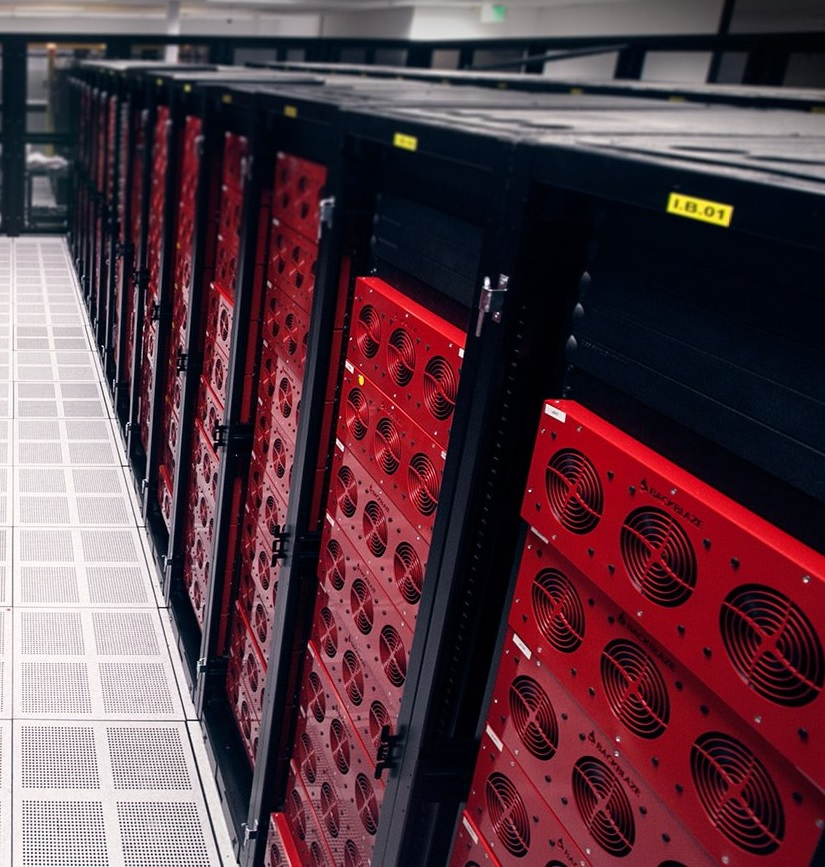
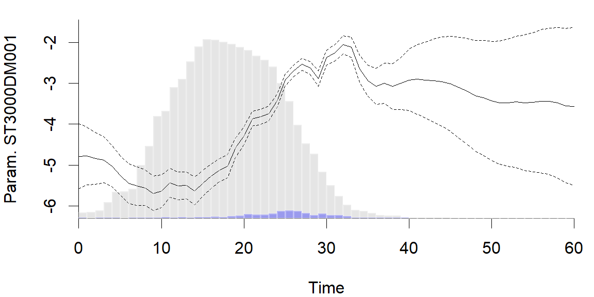

dynamichazard Dynamic Hazard Models using State Space Models
========================================================
author: Benjamin Christoffersen
date: 28/07/2017
css: custom.css
autosize: false
width:1200
height:800

<!-- Two line header + add affiliation -->
<script>
var h1s = document.getElementsByTagName("h1");
h1s[0].outerHTML = "<h1 style='margin-bottom: 0;'>dynamichazard</h1><h2 style='margin-top: 0;'>Dynamic Hazard Models <br /> using State Space Models</h2>";

// IE11 does not support xpath
//var ptag = document.evaluate("//p[contains(text(),'Benjamin Christoffersen')]", 
//  document, null, XPathResult.FIRST_ORDERED_NODE_TYPE, null).singleNodeValue;
var ptag = document.getElementsByTagName("p")[0];
ptag.innerHTML = ptag.innerHTML.replace(
  "Christoffersen",
  "Christoffersen<br/>Copenhagen Business School<br/>Center for Statistics");
</script>  

<!-- See this link for macros with mathjax: http://docs.mathjax.org/en/latest/tex.html#tex-macros -->
<script>
MathJax.Hub.Config({
  // See http://docs.mathjax.org/en/latest/configuration.html and http://docs.mathjax.org/en/latest/output.html

  jax: ["input/TeX","output/SVG"],
  
  // See https://stackoverflow.com/a/25329062/5861244
  "HTML-CSS": { scale: 80 },

  TeX: {
    Macros: {
      mat: ["\\mathbf{#1}", 1],
      
      Lparen: ["\\left( #1\\right)", 1],
      Lbrace: ["\\left\\{ #1\\right\\}", 1],
      
      Cond: ["\\left. #1 \\vphantom{#2} \\right\\vert #2", 2],
      
      emNotee: ["#1_{\\left. #2 \\right\\vert #3}", 3],
      
      Prob: ["\\text{P}"],
      propp: ["\\Prob\\Lparen{#1}", 1],
      proppCond: ["\\propp{\\Cond{#1}{#2}}", 2],
      
      E: ["\\text{E}"],
      expecp: ["\\E\\Lparen{#1}", 1],
      expecpCond: ["\\expecp{\\Cond{#1}{#2}}", 2],
      
      deter: ["\\left| #1 \\right|", 1],
      
      argminu: ["\\underset{#1}{\\text{argmin}}\\:", 1]
    }
  }
});
</script>


Presentation
========================================================
incremental: true

* Model
* Hard disk failures
* Estimation methods
* End comments

Presentation: Focus
========================================================
incremental: true

Survival analysis with time-varying coefficients

Continuous time model

Fast and scalable


Model
========================================================
incremental: true

Individual $i = 1,\dots,n$

Failure times $T_1,\dots,T_n\in \mathbb{R}_+$

Timer intervals $t = 1, \dots, d$

Binary outcomes $y_{it} = \left\{ \begin{matrix} 1 & T_i \in (t-1, t] \\ 0 & \text{otherwise} \end{matrix}\right.$

Censoring indicators $D_{i1},\dots,D_{i2},\dots$ <small class="inline"> (one if censored)</small>

Covariates $\vec{x}_{i1}, \vec{x}_{i2}, \dots$

Model
========================================================

<div class="fragment">
<h2>Observational model</h2>

$$
\begin{array}{c}
\proppCond{Y_{it} = 1}{ \vec{\alpha}_t} =  h(\vec{\alpha}_t^\top \vec{x}_{it}) \\
h(\eta) = 1 / (1 + \exp(-\eta))
\end{array}
$$
</div>

<div class="fragment">
## State model

$$\begin{array}{ll}
  \vec{\alpha}_{t + 1} = \mat{F}\vec{\alpha}_t + \mat{R}\vec{\eta}_t \qquad &
  \vec{\eta}_t \sim N(\vec{0}, \mat{Q}) \\
  & \vec{\alpha}_{0} \sim N(\vec{a}_0, \mat{Q}_0)
\end{array} , \qquad t = 1,\dots, d$$

1. and 2. order random walk
<div>

Hard disk failures
========================================================
left: 50%


<p class="fragment">Storage provider</p>

<p class="fragment">More than 65000 hard disks Today</p>

<p class="fragment">3 years of data <small class="inline">(2013Q2‒2016Q3)</small></p>

<p class="fragment">84366 observations and 623268 data rows</p>


***


Hard disk failures
========================================================


```r
hd_dat[
  1:10, c("serial_number", "model", "tstart", 
          "tstop", "fails", "smart_12")]
```

```
    serial_number        model tstart tstop fails smart_12
505      5XW004AJ ST31500541AS   30.0  40.0     0        0
506      5XW004AJ ST31500541AS   40.0  43.2     0       24
507      5XW004AJ ST31500541AS   43.2  56.9     0       25
508      5XW004Q0 ST31500541AS   40.6  51.0     0        0
509      5XW004Q0 ST31500541AS   51.0  53.7     0       54
510      5XW004Q0 ST31500541AS   53.7  54.1     0       56
511      5XW004Q0 ST31500541AS   54.1  54.4     0       57
512      5XW004Q0 ST31500541AS   54.4  54.5     0       58
513      5XW004Q0 ST31500541AS   54.5  54.7     0       59
514      5XW004Q0 ST31500541AS   54.7  57.2     0       61
```

Hard disk failures
========================================================


<!-- html table generated in R 3.4.1 by xtable 1.8-2 package -->
<!-- Fri Jul 21 14:45:37 2017 -->
<table border=1>
<tr> <th>  </th> <th> Number of hard disks </th> <th> Number of failures </th>  </tr>
  <tr> <td align="right"> ST4000DM000 </td> <td align="right"> 36286 </td> <td align="right"> 1556 </td> </tr>
  <tr> <td align="right"> HMS5C4040BLE640 </td> <td align="right"> 9333 </td> <td align="right">  40 </td> </tr>
  <tr> <td align="right"> HMS5C4040ALE640 </td> <td align="right"> 7162 </td> <td align="right">  93 </td> </tr>
  <tr> <td align="right"> ST8000DM002 </td> <td align="right"> 5155 </td> <td align="right">  17 </td> </tr>
  <tr> <td align="right"> HDS722020ALA330 </td> <td align="right"> 4774 </td> <td align="right"> 230 </td> </tr>
  <tr> <td align="right"> ST3000DM001 </td> <td align="right"> 4698 </td> <td align="right"> 1701 </td> </tr>
   </table>

<small>Top 6 hard disk versions by number of disks</small>


Estimation methods: Log likelihood
========================================================
$$
L(\mat{Q},\mat{Q}_0, \vec{a}_0)
	= p(\vec{\alpha}_0)\prod_{t = 1}^d \proppCond{\vec{\alpha}_t}{\vec{\alpha}_{t-1}}
		\prod_{i \in R_t} \proppCond{y_{it}}{\vec{\alpha}_t}
$$
 
Risk set $R_t = \Lbrace{i \in \{1,\dots,n\}: D_{it} = 0}$


Estimation methods: Log likelihood
========================================================

$$
\begin{aligned}
	\log L \Lparen{\mat{Q},\mat{Q}_0, \vec{a}_0}
		= & - \frac{1}{2} \Lparen{\vec{\alpha}_0 - \vec{a}_0}^\top \mat{Q}^{-1}_0\Lparen{\vec{\alpha}_0 - \vec{a}_0} \\
	&  - \frac{1}{2} \sum_{t = 1}^d \Lparen{\vec{\alpha}_t - \mat{F}\vec{\alpha}_{t - 1}}^\top\mat{R}^\top\mat{Q}^{-1}\mat{R}\Lparen{\vec{\alpha}_t - \mat{F}\vec{\alpha}_{t - 1}} \\
	&  - \frac{1}{2} \log \deter{\mat{Q}_0} - \frac{1}{2d} \log \deter{\mat{Q}} \\
	&  + \sum_{t = 1}^d \sum_{i \in R_t} l_{it}({\vec{\alpha}_t}) + \dots
\end{aligned}
$$

Estimation methods: Log likelihood
========================================================

<div class="fragment">
<h2>E-step</h2>
Find smoothed estimates of $\vec{\alpha}_0,\dots, \vec{\alpha}_d$ and smoothed covariance matrices given $\mat{Q}$, $\mat{Q}_0$ and $\vec{a}_0$
</div>

<div class="fragment">
<h2>M-step</h2>

Update $\mat{Q}$ and $\vec{a}_0$
</div>

<div class="fragment">
<h2>References</h2>
<small>Due to Fahrmeir (1992) and Fahrmeir (1994). Like Shumway and Stoffer (1982) </small>
</div>

Estimation methods: E-step
========================================================

<div class="fragment">
<h2>Filtering</h2>

<ul>
<li>Extended Kalman Filter (EKF)</li>
<li>Unscented Kalman filter</li>
<li>Sequential approximation of posterior modes</li>
<li>Mode estimation</li>
</ul>

</div>

<div class="fragment">

<h2>Smoothing</h2>
Rauch-Tung-Striebel algorithm

</div>

Estimation methods: Kalman Filter (KF)
========================================================

<div class="fragment">
$$
\emNotee{\vec{a}}{t}{s} = \expecpCond{\vec{\alpha}_t}{\vec{y}_1,\dots,\vec{y}_s},  \qquad
    \emNotee{\mat{V}}{t}{s} = \expecpCond{\mat{V}_t}{\vec{y}_1,\dots,\vec{y}_s}
$$
</div>

<div class="fragment">
<h2>Prediction step</h2>
Compute $\emNotee{\vec{a}}{t}{t - 1}$ &  $\emNotee{\mat{V}}{t}{t - 1}$ with $\emNotee{\vec{a}}{t - 1}{t - 1}$ and $\emNotee{\mat{V}}{t - 1}{t - 1}$
</div>

<div class="fragment">
<h2>Correction step</h2>
Compute $\emNotee{\vec{a}}{t}{t}$ &  $\emNotee{\mat{V}}{t}{t}$ with $\emNotee{\vec{a}}{t}{t-1}$,  $\emNotee{\mat{V}}{t}{t - 1}$ and $\vec{y}_t$
</div>

Estimation methods: Extended Kalman Filter
========================================================
incremental: true

Same prediction step as KF

Make 1. order Taylor expansion around $\emNotee{\vec{a}}{t}{t - 1}$

Same as one Fisher scoring step in:

$$
\begin{array}{c}
\emNotee{\vec{a}}{t}{t} = \argminu{\vec{\alpha}}
  - \log \proppCond{\vec{\alpha}}{\emNotee{\vec{a}}{t}{t-1}, \emNotee{\mat{V}}{t}{t-1}}
    -\sum_{i \in R_t} \log\proppCond{y_{it}}{\vec{\alpha}} \\
%
\vec{\alpha} \sim N\Lparen{\emNotee{\vec{a}}{t}{t-1}, \emNotee{\mat{V}}{t}{t-1}}
\end{array}
$$

Essentially L2 penalized generalized linear models

Estimation methods: mode approximation
========================================================
incremental: true

*Mode approximation:* Minimize directly using Newton Raphson 

*EKF with extra iteration:* More iterations using working responses as `glm`

Example: Only factors
========================================================


```r
library(dynamichazard)

frm <- Surv(tstart, tstop, fails) ~ -1 + model

system.time(
  ddfit <- ddhazard(
    formula = frm, data = hd_dat,
    id = hd_dat$serial_number,
    Q_0 = diag(1, 17), Q = diag(.01, 17),
    by = 1, max_T = 60,
    control = list(
      method = "EKF",
      eps = .005,
      NR_eps = .00001)))
```

```
   user  system elapsed 
   17.0     1.2    10.9 
```


Example: Only factors
========================================================


Example: Only factors
========================================================



<small>See this <a href='https://www.backblaze.com/blog/3tb-hard-drive-failure/'>blog post</a> for explanation</small>

<!--
Background: 
Beginning in January 2012, Backblaze deployed 4,829 Seagate 3TB hard drives, model ST3000DM001, into Backblaze Storage Pods. In our experience, 80% of the hard drives we deploy will function at least 4 years. As of March 31, 2015, just 10% of the Seagate 3TB drives deployed in 2012 are still in service. This is the story of the 4,345 Seagate 3TB drives that are no longer in service. [Remeber data we have starts April 2013 and ends Q3 2016]

[Deployed over ~2 years See figure in the post]

...

As of March 31, 2015, 1,423 of the 4,829 deployed Seagate 3TB drives had failed, that’s 29.5% of the drives.

...

[On failure in service they start to test the others drivers if an error happen doing rebuilidng. These is not in the statistics!]

Let’s take a minute to describe what happens when a drive in a Storage Pod fails. When a drive fails, no data is compromised since we distribute data redundantly across multiple drives. Simply, the bad drive is replaced and the system is tested and rebuilt. During the entire process, the data is safe and available for file recovery as needed.

If during the rebuilding process, a second drives fails, the data is migrated to another Storage Pod where it is safe and available, and the Storage Pod with the second failed drive is taken off-line. Once off-line, technicians go through a series of steps to assess the health of the system.

One of the health assessment steps can be to remove all the drives from the Storage Pod for testing. There are two different tests. The first test is similar to “advanced” reformatting and takes about 20 minutes. The second basically writes and reads all the sectors on the drive and takes several hours. Only if a drives passes both tests can it be reformatted and reused.

...

The failure count continued to rise and in the Spring of 2014 we had decided that if a Storage Pod with Seagate 3TB drives showed any type of drive failure we would 1) immediately migrate all the data and then 2) remove and test all the drives in the Storage Pod.

In July alone, 189 hard drives failed and another 273 were removed from service. The total, 462, was 11.4% of the Seagate 3TB drives operational on July 1st, 2014.

To be clear, a drive is marked “Failed” because it failed in operation or during a rebuilding process. Drives marked “Removed” are those that were removed from a Storage Pod that contained failed drives. When the “Removed” drives were tested nearly 75% of them failed one of the two tests done after removal. It could be argued that 25% of the “Removed” drives were still good, even though they were assigned to the removed category, but these drives were never reinstalled.

...

As a reminder, about 75% of the “Removed” drives failed one of the bench tests once they were removed from a Storage Pod.
-->

Example: Slope
========================================================


Example: Slope
========================================================


```r
frm <- Surv(tstart, tstop, fails) ~ -1 + model + smart_12 : model_large
```

Example: Slope
========================================================


Example: Slope
========================================================
incremental: true

* First failure: Replace and *rebuilt*
* Extra test if another fails doing rebuilt
* Removal due to extra tests are not recorded!

Example: Slope
========================================================


Example: Slope
========================================================


Other options
========================================================
incremental: true

* S3 methods for plots, residuals, predict etc. 
* Second order random walk
* Bootstrap
* Fixed effects
* Continuous time observational model

<small>Slides at <a href="https://rpubs.com/boennecd/EMS17">rpubs.com/boennecd/EMS17</a> and code at <a href="https://github.com/boennecd/Talks">github/boennecd/Talks</a></small>

Demo
========================================================


```r
dynamichazard::ddhazard_app()
```


References
========================================================
<small><div class="references">
[1] L. Fahrmeir. "Dynamic Modelling and Penalized
Likelihood Estimation for Discrete Time Survival
Data". In: _Biometrika_ 81.2 (1994), pp. 317-330.

[2] L. Fahrmeir. "Posterior Mode Estimation by
Extended Kalman Filtering for Multivariate Dynamic
Generalized Linear Models". In: _Journal of the
American Statistical Association_ 87.418 (1992), pp.
501-509.

[3] R. H. Shumway and D. S. Stoffer. "An Approach to
Time Series Smoothing and Forecasting Using the Em
Algorithm". In: _Journal of Time Series Analysis_ 3.4
(1982), pp. 253-264. ISSN: 1467-9892. DOI:
10.1111/j.1467-9892.1982.tb00349.x. <URL:
http://dx.doi.org/10.1111/j.1467-9892.1982.tb00349.x>.
</div></small>
