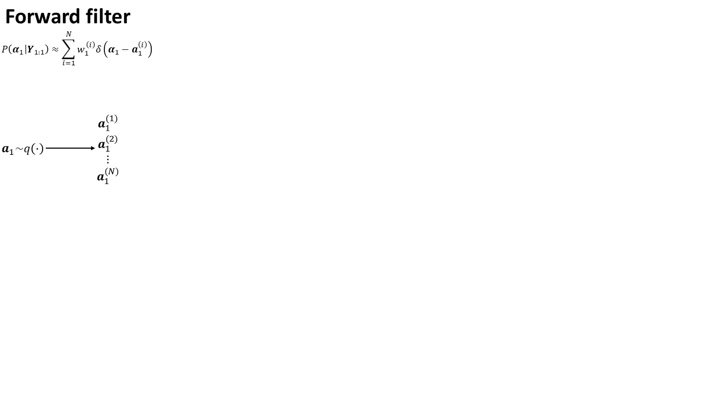
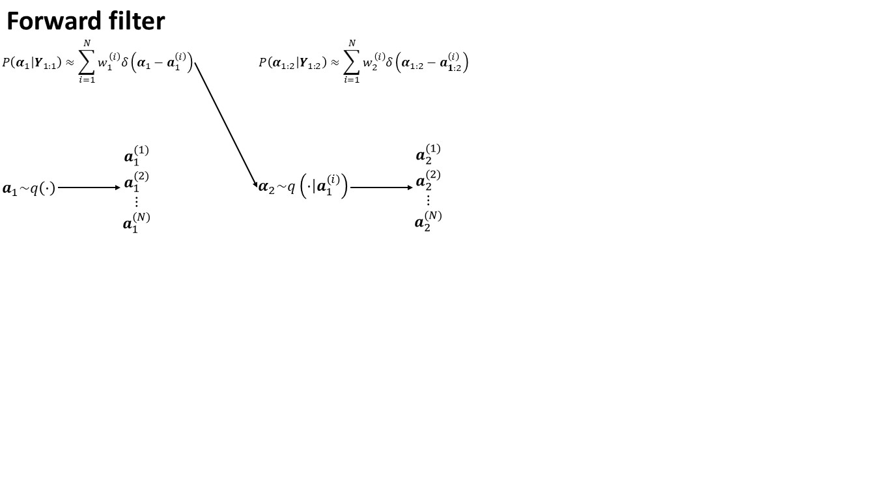
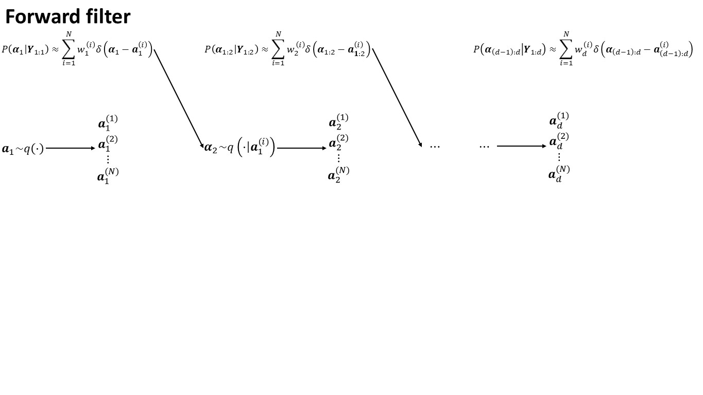
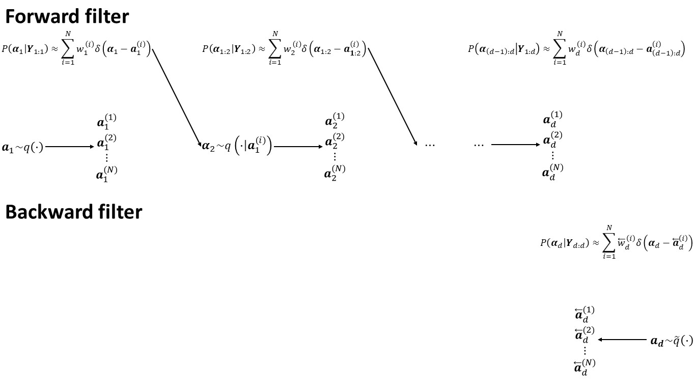
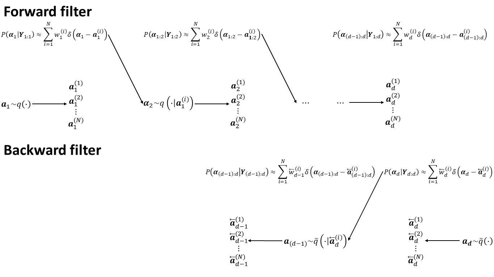
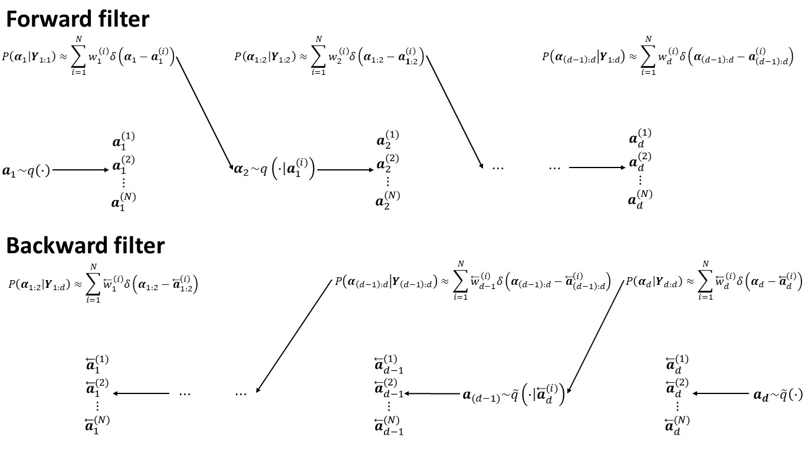

```{r setup, include=FALSE, echo=FALSE}
options(digits = 4, scipen = 8)
knitr::opts_chunk$set(
  error = FALSE, cache = FALSE, warnings = TRUE, message = TRUE, dpi = 128, 
  fig.path = "figures/R/", cache.path = "cache/", comment = "#R> ")
```


## dummy slide

<!--javascript to remove dummy slide-->
<script>
document.getElementById("dummy-slide").remove();
</script>

<!--end dummy slide-->
</section>


<section>
<section class="titleslide slide level1">
<h1>Talk overview</h1>
<div class = "left">
<p> Motivation and model.</p>
<p class = "fragment">Generalized two-filter smoother and an extension.</p>
<p class = "fragment">Example.</p>
</div>
</section>
</section>

<section>
<section class="titleslide slide level1">
<h1>Motivation</h1>
<div class = "left">
<p class = "fragment">
Longitudinal data set up to time $d$ where individuals are censored or cease to 
exist.
</p>

<p class = "fragment">
Expect that slopes or the intercept may vary.
</p>

<p class = "fragment">
Want to extrapolate beyond time $d$.
</p>

<p class = "fragment">
Methods are available in the R package `dynamichazard`.
</p>
</div>
</section>
</section>

<section>
<section class="titleslide slide level1">
<h1>Example: Firm defaults</h1>
<div class = "left"> 
<p class = "fragment">Each month we have the firms that are listed in the prior 
month for a total of $d$ months.</p>

<p class = "fragment">A typical model is a logistic regression conditional on 
having survived up to time $t - 1$. </p>

<p class = "fragment">Firms may be censored (merged, split etc.) or default.
</p>

<p class = "fragment">The intercept may be non-constant (unobservable macro 
effect).</p>

<p class = "fragment">Some of the slopes may vary.</p>

</div>
</section>
</section>

<section>
<section class="titleslide slide level1">
<h1>Model</h1>
<div class="left">
Observational equation

$$
y_{it} \sim g(\cdot \vert \eta_{it}), \qquad
\eta_{it} = \bea^\top\vec{x}_{it} + (\mat{R}^\top\alf_t)^\top\vec{z}_{it} + 
  o_{it}
$$

<p class = "extra-marg">
$t=1,\dots,d$, $i\in \mathcal{R}_t$, $g(\cdot \vert \eta_{it})$ is from the 
exponential family
</p>

<div class = "fragment">

$\alf_t$ is an unobservable with dynamics

$$
\begin{split}
\alf_t = \mat{F}(\thet) \alf_{t-1} + \mat{R}\epslon_t, 
  \qquad & \epslon_t \sim N(\vec{0}, \mat{Q}) \\
  & \alf_0 \sim N(\vec{a}_0, \mat{Q}_0)
\end{split}
$$
</div>
</div>

## Example: conditional piece-wise constant exponential distribution
<div class="left">
$T_i\in[0,\infty)$ is the stop time and likelihood when $T_i > t - 1$

$$
\begin{split}
y_{it} &= 1_{\{T_i \in (t-1, t]\}}, \quad o_{it} = \log(\min\{t, T_i\} - (t - 1)) \\
P(y_{it} \vert \eta_{it}) &= \exp(y_{it}\eta_{it} - \exp(\eta_{it}))
\end{split}
$$

<div class = "fragment">

with AR(2) process

$$
\begin{split}
\vxi_t &= \mat{R}^\top \alf_t, \quad
  \qquad \alf_t = (\vxi_t^\top, \vxi_{t - 1}^\top)^\top \\
\mat{R} &= 
  \begin{pmatrix} \mat{I}_r & \mat{0} \\ \mat{0} & \mat{0} \end{pmatrix},
  \qquad \mat{F} = 
    \begin{pmatrix} \Thet_1 & \Thet_2 \\ \mat{I}_r & \mat{0} \end{pmatrix}
\end{split}
$$
</div>
</div>


</section>
</section>


<section>
<section class="titleslide slide level1">
<h1>Particle filtering and smoothing</h1>

Idea of generalized two-filter smoother

* Run a forward particle filter.
* Run a backward particle filter.
* Combine the two.


<!-- there is a end tag from the previous slide -->
<!-- </section> -->

## Foward particle filter
Idea: sequential importance sampling

</section>

<section data-transition="slide-in fade-out">


</section>

<section data-transition="fade-in fade-out">


</section>

<section data-transition="fade-in slide-out">


## Issue
Want smoothed approximation 

$$P(\alf_{(t-1):t} \vert \vec{Y}_{1:d})$$

and not

$$P(\alf_{(t-1):t} \vert \vec{Y}_{1:t})$$

## Generalized two sample filter
<div class = "left">
Need backward filter approximation

$$P(\alf_t \vert \vec{Y}_{t:d}) \propto \gamma_t(\alf_t)P(\vec{Y}_{t:d} \vert \alf_t )$$

<div class="fragment">
where the artificial probability distributions is

$$\begin{split} \gamma_t(\alf_t) &= 
    \int_{\mathbb{R}^q} f(\alf_t\vert\alf_{t-1})
    \gamma_{t - 1}(\alf_{t-1})d\alf_{t-1} \\
& = N(\mat{F}(\thet)^{t}\vec{a}_0, \mat{Q}_0+\mat{F}(\thet)^{t\top}\mat{Q}\mat{F}(\thet)^{t})
\end{split}$$
</div>
</div>

</section>

<section data-transition="slide-in fade-out">


</section>

<section data-transition="fade-in fade-out">


</section>

<section data-transition="fade-in slide-out">


## Combining: @Briers2009
<div class="left">
Idea: re-weight particles using


$$\hat{w}^{(i)}_t = 
   \frac{\overleftarrow{w}_t^{(i)}}{\gamma_t(\overleftarrow{\alf}_t^{(i)})}
    \sum_{j = 1}^N f(
       \overleftarrow{\alf}_t^{(i)} \vert 
       \alf_{t - 1}^{(j)})w_{t - 1}^{(j)}$$

<p class = "fragment extra-marg"> Issue: $\bigO{N^2}$ </p>

</div>

## Combining: @Fearnhead10
<div class="left">
Sample $i_k$ using $\overleftarrow{w}_{t + 1}^{(1)}, \dots \overleftarrow{w}_{t + 1}^{(N)}$.

Sample $j_k$ using $w_{t - 1}^{(1)}, \dots, w_{t - 1}^{(N)}$.

<p class="fragment">
Sample $\hat{\alf}_t^{(k)} \sim \hat{q}(\cdot \vert \overleftarrow{\alf}_{t + 1}^{(i_k)}, \alf_{t - 1}^{(j_k)})$. 
</p>

<div class="fragment">
Set 

$$
\hat{w}_t^{(k)} \propto \frac{
    f(\hat{\alf}_t^{(k)} \vert \alf_{t-1}^{(j_k)})
    g(\vec{y}_t\vert\hat{\alf}_t^{(k)})
    f(\overleftarrow{\alf}_{t + 1}^{(j_k)} \vert \hat{\alf}_t^{(k)})
}{
   \hat{q}(\hat{\alf}_{t + 1}^{(k)} \vert \overleftarrow{\alf}_{t + 1}^{(i_k)}, \alf_{t - 1}^{(j_k)})
   \gamma_{t + 1}(\overleftarrow{\alf}_{t + 1}^{(i_k)})
}
$$

</div>
</div>


</section>
</section>


<section>
<section class="titleslide slide level1">
<h1>Example: Randomized clinical trial</h1>

```{r pre_data, message=FALSE, echo = FALSE}
library(dynamichazard)
library(JMbayes)
aids <- subset(aids, Time == stop)
```

<div class = "left">

Longitudinal data with `r length(unique(aids$patient))` patients and 
`r sum(aids$event)` deaths with a cohort followed for around 20 months. 

<!--html_preserve-->
<div class = "fragment"><small>
<!--/html_preserve-->

* `drug`: factor for the used drug.
* `AZT`: whether intolerant to AZT or AZT failed.
* `prevOI`: had opportunistic AIDS infection at $t=0$.

<!--html_preserve-->
</small><br><small>
<!--/html_preserve-->

See e.g., @Guo04 for an analysis.

<!--html_preserve-->
</small></div>
<!--/html_preserve-->

</div>

## Constant hazard model

```{r exp__model, results='hide'}
sur_fit <- survreg(
  Surv(stop, event) ~ AZT + gender + drug + prevOI, aids,
  dist= "exponential")
summary(sur_fit)$table[, c("Value", "Std. Error", "p")]
```

```{r exp_model_print, echo = FALSE}
local({
  tmp <- summary(sur_fit)$table[, c("Value", "Std. Error", "p")]
  . <- function(x, d){
    x <- round(x, d)
    x <- ifelse(abs(x[]) < 10^-d, paste0("< 1E-", d), 
                  sprintf(paste0("% 3.", d, "f"), x))
    x
  }
  tmp <- cbind(.(tmp[, 1:2], 4), .(tmp[, 3, drop = FALSE], 16))
  print(tmp, quote = FALSE, right = TRUE)
})
```


## Cox proportional hazards models 

```{r cox__model}
cox_fit <- coxph(
  Surv(stop, event) ~ AZT + gender + drug + prevOI, aids)
summary(cox_fit)$coefficients[, c("coef", "z", "Pr(>|z|)")]
```

## Cumulative hazard function

```{r plot_cum_haz, echo = FALSE}
cum <- basehaz(cox_fit, centered = FALSE)
plot(cum$time, cum$hazard, type = "l", xlab = "Months", 
     ylab = "Cumulative baseline hazard")
abline(a = 0, b = exp(-coef(sur_fit)["(Intercept)"]), col = "blue")
```

Blue: constant hazard model. Black: non-parametric baseline hazard from cox model.

</section>

<section>
<h1>$\bigO{N^2}$ smoother</h1>

<!-- 
  knitr::opts_knit$set(output.dir = ".")
  fit_Brier <- knitr::load_cache("Brier_O_N_square_fit", "fit_Brier", path = "cache/")
-->

```{r Brier_O_N_square_fit, cache = 1, message = FALSE}
set.seed(33706242)
system.time(
  fit_Brier <- PF_EM(
    Surv(stop, event) ~ ddFixed(AZT) + ddFixed(gender) + ddFixed(drug) +
      ddFixed(prevOI),
    aids, model = "exponential", by = .5, max_T = 20, Q = .33, Q_0 = 1,
    id = aids$patient,
    control = PF_control(
      n_threads = 4, N_fw_n_bw = 1000, N_first = 1000,
      N_smooth = 1,                  # Does not matter with Brier_O_N_square
      smoother = "Brier_O_N_square", # Select smoother
      eps = .001, n_max = 100)))
```

</section>
<section>
<h1>$\bigO{N^2}$ smoother</h1>

```{r Brier_O_N_square_fit_plot, echo = FALSE}
plot(fit_Brier)
abline(h = -coef(sur_fit)["(Intercept)"], lty = 2)
```

<small>
Outer crosses are 90% confidence limits, inner crosses are the mean, dashed 
line is the log of the baseline hazard in  the exponential distributed model.
</small>

</section>
<section>
<h1>$\bigO{N^2}$ smoother</h1>

```{r Brier_O_N_square_fit_figures, results = "hold"}
mean(fit_Brier$effective_sample_size$smoothed_clouds)
drop(sqrt(fit_Brier$Q))
fit_Brier$fixed_effects
fit_Brier$n_iter
```

</section>
<section>
<h1>$\bigO{N^2}$ smoother</h1>

```{r show_log_like, echo = FALSE}
plot(fit_Brier$log_likes, type = "l", ylab = expression(P(y[1:d])), 
     xlab = "EM iteration")
```


</section>
<section>
<h1>$\bigO{N}$ smoother</h1>

<!-- 
  knitr::opts_knit$set(output.dir = ".")
  fit_Fearn <- knitr::load_cache("Fearnhead_O_N", "fit_Fearn", path = "cache/")
-->

```{r Fearnhead_O_N, cache = 1, message = FALSE}
set.seed(33706242)
system.time(
  fit_Fearn <- PF_EM(
    Surv(stop, event) ~ ddFixed(AZT) + ddFixed(gender) + ddFixed(drug) +
      ddFixed(prevOI),
    aids, model = "exponential", by = .5, max_T = 20, Q = .33, Q_0 = 1,
    id = aids$patient,
    control = PF_control(
      n_threads = 4, N_fw_n_bw = 250, N_first = 1000,
      N_smooth = 5000,            # Now it matters
      smoother = "Fearnhead_O_N", # Select smoother
      eps = .001, n_max = 100)))
```

</section>
<section>
<h1>$\bigO{N}$ smoother</h1>

```{r Fearnhead_O_N_plot, echo = FALSE}
plot(fit_Fearn)
plot(fit_Brier, col = "Blue", add = TRUE)
```

<small>
Blue: $\bigO{N^2}$ smoother. Black: $\bigO{N}$ smoother.
</small>

</section>
<section>
<h1>$\bigO{N}$ smoother</h1>

```{r Fearnhead_O_N_plot_figures, results = "hold"}
mean(fit_Fearn$effective_sample_size$smoothed_clouds)
drop(sqrt(fit_Fearn$Q))
fit_Fearn$n_iter
```

</section>
<section>
<h1>Two random effects</h1>

```{r Fearnhead_O_N_two, cache = 1, message = FALSE, eval = FALSE}
set.seed(33706242)
system.time(
  fit_Fearn_two <- PF_EM(
    Surv(stop, event) ~ ddFixed(AZT) + ddFixed(gender) + drug + ddFixed(prevOI),
    aids, model = "exponential", by = .5, max_T = 20, 
    Q = diag(.33, 2), Q_0 = diag(1, 2),
    id = aids$patient,
    control = PF_control(
      n_threads = 4, N_fw_n_bw = 250, N_first = 1000,
      N_smooth = 5000,  smoother = "Fearnhead_O_N", eps = .001, n_max = 100)))
```

</section>
<section>
<h1>Intercept</h1>

```{r Fearnhead_O_N_two_plot_inter, echo = FALSE, eval = FALSE}
plot(fit_Fearn_two$clouds, cov_index = 1)
```

</section>
<section>
<h1>`Drug` dummy</h1>

```{r Fearnhead_O_N_two_plot_slope, echo = FALSE, eval = FALSE}
plot(fit_Fearn_two$clouds, cov_index = 2)
abline(h = -coef(sur_fit)["drugddI"], lty = 2)
```

<small>
Dashed line is the log of the baseline hazard in  the exponential distributed 
model.
</small>

</section>
<section>
<h1>Co-variance matrix</h1>

```{r Fearnhead_O_N_two_covar, eval = FALSE}
fit_Fearn_two$Q
cov2cor(fit_Fearn_two$Q)
mean(fit_Fearn_two$effective_sample_size$smoothed_clouds)
```


</section>
</section>


<section>
<section class="titleslide slide level1">
<h1>Comments</h1>
<div class="left">
Ignored re-sampling, choice of proposal distribution and more. Different 
options are available in `dynamichazard` packages. 

Only supports a random walk. More general models is available soon.

</div>
</section>
</section>


<section class="titleslide slide level1">
<h1>References</h1>

<!-- </section> -->