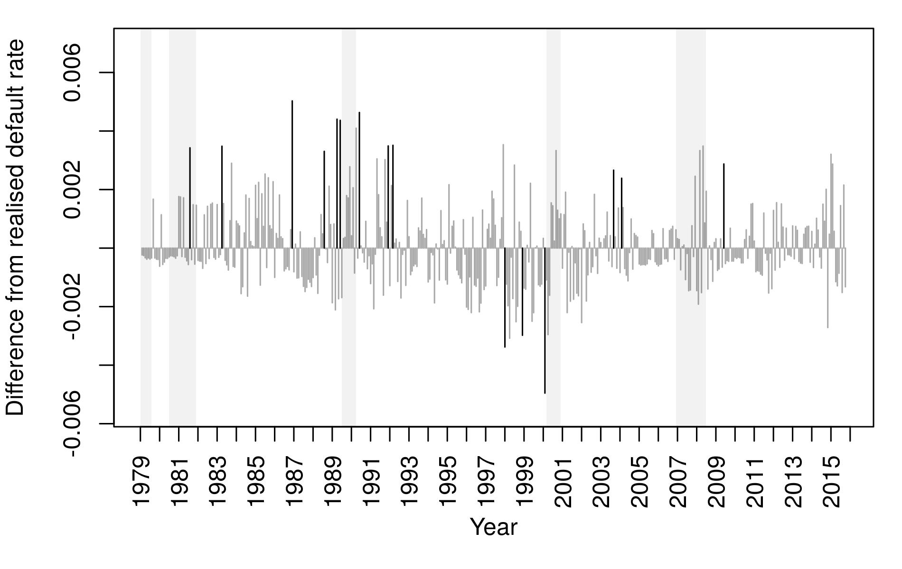
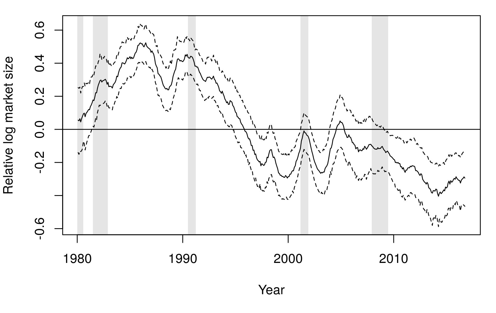
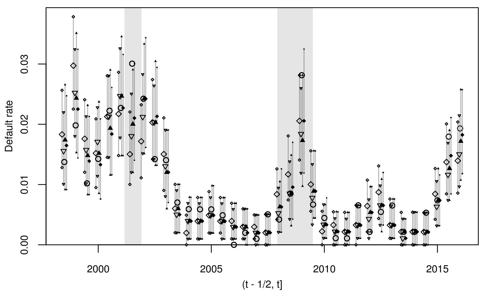
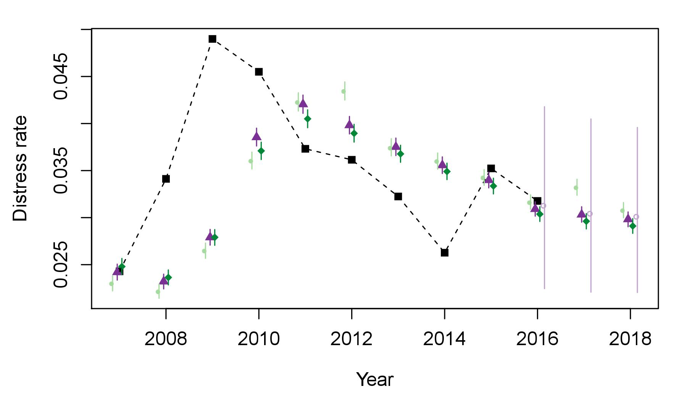

```{r setup, include=FALSE}
knitr::opts_chunk$set(echo = TRUE)
```

## dummy slide

<!--html_preserve-->
<script>
(function() {
  document.getElementById("dummy-slide").remove(); 
  
  var front_div = document.getElementsByTagName("section")[0];
  front_div.classList.add("front");
  front_div.classList.add("center");
  
  // add second header
  var second_head = document.createElement("p");
  var node = document.createTextNode("An Application of the dynamichazard Package");
  second_head.appendChild(node);
  second_head.innerHTML += "<span class='fragment'><br>and a Glance at the mssn Package</span>";
  front_div.appendChild(second_head);
  
  // add author 
  var credit_div = document.createElement('div');
  credit_div.innerHTML += "<div class='w-small'><p>Benjamin Christoffersen</p><p class='smallish'>Copenhagen Business School, Department of Finance, Center for Statistics, <a href='mailto:bch.fi@cbs.dk'>bch.fi@cbs.dk</p></div>";
  credit_div.classList.add("authors");
  front_div.appendChild(credit_div);
})();
</script>
<!--end dummy slide-->

</section>

<section>
<section class="large-first center slide level2">
<h1>Why?</h1>

<!--/html_preserve-->

<div style="display: none;">
$$
\definecolor{gray}{RGB}{192,192,192}
\def\vect#1{\boldsymbol #1}
\def\bigO#1{\mathcal{O}(#1)}
\def\Cond#1#2{\left(#1 \mid #2\right)}
\def\diff{{\mathop{}\!\mathrm{d}}}
$$
</div>

<!-- there is a end tag from the previous slide -->
<!-- </section> -->

## Motivation {data-transition="slide-in none"}

Want to model the loss distribution of <i>b</i> banks. 

## Motivation {data-transition="fade-in none"}

Want to model the loss distribution of <i>b</i> banks. 

<div>
Loss is given by

$$
L_{bt} = \sum_{i\in R_{bt}} E_{bit}G_{bit}Y_{it}
$$

$R_{bt}$: risk set, $E_{bit}\in (0,\infty)$: exposure, $G_{bit}\in[0,1]$: 
loss-given-default, and $Y_{it}\in\{0,1\}$: default indicator. 
</div>

## Motivation {data-transition="fade-in slide-out"}

Want to model the loss distribution of <i>b</i> banks. 

<div>
Loss is given by

$$
L_{bt} = \sum_{i\in R_{bt}} \color{gray}{E_{bit}G_{bit}}Y_{it}
$$

<span class="gray">$R_{bt}$: risk set, $E_{bit}\in (0,\infty)$: exposure, $G_{bit}\in[0,1]$: 
loss-given-default, and</span> $Y_{it}\in\{0,1\}$: default indicator. 
</div>

Focus on $Y_{it}$.

## First Idea
Assume conditional independence and e.g., let the default intensity be

$$\log\lambda_{it} = \vect\beta^\top \vect x_{it} + \vect\gamma^\top \vect z_t$$

<div class="fragment">
So the probability of default is

$$
\begin{multline*}
P(Y_{i,t}=1\mid Y_{i,1}=\cdots=Y_{i,t-1}=0, \\ 
    \lambda_{it} = \lambda) = 1 - \exp\left(-\lambda\right)
\end{multline*}
$$

<p class="fragment">Poor choice for tail risk if invalid.</p>
</div>

<!--html_preserve-->
</section>
<section class="center-horiz">
<h2>First Idea</h2>

<!--/html_preserve-->


In-sample predicted less realized default rate. Black bars are outside 90 pct. 
confidence intervals.

## Add Frailty
@Duffie09 suggest to generalize to

$$
\begin{aligned}
\log\lambda_{it} &= \vect\beta^\top \vect x_{it} + \vect\gamma^\top \vect z_t + A_t \\
A_t &\sim \theta A_{t-1} + \epsilon_t \\ 
\epsilon_t&\sim N(0,\sigma^2)
\end{aligned}    
$$

The auto-regressive frailty, $A_k$, captures clustering.

## Thoughts

Very nice paper!

<div class="w-small fragment">
But is only the intercept time-varying? 
<p class="smallish">Findings in @David13, @Filipe16, and @Jensen17 suggest not.
</p></div>

<div class="w-small fragment">
And are all the effects linear on the hazard scale?
<p class="smallish">Findings in @Daniel07, @Christoffersen18, and the ML 
literature suggest not.</p>
</div>

## Generalize {data-transition="slide-in none"}

$$
\begin{aligned}
\log\lambda_{it} &= \vect\beta^{(1)\top}\vect x_{it}^{(1)} +  
    \vect\gamma^\top \vect z_t + 
    \vect\beta^{(2)\top} \vect f(\vect x_{it}^{(2)}) + 
    \vect A_t^\top\vect u_{it} \\
\vect A_t &\sim F\vect A_{t-1} + \vect \epsilon_t \\ 
\vect \epsilon_t&\sim \vect N(\vect 0, Q) \\
\vect x_{it} &= 
     \left(\vect x_{it}^{(1)\top}, \vect x_{it}^{(2)\top}\right)^\top
\end{aligned}    
$$

$\vect A_t \in \mathbb{R}^p$ is low dimensional and some elements in $\vect u_{it}$ and 
$\vect x_{it}$ may match.

## Generalize {data-transition="fade-in slide-out"}

$$
\begin{aligned}
\log\lambda_{it} &= \color{gray}{\vect\beta^{(1)\top}\vect x_{it}^{(1)} +  
    \vect\gamma^\top \vect z_t} + 
    \vect\beta^{(2)\top} \vect f(\vect x_{it}^{(2)}) + 
    \vect A_t^\top\vect u_{it} \\
\color{gray}{\vect A_t} &\sim F \color{gray}{\vect A_{t-1} + \vect \epsilon_t} \\ 
\color{gray}{\vect \epsilon_t}
    &\color{gray}\sim \color{gray}{\vect N(\vect 0, }Q\color{gray}) \\
\color{gray}{\vect x_{it}} & \color{gray}= \color{gray}{ 
    \left(\vect x_{it}^{(1)\top}, \vect x_{it}^{(2)\top}\right)^\top}
\end{aligned}    
$$

<p class="gray">$\vect A_t \in \mathbb{R}^p$ is low dimensional and some elements in $\vect u_{it}$ and 
$\vect x_{it}$ may match.</p>

## Need to Evaluate

$$
\begin{aligned}
L &= \int_{\mathbb R^{pd}} \mu_0(\vect A_1)g_1\Cond{\vect y_1}{\vect A_1} \\
&\hspace{25pt}
    \cdot\prod_{t=2}^d g_t\Cond{\vect y_t}{\vect A_t}
    f\Cond{\vect A_t}{\vect A_{t-1}}\mathrm{d}A_{1:d} \\
\vect y_t &= \{y_{it}\}_{i\in O_t}
\end{aligned}
$$

$O_t$ is the risk set.

<!--html_preserve-->
</section>
<!-- need extra end tag before next section -->
</section>


<section>
<section class = "center">
<h1>Talk Overview</h1>

<div class="w-small">
How?
<p class="smallish">Introduction to the dynamichazard package.
</p></div>

<div class="w-small fragment">
Example
<p class="smallish">Summary of paper with application.
</p></div>

<div class="w-small fragment">
Why another package?
<p class="smallish">Motivation for the mssm package.
</p></div>
</section>
</section>


<section>
<section class="large-first center">
<h1>How?</h1>

<!-- there is a end tag from the previous slide -->
<!-- </section> -->
<!--/html_preserve-->

## Fast Approximation
<div class="w-small">
Need to estimate parameters. Could use a fast approximation. 
<p class="smallish">E.g., extended Kalman filter, unscented Kalman filter,
pseudo-likelihood approximation, Laplace approximation, etc.
</p></div>


<div class="w-small fragment">
dynamichazard contains an extended Kalman filter and unscented Kalman filter 
for the random walk model.
<p class="smallish">Especially the former is extremely fast. Try 
`dynamichazard::ddhazard_app()`.</p></div>

## Monte Carlo Method
Use Monte Carlo expectation maximization. 

Approximate E-step with particle smoother.

Get arbitrary precision.

## Particle Smoother
Contains an implementation of the generalized two-filter smoother suggested
by @Briers09. 

<div class="w-small fragment">
Method is $\bigO{N^2}$
<p class="smallish">where $N$ is the number of particles. 
Not a problem for $N<2000$.</p>
</div>

<div class="w-small fragment">
Contains an implementation of the particle smoother suggested by @Fearnhead10.
<p class="smallish">This is $\bigO{N}$ with some extra overhead per 
particle.</p>
</div>

## Small Example

```{r prep_lung, echo = FALSE}
library(survival)
lung <- lung[!is.na(lung$ph.ecog), c("time", "status", "ph.ecog", "age")]
lung$id <- 1:nrow(lung)
lung$status <- lung$status == 2L
lung$status[lung$time > 800L] <- FALSE
lung$time <- pmin(lung$time, 800L)
```

```{r show_lung}
head(lung)
```

## Fit Model

```{r attach_dynam, echo = FALSE}
library(dynamichazard)
```

```{r fit_lung, message = FALSE}
set.seed(59366336)
system.time(pf_fit <- PF_EM(
  fixed = Surv(time, status) ~ ph.ecog + age, random = ~ 1,
  model = "exponential", Q = as.matrix(.0001), type = "VAR", 
  by = 50L, Fmat = as.matrix(.0001),
  control = PF_control(
    N_fw_n_bw = 500L, N_smooth = 1000L, N_first = 1000L, 
    nu = 6, smoother = "Fearnhead_O_N", n_threads = 6, 
    averaging_start = 200L, n_max = 300L, eps = 1e-4),
  data = lung, max_T = max(lung$time), id = lung$id, 
  Q_0 = as.matrix(4)))
```

<!--html_preserve-->
</section>
<section class="center-horiz">
<h2>Smoothed Predicted Value</h2>
<!--/html_preserve-->

```{r plot_lung}
par(mar = c(6, 4, 1, 1))
plot(pf_fit)
```

## Compare Fits

```{r comp_coef}
# fit models
const_fit <- survreg(Surv(time, status) ~ ph.ecog + age, 
                     data = lung, dist = "exponential")
coxf <- coxph(Surv(time, status) ~ ph.ecog + age, data = lung)

rbind(
  survreg = -const_fit$coefficients,
  coxph   = c(NA_real_, coef(coxf)), 
  PF_EM   = pf_fit$fixed_effects)
```


<!--html_preserve-->
</section>
<section class="center-horiz">
<h2>Log-Likelihood Approximations</h2>
<!--/html_preserve-->

```{r plot_ll}
par(mar = c(6, 4, 1, 1))
plot(pf_fit$log_likes, type = "l", ylab = "Log-Likelihood")
abline(h = logLik(const_fit), lty = 2)
```

## Features 

<div class="w-small">
Few options for conditional model given state variables. 
<p class="smallish">
Discrete time models with logit and cloglog link function and log link
in continuous time.
</p></div>

<div class="w-small fragment">
Approximations of gradient and observed information matrix are available. 
<p class="smallish">
Both method suggested by @Poyiadjis11 and method mentioned in @Cappe05. See 
the `dynamichazard::PF_get_score_n_hess` function.
</p></div>

<!--html_preserve-->
</section>
<!-- need extra end tag before next section -->
</section>


<section>
<section class="large-first center">
<h1>Example</h1>

<!-- there is a end tag from the previous slide -->
<!-- </section> -->
<!--/html_preserve-->

## Paper

Show example from @Christoffersen19.

<div class="w-small">
Rastin Matin
<p class="smallish">
Danmarks Nationalbank, <a href="rma@nationalbanken.dk">rma@nationalbanken.dk</a>
</p></div>

## Summary

Add covariates, non-linear effects, and a random slope 
to model in @Duffie07 and @Duffie09.

<div class="w-small fragment">
Find less evidence of time-varying intercept.
<p class="smallish">
As shown by @Lando10.
</p></div>

<p class="fragment">Provide evidence of time-varying size slope.</p>

<p class="fragment">Show improved firm-level performance and industry-level
performance.</p>

## Shameless Plug

Need to compute distance-to-default and perform rolling regressions.

<div class="fragment">
Uses dtd and rollRegres package. The latter is a fast alternative:

```
#R Unit: milliseconds
#R                     expr       mean     median
#R             roll_regress   5.007243   5.027944
#R          roll_regress_df   5.786401   5.539363
#R         roll_regress_zoo 513.787995 512.832266
#R  roll_regress_R_for_loop 300.358362 301.748222
#R                  roll_lm  63.389449  63.475249
```

<p class="smallish">
https://cran.r-project.org/web/packages/rollRegres/vignettes/Comparisons.html
</p>

</div>


<!--html_preserve-->
</section>
<section class="center-horiz">
<h2>Smoothed Predicted Random Effect</h2>
<!--/html_preserve-->



Log market size is an in @Shumway01. This is just the zero-mean random 
effect $A_{tj}$.

<!--html_preserve-->
</section>
<section class="center-horiz" data-transition="slide-in none">
<h2>Out-of-Sample AUCs</h2>
<!--/html_preserve-->


<p class="smallish">
Blue: lowest, black: highest. 
◇: model as in @Duffie07, 
▽: + covariates and non-linear effects, 
▲: + random intercept, and
◆: + random size slope.
</p>

<!--html_preserve-->
</section>
<section class="center-horiz" data-transition="fade-in slide-out">
<h2>Out-of-Sample AUCs</h2>
<!--/html_preserve-->


<p class="smallish">
Blue: lowest, black: highest. 
◇: model as in @Duffie07, 
▽: + covariates and non-linear effects, 
▲: + random intercept, and
◆: + random size slope.
</p>

<!--html_preserve-->
</section>
<section class="center-horiz" data-transition="slide-in none">
<h2>Out-of-Sample Industry Default Rate</h2>
<!--/html_preserve-->



<p class="smallish">
Bars: 90% prediction interval, ○:  realized rate.
◇: model as in @Duffie07, 
▽: + covariates and non-linear effects, 
▲: + random intercept, and
◆: + random size slope.
</p>

<!--html_preserve-->
</section>
<section class="center-horiz" data-transition="fade-in slide-out">
<h2>Out-of-Sample Industry Default Rate</h2>
<!--/html_preserve-->


<p class="smallish">
Bars: 90% prediction interval, ○:  realized rate.
◇: model as in @Duffie07, 
▽: + covariates and non-linear effects, 
▲: + random intercept, and
◆: + random size slope.
</p>

<!--html_preserve-->
</section>
<section class="center-horiz">
<h2>Risk Set's Size and PD Effect</h2>
<!--/html_preserve-->



<p class="smallish">
From @Christoffersen18 with iid random effects and a much larger sample.
</p>

<!--html_preserve-->
</section>
<!-- need extra end tag before next section -->
</section>


<section>
<section class="large-first center">
<h1>Why Another Package?</h1>

<!-- there is a end tag from the previous slide -->
<!-- </section> -->
<!--/html_preserve-->

## Cons

> This is $\bigO{N}$ with some extra overhead per particle.

```{r eval = FALSE}
fit <- PF_EM(
  ..., control = PF_control(N_fw_n_bw = 200L, N_smooth = 1000L))
```

<p class="fragment">Extra evaluations of $g_t\Cond{\vect y_t}{\vect A_t}$. 
Expensive!</p>

## And What If...

... I have non-binary outcomes or not time-to-event data?

E.g., Poisson or Gamma distributed.

## Solution
<div class="w-small">
Use methods suggested by @Lin05 and @Poyiadjis11.
<p class="smallish">
Lower variance of estimates as function of time but $\bigO{N^2}$.
</p></div>

<div class="w-small fragment">
Use approximation shown in @Klaas06 and like suggested in @Gray03.
<p class="smallish">
Reduces computational complexity to $\bigO{N\log N}$.
</p></div>

## Fast Approximation

```r
##          method
## N         Dual-tree      Naive
##   12288    0.039704  0.7137595
##   24576    0.062140  2.6771194
##   49152    0.115722 10.9796716
##   98304    0.227879         NA
##   196608   0.450209         NA
##   393216   0.913649         NA
##   786432   1.844256         NA
##   1572864  4.057902         NA
```

https://github.com/boennecd/mssm

## Starting Values
Contains fast Laplace approximation to get starting values.

## Cons
Higher memory usage.

Need some extra work to fit models in dynamichazard.


<!--html_preserve-->
</section>
<!-- need extra end tag before next section -->
</section>


<section>
<section class="center final">
<h1>Thank You!</h1>

<div class="w-small">
<p class="smallish">Paper is at  
<a href="https://ssrn.com/abstract=3339981">ssrn.com/abstract=3339981</a>.</p>
<p class="smallish">Slides are at  
<a href="http://rpubs.com/boennecd/R-Fin19">rpubs.com/boennecd/R-Fin19</a>.</p>
<p class="smallish">Markdown is at  
<a href="https://github.com/boennecd/Talks">github.com/boennecd/Talks</a>.</p>
<p class="smallish">More examples at  
<a href="https://github.com/boennecd/dynamichazard/tree/master/examples">
github.com/boennecd/dynamichazard/tree/master/examples</a>.</p>
<p class="smallish">References on next slide.</p>
</div>

<!-- there is a end tag from the previous slide -->
<!-- </section> -->
<!--/html_preserve-->


<!--html_preserve-->
</section>
<!-- need extra end tag before next section -->
</section>


<section>
<h1>References</h1>

<!--/html_preserve-->
