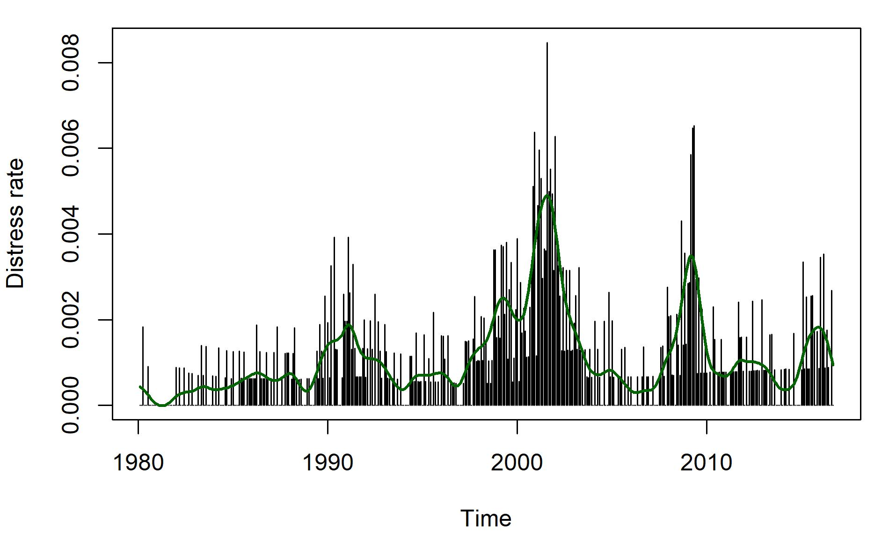

## dummy slide

<!--javascript to remove dummy slide-->
<!--html_preserve-->
<script>
(function() {
  document.getElementById("dummy-slide").remove(); 
})();
</script>
<!--/html_preserve-->

<!--end dummy slide-->
</section>

```{r setup, include = FALSE, cache = FALSE}
options(width = 100, digits = 4, scipen = 8)
knitr::opts_chunk$set(
  error = FALSE, cache = FALSE, warnings = TRUE, message = TRUE, dpi = 128)

knitr::knit_hooks$set(inline = function(x) {
  prettyNum(x, big.mark = ",")
})
```

```{r figures, echo = FALSE}
n_firm_months <- 624692L
n_firms <- 4433L
n_events <- 721L
```


<!--html_preserve-->
<section>
<section class="titleslide slide level1">
<h1>Introduction</h1>
<div class="left">

<p class="fragment">Hazard models are powerful distress models.</p>
<!--/html_preserve-->

<p class="fragment">Popular since @Shumway01.</p>

<!--html_preserve-->
<div class="fragment">
<!--/html_preserve-->
$$\begin{align*}
y_{it} &\in\{0,1\}\\
g(E(y_{it}|\vec x_{it}, \vec z_t)) &= 
    \vec\beta^\top\vec x_{it}+ \vec \gamma^\top \vec z_t
\end{align*}$$

<small>$y_{it}$s are binary distress indicator, $\vec x_{it}$s are firm 
covariates, and $\vec{z}_t$s are macro variables.</small>

<small class="fragment">
E.g., see @Chava04, @Beaver05, and @Campbell08.</small>

<!--html_preserve-->
</div>
</div>

<!-- there is a end tag from the previous slide -->
<!-- </section> -->
<!--/html_preserve-->

## Large time variation



Cannot be caputured by firm specific covariates, $\vec x_{it}$, and macro 
covariates, $\vec z_t$. Major issue for portfolio risk.

## Frailty models

<div class="left">

<div class="fragment">
Extend to include latent effects

$$
\begin{align*}
g(E(y_{it}|\vec x_{it}, \vec z_t, \vec u_t, \vec o_{it})) &= 
    \vec\beta^\top\vec x_{it}+ \vec \gamma^\top \vec z_t 
    + \vec u_t^\top \vec o_{it} \\
\vec u_t &\sim p_{\vec \theta}(\vec u_{t-1})
\end{align*}
$$

</div>

<p class="fragment">Pioneered in @Duffie09.</p>

<small class="fragment">
E.g., see @Koopman11, @Azizpour16, @Nickerson17, and @kwon18.</small>

</div>


## Motivation
<div class="left">
> Although an OU process is a reasonable starting model for the frailty process, one could allow much richer frailty models. ..., however, we have found that even our relatively large data set is too limited to identify much of the time-series properties of frailty.
... For the same reason, we have not attempted to identify sector-specific frailty effects.
> 
> @Duffie09

</div>

</section>
<!-- need extra end tag before next section -->
</section>


<!--html_preserve-->
<section>
<section class="titleslide slide level1">
<h1>Talk overview</h1>


<p class="fragment">Data set.</p>
<p class="fragment">Models without frailty.</p> 
<p class="fragment">Models with frailty.</p> 

</section>
<!-- need extra end tag before next section -->
</section>
<!--/html_preserve-->


<!--html_preserve-->
<section>
<section class="titleslide slide level1">
<h1>Data set</h1>
<div class="left">

<p>Merge CRSP and Compustat.</p>

<p>Merge with Moody’s Analytics Default & Recovery Database.</p>

</div>
<!-- there is a end tag from the previous slide -->
<!-- </section> -->
<!--/html_preserve-->

## Distress events

<div class = "left">
<p class="fragment">At risk: have not had a distress, is after resolution date, 
or 12 months after distress if resolution date is missing.</p> 

<small class="fragment">Events are alternative dispute resolution, conservatorship, cross default, loan forgiven, chapter 7, placed under administration, seized by regulators, deposit freeze, suspension of payments, grace period default, payment moratorium, prepackaged chapter 11, indenture modified, bankruptcy, receivership, missed principal payment, missed principal and interest payments, distressed exchange, chapter 11, and missed interest payment.</small>

<p class="fragment">Missed interest payment is by far the most common.</p>

<!--
  x <- c(
    "Alternative Dispute Resolution", "Conservatorship", "Cross default", 
    "Loan forgiven", "Chapter 7", "Placed under administration", 
    "Seized by regulators", "Deposit Freeze", "Suspension of payments", 
    "Grace period default", "Payment moratorium", "Prepackaged Chapter 11", 
    "Indenture modified", "Bankruptcy", "Receivership", 
    "Missed principal payment", "Missed principal and interest payments", 
    "Distressed exchange", "Chapter 11", "Missed interest payment")
  stopifnot(!any(duplicated(x)))
  cat(paste0(x, collapse = ", "))
-->

<p class="fragment">Macthing to Compustat is done with CUSIPs, ticker symbols,
and company names.</p>

</div>


## Compustat data 
<div class="left">
Use quatlery data and impute yearly data when missing. 

Data is "leaded" with 3 months and carried forward for up to 1 year.
</div>

## CRSP
<div class="left">
<!--html_preserve-->
<div class="no-top-marg-next"> 
<!--/html_preserve-->
Used to compute idiosyncratic volatility.
<small>Standard deviation from 1 year 
rolling regression of daily stock log return on the log market return. Require 
3 months data in window and 1 year initial data.</small> 
<!--html_preserve-->
</div> 
<!--/html_preserve-->

Used to compute past 1 year excess log return. 

Used to compute log relative market size. 

Data is "leaded" with 1 month and carried forward for up to 3 months.
</div>


## Distance-to-default
<div class="left">
Very good predictor [@Shumway08]. 

<!--html_preserve-->
<div class="no-top-marg-next"> 
<!--/html_preserve-->
Computed with the so-called KMV method [@Vassalou04]. 
<small>Computed with daily stock data, debt 
data from Compustat, 1 year T-bill rate, and with a rolling 1 year window.</small>
<!--html_preserve-->
</div> 
<!--/html_preserve-->

Require 1 years initial data and at-least 3 months of data in each window. 
</div>

## Final sample
<div class="left">

<!--html_preserve-->
<div class="no-top-marg-next"> 
<!--/html_preserve-->
Exclude firm with first digit SIC code 6 or 9. 
<small>Use compustat `siccd` if avialable. Otherwise use CRSP `sich`.</small>
<!--html_preserve-->
</div> 
<!--/html_preserve-->

Final samples has `r n_firm_months` firm-months, `r n_firms` firms and 
`r n_events` events.

</div> 
</section>
<!-- need extra end tag before next section -->
</section>


<section class="titleslide slide level1">
<h1>References</h1>