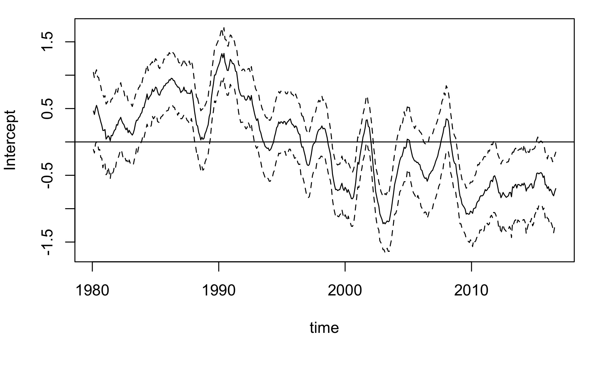
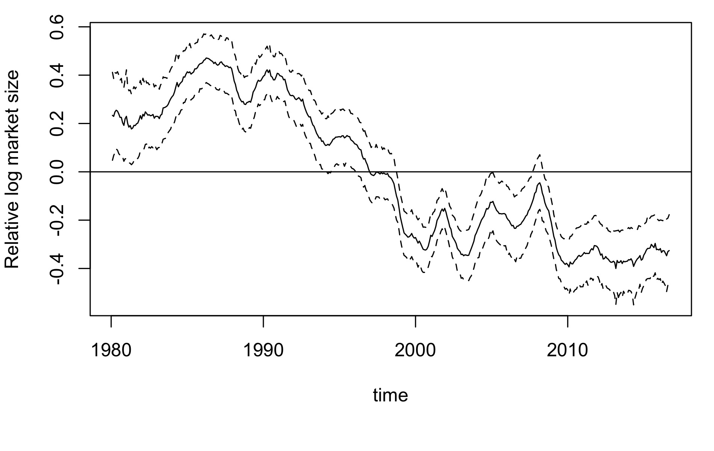

## dummy slide

<!--javascript to remove dummy slide-->
<!--html_preserve-->
<script>
(function() {
  document.getElementById("dummy-slide").remove(); 
  
  var credit_div = document.createElement('div');
  credit_div.innerHTML = "<p>Benjamin Christoffersen<br>Copenhagen Business School<br>Department of Finance, Center for Statistics</p>";
  credit_div.className += "left";
  document.getElementsByTagName("section")[0].appendChild(credit_div);
  
  document.getElementsByTagName("section")[0].classList.add("front");
})();
</script>
<!--/html_preserve-->

<!--end dummy slide-->
</section>

```{r setup, include = FALSE, cache = FALSE}
options(width = 100, digits = 4, scipen = 8)
knitr::opts_chunk$set(
  error = FALSE, cache = FALSE, warnings = TRUE, message = TRUE, dpi = 128)

knitr::knit_hooks$set(inline = function(x) {
  prettyNum(x, big.mark = ",")
})
```

```{r figures, echo = FALSE}
n_firm_months <- 624692L
n_firms <- 4433L
n_events <- 721L

rel_size_frailty_slope <- 0.03975

aic_tab <- function(n_terms){
  o <- '
<table>
<thead>
<tr>
  <th id="tableHTML_header_1"> </th>
  <th id="tableHTML_header_2">Df</th>
  <th id="tableHTML_header_3">AIC</th>
</tr>
</thead>
<tbody>\n'
  
  trs <- c('
<tr>
  <td id="tableHTML_rownames">First model</td>
  <td id="tableHTML_column_1">12</td>
  <td id="tableHTML_column_2">7612.93</td>
</tr>', '
<tr>
  <td id="tableHTML_rownames">New denominator</td>
  <td id="tableHTML_column_1">12</td>
  <td id="tableHTML_column_2">7559.93</td>
</tr>', '
<tr>
  <td id="tableHTML_rownames">Add distance-to-default</td>
  <td id="tableHTML_column_1">13</td>
  <td id="tableHTML_column_2">7469.90</td>
</tr>', '
<tr>
  <td id="tableHTML_rownames">Add macro variables</td>
  <td id="tableHTML_column_1">15</td>
  <td id="tableHTML_column_2">7447.24</td>
</tr>', '
<tr>
  <td id="tableHTML_rownames">Simplify model</td>
  <td id="tableHTML_column_1">11</td>
  <td id="tableHTML_column_2">7441.04</td>
</tr>')
  
  all_ele <- seq_along(trs)
  keep <- 1:n_terms
  p1 <- trs[keep]
  p2 <- trs[setdiff(all_ele, keep)]
  if(length(p2) > 0)
    p2 <- gsub("<tr>", "<tr class=\"invis\">", p2)
  trs <- c(p1, p2)
  
  cat(paste0(o, paste0(trs, collapse = "\n"),  
             '</tbody></table>\n', collapse = "\n"))
}

aic_tab_frailty <- function(n_terms){
  o <- '
<table>
<thead>
<tr>
  <th id="tableHTML_header_1"> </th>
  <th id="tableHTML_header_2">Df</th>
  <th id="tableHTML_header_3">AIC</th>
</tr>
</thead>
<tbody>\n'
  
  trs <- c('
<tr>
  <td id="tableHTML_rownames">Model without frailty</td>
  <td id="tableHTML_column_1">17</td>
  <td id="tableHTML_column_2">7378</td>
</tr>', '
<tr>
  <td id="tableHTML_rownames">Random intercept</td>
  <td id="tableHTML_column_1">19</td>
  <td id="tableHTML_column_2">7345</td>
</tr>', '
<tr>
  <td id="tableHTML_rownames">Random intercept and log relative size</td>
  <td id="tableHTML_column_1">22</td>
  <td id="tableHTML_column_2">7229</td>
</tr>', '
<tr>
  <td id="tableHTML_rownames">Random intercept, log relative size, and industry dummies</td>
  <td id="tableHTML_column_1">25</td>
  <td id="tableHTML_column_2">7238</td>
</tr>')
  
  all_ele <- seq_along(trs)
  keep <- 1:n_terms
  p1 <- trs[keep]
  p2 <- trs[setdiff(all_ele, keep)]
  if(length(p2) > 0)
    p2 <- gsub("<tr>", "<tr class=\"invis\">", p2)
  trs <- c(p1, p2)
  
  cat(paste0(o, paste0(trs, collapse = "\n"),  
             '</tbody></table>\n', collapse = "\n"))
}
```


<!--html_preserve-->
<section>
<section class="titleslide slide level1">
<h1>Introduction</h1>
<div class="left">

<p class="fragment">Hazard models are powerful distress models.</p>
<!--/html_preserve-->

<p class="fragment">Popular since @Shumway01.</p>

<!--html_preserve-->
<div class="fragment">
<!--/html_preserve-->
$$\begin{align*}
y_{it} &\in\{0,1\}\\
g(E(y_{it}|\vec x_{it}, \vec z_t)) &= 
    \vec\beta^\top\vec x_{it}+ \vec \gamma^\top \vec z_t
\end{align*}$$

<small>$y_{it}$s are binary distress indicator, $\vec x_{it}$s are firm 
covariates, and $\vec{z}_t$s are macro variables.</small>

<small class="fragment">
E.g., see @Chava04, @Beaver05, and @Campbell08.</small>

<!--html_preserve-->
</div>
</div>

<!-- there is a end tag from the previous slide -->
<!-- </section> -->
<!--/html_preserve-->

## Large time variation

<!--html_preserve-->
<div class="no-top-marg-next"> 
<!--/html_preserve-->

<small>Line is a generalized additive model with a spline for the intercept 
[@Wood17].
</small>

<!--html_preserve-->
</div> 
<!--/html_preserve-->

Cannot be captured by firm specific covariates, $\vec x_{it}$, and macro 
covariates, $\vec z_t$. Major issue for portfolio risk.

## Frailty models

<div class="left">

<div class="fragment">
Extend to include latent effects

$$
\begin{align*}
g(E(y_{it}|\vec x_{it}, \vec z_t, \vec u_t, \vec o_{it})) &= 
    \vec\beta^\top\vec x_{it}+ \vec \gamma^\top \vec z_t 
    + \vec u_t^\top \vec o_{it} \\
\vec u_t &\sim p_{\vec \theta}(\vec u_{t-1})
\end{align*}
$$

</div>

<p class="fragment">Pioneered by @Duffie09.</p>

<div class="fragment">
<small>
E.g., see @Koopman11, @Hwang12, @Chen14, @Qi14, @Nickerson17, @Azizpour18, and 
@kwon18 for other papers on time-varying effects.</small>

<small class="has-math">
Only a frailty model as in @Vaupel1979 for certain link functions where 
$\vec u_t^\top \vec o_{it}$ is a multiplicative factor on the 
instantaneous hazard. This is not the case for e.g., the logit link function 
where $\vec u_t^\top \vec o_{it}$ is a multiplicative factor on the 
odds.</small> 
</div>

</div>


## Motivation
<div class="left">
> Although an OU process is a reasonable starting model for the frailty process, one could allow much richer frailty models. ..., however, we have found that even our relatively large data set is too limited to identify much of the time-series properties of frailty.
... For the same reason, we have not attempted to identify sector-specific frailty effects.
> 
> @Duffie09

</div>

</section>
<!-- need extra end tag before next section -->
</section>


<!--html_preserve-->
<section>
<section class="titleslide slide level1">
<h1>Talk overview</h1>


<p class="fragment">Data set.</p>
<p class="fragment">Models without frailty.</p> 
<p class="fragment">Models with frailty.</p> 

</section>
<!-- need extra end tag before next section -->
</section>
<!--/html_preserve-->


<!--html_preserve-->
<section>
<section class="titleslide slide level1">
<h1>Data set</h1>
<div class="left">

<p>Merge CRSP and Compustat.</p>

<p>Merge with Moody’s Analytics Default & Recovery Database.</p>

</div>
<!-- there is a end tag from the previous slide -->
<!-- </section> -->
<!--/html_preserve-->

## Distress events

<div class = "left">
<p class="fragment">At risk: has not had a distress, is after resolution date, 
or 12 months after distress if resolution date is missing.</p> 

<small class="fragment">Events are alternative dispute resolution, conservatorship, cross default, loan forgiven, chapter 7, placed under administration, seized by regulators, deposit freeze, suspension of payments, grace period default, payment moratorium, prepackaged chapter 11, indenture modified, bankruptcy, receivership, missed principal payment, missed principal and interest payments, distressed exchange, chapter 11, and missed interest payment.</small>

<p class="fragment">Missed interest payment is by far the most common.</p>

<!--
  x <- c(
    "Alternative Dispute Resolution", "Conservatorship", "Cross default", 
    "Loan forgiven", "Chapter 7", "Placed under administration", 
    "Seized by regulators", "Deposit Freeze", "Suspension of payments", 
    "Grace period default", "Payment moratorium", "Prepackaged Chapter 11", 
    "Indenture modified", "Bankruptcy", "Receivership", 
    "Missed principal payment", "Missed principal and interest payments", 
    "Distressed exchange", "Chapter 11", "Missed interest payment")
  stopifnot(!any(duplicated(x)))
  cat(paste0(x, collapse = ", "))
-->

<p class="fragment">Matching to Compustat is done with CUSIPs, ticker symbols,
and company names.</p>

</div>


## Compustat data 
<div class="left">
Use quatlery data and impute yearly data when missing. 

Data is lagged with 3 months and carried forward for up to 1 year.
</div>

## CRSP
<div class="left">
<!--html_preserve-->
<div class="no-top-marg-next"> 
<!--/html_preserve-->
Used to compute idiosyncratic volatility.
<small>Standard deviation from 1 year 
rolling regression of daily stock log return on the log market return. Require 
3 months data in window and 1 year initial data.</small> 
<!--html_preserve-->
</div> 
<!--/html_preserve-->

Used to compute past 1 year excess log return. 

Used to compute log relative market size. 

Data is lagged with 1 month and carried forward for up to 3 months.
</div>


## Distance-to-default
<div class="left">
Very good predictor [@Shumway08]. 

<!--html_preserve-->
<div class="no-top-marg-next"> 
<!--/html_preserve-->
Computed with the so-called KMV method [@Vassalou04]. 
<small>Computed with daily stock data, debt 
data from Compustat, the 1 year T-bill rate, and with a rolling 1 year window.</small>
<!--html_preserve-->
</div> 
<!--/html_preserve-->

Require 1 year initial data and at least 3 months of data in each window. 
</div>

## Final sample
<div class="left">

<!--html_preserve-->
<div class="no-top-marg-next"> 
<!--/html_preserve-->
Exclude firms with first digit SIC code 6 or 9. 
<small>Use Compustat `siccd` if available. Otherwise use CRSP `sich`.</small>
<!--html_preserve-->
</div> 
<!--/html_preserve-->

Final samples has `r n_firm_months` firm-months, `r n_firms` firms and 
`r n_events` events.

</div> 
</section>
<!-- need extra end tag before next section -->
</section>


<!--html_preserve-->
<section>
<section class="titleslide slide level1">
<h1>Models without frailty</h1>
<p>Included variables are</p>
<small>
<!--/html_preserve-->

 * Working capital / total assets
 * Retained Earnings / total assets
 * Operating income / total assets
 * Sales / total assets
 * Net income / total assets
 * Total liabilities / total assets
 * Current ratio
 * Market value / total liabilities
 * Idiosyncratic volatility
 * Log excess return
 * Relative log market size

All winsorized at 1% and 99%.

<!--html_preserve--> 
</small>
<!-- there is a end tag from the previous slide -->
<!-- </section> -->
<!--/html_preserve-->

## First model {data-transition="fade"}

```{r aic_print_first, results='asis', echo=F}
aic_tab(1)
```


## Change denominators {data-transition="fade"}

```{r aic_print_denom, results='asis', echo=F}
aic_tab(2)
```

<div class="left">
Issue with small denominators as in @Campbell08. Change denominator to 50% 
total assets and 50% market value. 
</div>

## Add distance-to-default {data-transition="fade"}

```{r aic_print_dtd, results='asis', echo=F}
aic_tab(3)
```


## Macro variables {data-transition="fade"}

```{r aic_print_macro, results='asis', echo=F}
aic_tab(4)
```

Past 1 year market log return and 1 year T-bill rate as in @Duffie09 and other 
papers  . 

## Remove terms {data-transition="fade"}

```{r aic_print_rm_terms, results='asis', echo=F}
aic_tab(5)
```

## Estimates -- Standardized coefficients


<table style="border-collapse:collapse;" class=table_8709 border=1>
<thead>
<tr>
  <th id="tableHTML_header_1"> </th>
  <th id="tableHTML_header_2">Estimate</th>
  <th id="tableHTML_header_3">Z-stat</th>
</tr>
</thead>
<tbody>
<tr>
  <td id="tableHTML_rownames">Intercept</td>
  <td id="tableHTML_column_1"> -8.448</td>
  <td id="tableHTML_column_2">-17.985</td>
</tr>
<tr>
  <td id="tableHTML_rownames">Distance-to-default</td>
  <td id="tableHTML_column_1"> -1.929</td>
  <td id="tableHTML_column_2"> -9.034</td>
</tr>
<tr>
  <td id="tableHTML_rownames">Log excess return</td>
  <td id="tableHTML_column_1"> -0.713</td>
  <td id="tableHTML_column_2">-18.711</td>
</tr>
<tr>
  <td id="tableHTML_rownames">Total liabilities / size</td>
  <td id="tableHTML_column_1">  0.437</td>
  <td id="tableHTML_column_2">  8.365</td>
</tr>
<tr>
  <td id="tableHTML_rownames">T-bill rate</td>
  <td id="tableHTML_column_1"> -0.281</td>
  <td id="tableHTML_column_2"> -5.113</td>
</tr>
<tr>
  <td id="tableHTML_rownames">Net income / size</td>
  <td id="tableHTML_column_1"> -0.110</td>
  <td id="tableHTML_column_2"> -5.650</td>
</tr>
<tr>
  <td id="tableHTML_rownames">Relative log market size</td>
  <td id="tableHTML_column_1"> -0.107</td>
  <td id="tableHTML_column_2"> -1.702</td>
</tr>
<tr>
  <td id="tableHTML_rownames">Current ratio</td>
  <td id="tableHTML_column_1"> -0.101</td>
  <td id="tableHTML_column_2"> -1.999</td>
</tr>
<tr>
  <td id="tableHTML_rownames">Idiosyncratic volatility</td>
  <td id="tableHTML_column_1">  0.092</td>
  <td id="tableHTML_column_2">  2.449</td>
</tr>
<tr>
  <td id="tableHTML_rownames">Log market return</td>
  <td id="tableHTML_column_1">  0.078</td>
  <td id="tableHTML_column_2">  2.287</td>
</tr>
<tr>
  <td id="tableHTML_rownames">Retained Earnings / size</td>
  <td id="tableHTML_column_1">  0.042</td>
  <td id="tableHTML_column_2">  1.543</td>
</tr>
</tbody>
</table>

<small>Terms that are included in @Duffie09 [table III] have similar sign.
</small>

## Non-linear effects -- Net income to size

<!--html_preserve-->
<div class="no-top-marg-next"> 
<!--/html_preserve-->

<div class = "left"><small>A cubic regression spline is added to the model. Term on the linear 
predictor scale is on the y-axis. Dashed lines are 95% confidence intervals of 
the regression spline. A histogram of net income / size is shown in the 
background.</small></div>
<!--html_preserve-->
</div> 
<!--/html_preserve-->


## Non-linear effects -- Idiosyncratic volatility


## Significance of terms


<small><table>
<thead>
<tr>
  <th id="tableHTML_header_1"> </th>
  <th id="tableHTML_header_2">AIC</th>
  <th id="tableHTML_header_3">Df</th>
  <th id="tableHTML_header_4">LR-stat</th>
  <th id="tableHTML_header_5">P-value</th>
</tr>
</thead>
<tbody>
<tr>
  <td id="tableHTML_rownames">Full model</td>
  <td id="tableHTML_column_1">7377.98</td>
  <td id="tableHTML_column_2"></td>
  <td id="tableHTML_column_3"></td>
  <td id="tableHTML_column_4"></td>
</tr>
<tr>
  <td id="tableHTML_rownames">% Relative log market size</td>
  <td id="tableHTML_column_1">7378.14</td>
  <td id="tableHTML_column_2">1</td>
  <td id="tableHTML_column_3">  2.16</td>
  <td id="tableHTML_column_4">  0.141196</td>
</tr>
<tr>
  <td id="tableHTML_rownames">% Retained Earnings / size</td>
  <td id="tableHTML_column_1">7378.98</td>
  <td id="tableHTML_column_2">1</td>
  <td id="tableHTML_column_3">  3.00</td>
  <td id="tableHTML_column_4">  0.083270</td>
</tr>
<tr>
  <td id="tableHTML_rownames">% Log market return</td>
  <td id="tableHTML_column_1">7380.39</td>
  <td id="tableHTML_column_2">1</td>
  <td id="tableHTML_column_3">  4.41</td>
  <td id="tableHTML_column_4">  0.035750</td>
</tr>
<tr>
  <td id="tableHTML_rownames">% Current ratio</td>
  <td id="tableHTML_column_1">7382.43</td>
  <td id="tableHTML_column_2">1</td>
  <td id="tableHTML_column_3">  6.45</td>
  <td id="tableHTML_column_4">  0.011094</td>
</tr>
<tr>
  <td id="tableHTML_rownames">% Net income / size (spline term)</td>
  <td id="tableHTML_column_1">7393.20</td>
  <td id="tableHTML_column_2">3</td>
  <td id="tableHTML_column_3"> 21.23</td>
  <td id="tableHTML_column_4">  0.000094</td>
</tr>
<tr>
  <td id="tableHTML_rownames">% Idiosyncratic volatility</td>
  <td id="tableHTML_column_1">7398.73</td>
  <td id="tableHTML_column_2">1</td>
  <td id="tableHTML_column_3"> 22.75</td>
  <td id="tableHTML_column_4">  0.000002</td>
</tr>
<tr>
  <td id="tableHTML_rownames">% T-bill rate</td>
  <td id="tableHTML_column_1">7406.89</td>
  <td id="tableHTML_column_2">1</td>
  <td id="tableHTML_column_3"> 30.91</td>
  <td id="tableHTML_column_4">&#60; 0.000001</td>
</tr>
<tr>
  <td id="tableHTML_rownames">% Idiosyncratic volatility (spline term)</td>
  <td id="tableHTML_column_1">7413.60</td>
  <td id="tableHTML_column_2">3</td>
  <td id="tableHTML_column_3"> 41.62</td>
  <td id="tableHTML_column_4">&#60; 0.000001</td>
</tr>
<tr>
  <td id="tableHTML_rownames">% Distance-to-default</td>
  <td id="tableHTML_column_1">7418.65</td>
  <td id="tableHTML_column_2">1</td>
  <td id="tableHTML_column_3"> 42.67</td>
  <td id="tableHTML_column_4">&#60; 0.000001</td>
</tr>
<tr>
  <td id="tableHTML_rownames">% Net income / size</td>
  <td id="tableHTML_column_1">7423.10</td>
  <td id="tableHTML_column_2">1</td>
  <td id="tableHTML_column_3"> 47.12</td>
  <td id="tableHTML_column_4">&#60; 0.000001</td>
</tr>
<tr>
  <td id="tableHTML_rownames">% Total liabilities / size</td>
  <td id="tableHTML_column_1">7457.40</td>
  <td id="tableHTML_column_2">1</td>
  <td id="tableHTML_column_3"> 81.42</td>
  <td id="tableHTML_column_4">&#60; 0.000001</td>
</tr>
<tr>
  <td id="tableHTML_rownames">% Log excess return</td>
  <td id="tableHTML_column_1">7732.36</td>
  <td id="tableHTML_column_2">1</td>
  <td id="tableHTML_column_3">356.38</td>
  <td id="tableHTML_column_4">&#60; 0.000001</td>
</tr>
</tbody>
</table>
<p>Rows are models without the given term. The spline terms are orthogonal to 
the linear term. P-values are based on likelihood ratio test.</p></small>

## In-sample results


<small>Gray area is pointwise 95% confidence intervals. The line is the 
predicted distress rate. Dots are realised distress rates. Black dots are not 
covered by confidence intervals.</small> 


## Out-of-sample results


<small>Model is estimated up to the year prior to the forecasting year.</small> 


## Out-of-sample results


<div class="left"><small>Out-of-sample AUC. Black markers are from the model without non-linear effects and 
the blue markers are from the model with the covariates in @Duffie09 except log excess 
return is used instead of the return and the 1 year T-bill rate is used instead of 
the 3 month. The last markers are from 
the full model with splines.</small></div>

</section>
<!-- need extra end tag before next section -->
</section>


<!--html_preserve-->
<section>
<section class="titleslide slide level1">
<h1>Models with frailty</h1>
<!--/html_preserve-->

<div class="left">

Starting point is a time-varying intercept as in @Duffie09.

$$
\begin{align*}
g(E(y_{it}|\vec x_{it}, \vec z_t, u_t)) &= 
    \vec\beta^\top\vec x_{it}+ \vec \gamma^\top \vec z_t 
    + u_t \\
u_t &\sim N(\theta u_{t - 1}, \sigma^2)
\end{align*}
$$

where $g$ is the inverse complementary-log-log function. 

<small>It may be that do use  $\Delta t$ close to zero in their discrete 
approximation but it appears that they use $\Delta t = 1$ month when 
you look at Appendix B and C. In that case, one could argue
that a log-likelihood of Poisson process with a log-offset (the continuous 
version) should not be used but rather the inverse complementary-log-log 
function (the discrete version). It presumably does not matter.</small>

</div>
<!-- there is a end tag from the previous slide -->
<!-- </section> -->

## Frailty model 
<div class="left">
<!--html_preserve-->
<div class="no-top-marg-next fragment"> 
<!--/html_preserve-->
Use an auxiliary particle filter and smoother to perform the estimation with 
a Monte Carlo EM or ECM algorithm. 
<small>See @Gordon93 for early work on particle filters, @Pitt99 for details on 
auxiliary particle filtering, and @Fearnhead10 for the smoother I use. See 
@Dempster77 and @Meng93 for respectively details on the EM and ECM algorithm.</small>
<!--html_preserve-->
</div> 
<!--/html_preserve-->

<p class="fragment">See the R package at [CRAN.R-project.org/package=dynamichazard](https://CRAN.R-project.org/package=dynamichazard)
for implementation details.</p>

</div>


## Random intercept -- Estimates
```{r aic_tab_frailty_inter, echo = FALSE, results='asis'}
aic_tab_frailty(2)
```

Estimates are $(\hat\theta, \hat\sigma) = (0.8912, 0.1484)$.

## Random intercept -- Smoothed Estimates


<!--html_preserve-->
<small>Dashed lines are 68.27% confidence intervals.</small>
<!--/html_preserve-->


## Random relative size -- Motivation
<div class="left">

Investigate reduced capital requirements of SMBs in Basel II/III as in 
@Jensen17.

<!--html_preserve-->
<small>
<!--/html_preserve-->

> Under the IRB approach for corporate credits, banks will be permitted to separately distinguish exposures to SME borrowers (defined as corporate exposures where the reported sales for the consolidated group of which the firm is a part is less than €50 million) from those to large firms. A firm-size adjustment ... is made to the corporate risk weight formula for exposures to SME borrowers. 
>
> Article 273 in @Basel06.

<!--html_preserve-->
</small>
</div>
<!--/html_preserve-->

## Random relative size -- Model

$$
\begin{align*}
g(E(y_{it}|\vec x_{it}, \vec z_t, \vec u_t, o_{it})) &= 
    \vec\beta^\top\vec x_{it}+ \vec \gamma^\top \vec z_t 
    + u_{I,t} +u_{R,t} o_{it} \\
\begin{pmatrix} u_{I,t} \\ u_{R,t} \end{pmatrix} 
    &\sim N\left(
\begin{pmatrix} \theta_Iu_{I,t-1} \\ \theta_Ru_{R,t-1} \end{pmatrix}, Q\right)
\end{align*}
$$

## Random relative size -- Estimates
```{r aic_tab_frailty_slope, echo = FALSE, results='asis'}
aic_tab_frailty(3)
```

<!--html_preserve-->
<div class="left fragment"><small>
<!--/html_preserve-->

Estimates are 

$$
\begin{align*} 
\begin{pmatrix} \hat\theta_I \\ \hat\theta_R \end{pmatrix} &=
    \begin{pmatrix} 0.9480 \\ 0.9793 \end{pmatrix} &
\hat Q&= \hat V\hat C\hat V\\ 
\hat V&=\begin{pmatrix} 0.2446 & \cdot \\ \cdot & 0.0500 \end{pmatrix} &
\hat C&=\begin{pmatrix} 1 & 0.9003 \\ 0.9003 & 1 \end{pmatrix}
\end{align*}
$$

<!--html_preserve-->
</small>
</div>
<!--/html_preserve-->


## Random relative size -- Smoothed estimates

<!--html_preserve-->
<div class="img-two-container">
<!--/html_preserve-->
  
  

<!--html_preserve-->
</div>
<!--/html_preserve-->

<div class = "left">
The fixed slope estimate `r rel_size_frailty_slope`. The overall mean is 
subtracted from the relative log market size (and also from other firm specific 
covariates, $\vec x_{it}$).</div>

## Different from marginal effect 


<!--html_preserve-->
<small>Points are means for distressed firms and crosses are the means of the 
whole sample. The two lines are smoothing splines.</small>
<!--/html_preserve-->


## Slope changes on T-bill rate

<small><table>
<thead>
<tr>
  <th id="tableHTML_header_1"> </th>
  <th id="tableHTML_header_2">Model without frailty</th>
  <th id="tableHTML_header_3">Model with frailty</th>
</tr>
</thead>
<tbody>
<tr>
  <td id="tableHTML_rownames">Intercept</td>
  <td id="tableHTML_column_1">-9.8216</td>
  <td id="tableHTML_column_2">-10.1538</td>
</tr>
<tr>
  <td id="tableHTML_rownames">Retained Earnings / size</td>
  <td id="tableHTML_column_1"> 0.0923</td>
  <td id="tableHTML_column_2"> 0.0850</td>
</tr>
<tr>
  <td id="tableHTML_rownames">Net income / size</td>
  <td id="tableHTML_column_1"></td>
  <td id="tableHTML_column_2"></td>
</tr>
<tr>
  <td id="tableHTML_rownames">Total liabilities / size</td>
  <td id="tableHTML_column_1"> 1.1879</td>
  <td id="tableHTML_column_2"> 1.1457</td>
</tr>
<tr>
  <td id="tableHTML_rownames">Current ratio</td>
  <td id="tableHTML_column_1">-0.0979</td>
  <td id="tableHTML_column_2">-0.1366</td>
</tr>
<tr>
  <td id="tableHTML_rownames">Idiosyncratic volatility</td>
  <td id="tableHTML_column_1"></td>
  <td id="tableHTML_column_2"></td>
</tr>
<tr>
  <td id="tableHTML_rownames">Log excess return</td>
  <td id="tableHTML_column_1">-1.3661</td>
  <td id="tableHTML_column_2">-1.3241</td>
</tr>
<tr>
  <td id="tableHTML_rownames">Relative log market size</td>
  <td id="tableHTML_column_1">-0.0467</td>
  <td id="tableHTML_column_2"> 0.0397</td>
</tr>
<tr>
  <td id="tableHTML_rownames">Distance-to-default</td>
  <td id="tableHTML_column_1">-0.3909</td>
  <td id="tableHTML_column_2">-0.3711</td>
</tr>
<tr>
  <td id="tableHTML_rownames">Log market return</td>
  <td id="tableHTML_column_1"> 0.4106</td>
  <td id="tableHTML_column_2"> 0.5064</td>
</tr>
<tr>
  <td id="tableHTML_rownames"><b>T-bill rate</b></td>
  <td id="tableHTML_column_1"><b>-8.3157</b></td>
  <td id="tableHTML_column_2"><b>-4.2765</b></td>
</tr>
<tr>
  <td id="tableHTML_rownames">Spline Net income / size</td>
  <td id="tableHTML_column_1"></td>
  <td id="tableHTML_column_2"></td>
</tr>
<tr>
  <td id="tableHTML_rownames">Spline Idiosyncratic volatility</td>
  <td id="tableHTML_column_1"></td>
  <td id="tableHTML_column_2"></td>
</tr>
</tbody>
</table></small>

## Comparisson with other papers
<div class="left">
<p class = "fragment">
@David13 find a time-varying log pledgeable assets effects in a non-parametric 
Aalen model.</p>

<p class = "fragment">
@Azizpour18 uses exponentially weighted log past defaulted debt in aggregate 
distress prediction.</p>
</div>


## Random industry -- Motivation
<div class="left">
Advocated by @Chava04 and @Chava11.

No evidence of industry effects in the model without frailty.


<!--html_preserve-->
<div class="no-top-marg-next fragment"> 

<!--/html_preserve-->
<p>Use dummies from @Chava04:</p>

<!--html_preserve-->
<small><ul>
<li>Manufacturing and mineral industries: SIC code in the ranges 1000–1499, 
2000–3999.</li>
<li>Miscellaneous industries: SIC code in the ranges 1–999, 1500–1799, 
5000–5999, 7000–8999.</li>
<li>Transportation, communications, and utilities: SIC code in the range 
4000–4999</li>
</small>

<!--/html_preserve-->


<!--html_preserve-->
</div></div>
<!--/html_preserve-->

## Random industry -- Model 
<!--html_preserve-->
<small>
<!--/html_preserve-->

$$
\begin{align*}
g(E(y_{it}|\vec x_{it}, \vec z_t, \vec u_t, \vec o_{it})) &= 
    \vec\beta^\top\vec x_{it}+ \vec \gamma^\top \vec z_t 
    + \vec u_{t}^\top\vec o_{it} \\
\begin{pmatrix} u_{I_1,t} \\u_{I_2,t} \\u_{I_3,t} \\ u_{R,t} \end{pmatrix} 
    &\sim N\left(
\begin{pmatrix} \theta_Iu_{I_1,t-1} \\ \theta_Iu_{I_2,t-1} \\ \theta_Iu_{I_3,t-1} \\ \theta_Ru_{R,t-1} \end{pmatrix}, Q\right) 
\end{align*}, \qquad Q=VCV
$$

$$
V=\begin{pmatrix} 
    \sigma_{I_1} & \cdot & \cdot & \cdot \\
    \cdot & \sigma_{I_2} & \cdot & \cdot \\
    \cdot & \cdot & \sigma_{I_3} & \cdot \\
    \cdot & \cdot & \cdot & \sigma_R \end{pmatrix}, \qquad
C = \begin{pmatrix} 
    1 & \rho_I & \rho_I & \rho_{IR} \\
    \rho_I & 1 & \rho_I & \rho_{IR} \\
    \rho_I & \rho_I & 1 & \rho_{IR} \\
    \rho_{IR} & \rho_{IR} & \rho_{IR} & 1 \end{pmatrix}
$$

<!--html_preserve-->
</small>
<!--/html_preserve-->

## Random industry -- Estimates

```{r aic_tab_frailty_indu, echo = FALSE, results='asis'}
aic_tab_frailty(4)
```

<!--html_preserve-->
<small>
<!--/html_preserve-->

$$
\begin{align*}
(\hat\theta_I, \hat\theta_R) &= (0.9062, 0.9616) \\ 
(\hat\sigma_{I_1}, \hat\sigma_{I_2}, \hat\sigma_{I_3},\hat\sigma_R)  &= 
    (0.2998, 0.3484, 0.3049, 0.0607) \\ 
(\hat\rho_I, \hat\rho_{IR}) &=  (0.9029, 0.9065)
\end{align*}
$$

The log-likelihood in the last model is actually smaller as is evident by the 
AIC. Though, it does seem like the EM is close to 
having converged in the latter model. 

<!--html_preserve-->
</small>
<!--/html_preserve-->


## Random industry -- Smoothed estimates

<!--html_preserve-->
<div class="img-four-container">
<!--/html_preserve-->
  
  
  
  

<!--html_preserve-->
</div>
<!--/html_preserve-->


## Comparisson with other papers
<div class="left">
<div class="fragment">
Compare with @kwon18. 

* No correlation of industry random effects and no random log relative size.  
* Different sample and questionable estimation method. 
</div>

<div class="fragment">
Compare with @Chen14. 

* Only bankruptcies. 
* Japanese firms.
* No random log relative size.
</div>


</div>
</section>
<!-- need extra end tag before next section -->
</section>


<!--html_preserve-->
<section>
<section class="titleslide slide level1">
<h1>Conclusion</h1>
<!--/html_preserve-->
<div class = "left">

<!--html_preserve-->
<div class="no-top-marg-next fragment"> 
<!--/html_preserve-->
Document non-linear effects.

<small>Rarely focused on. One example is @Daniel07.</small>
<!--html_preserve-->
</div> 
<!--/html_preserve-->

<p class="fragment">
Partial association between size of the firm and distress is non-constant through time.</p> 

<p class="fragment">
Weak evidence for partial industry effects.</p>

</div>

<!-- there is a end tag from the previous slide -->
<!-- </section> -->


## Next steps
<!--html_preserve-->
<div class = "left">
<!--/html_preserve-->

<p class="fragment">
Document importance. Could make model for $(\vec x_{it}, \vec z_t, \vec o_{it})$ 
as in @Duffie07, @Duffie09, @Chen14, and @Qi14. This may lead to poor 
performance as documented in @Duan12. 

<p class="fragment">Alternatively, forgo the the covariate prediction problem and make a 1 year 
distress model.</p>

<!--html_preserve-->
</div>
<!--/html_preserve-->


## Next steps
<!--html_preserve-->
<div class = "left">
<!--/html_preserve-->

<p class="fragment">
Explore other time-varying coefficients.</p>

<p class="fragment">
Have no standard errors for effects. Compute observed information matrix
with numerical differentiation or the methods in e.g., @cappe05 
or @Poyiadjis11.</p> 

<p class="fragment">
Potential issue with Moody's data.</p>

<!--html_preserve-->
</div>
<!--/html_preserve-->

</section>
<!-- need extra end tag before next section -->
</section>


<!--html_preserve-->
<section>
<section class="end">
<h1>Thank you!</h1>

Slides are on <a href="https://github.com/boennecd/Talks">github.com/boennecd/Talks</a>.

</section>
</section>
<!--/html_preserve-->


<section class="titleslide slide level1">
<h1>References</h1>