Forecasting corporate distress
========================================================
author: Benjamin Christoffersen
date: 27/02/2017
autosize: true
css: custom.css

Content
========================================================

- Main cited papers
- Generalizing
- Non-static coefficients
- Future work

Multi-period logit model
========================================================

 - Shumway (2001)
 - Chava and Jarrow (2004)
 - Campbell, Hilscher, and Szilagyi (2008)

Shumway (2001)
========================================================
incremental: true

AMEX or NYSE

- Total liabilities to total assets
- Net income to total assets
- Excess stock returns
- Log relative size
- Standard deviation of stock return regressed against market return 

Change denominator
========================================================

>  That is, we add 10% of the difference between market and book equity to
the book value of total assets, thereby increasing book values that are extremely
small and probably mismeasured

<small>Source: Campbell, Hilscher, and Szilagyi (2008)</small>

Change denominator
========================================================

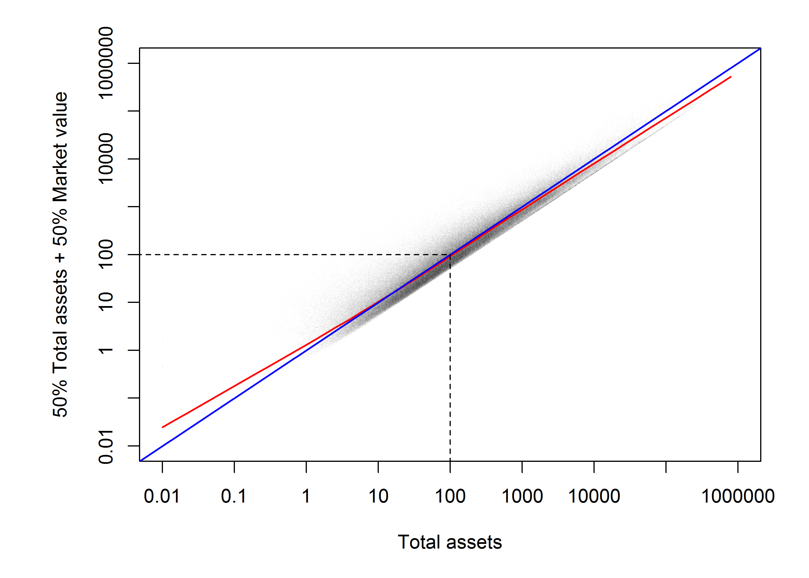

Use splines
========================================================

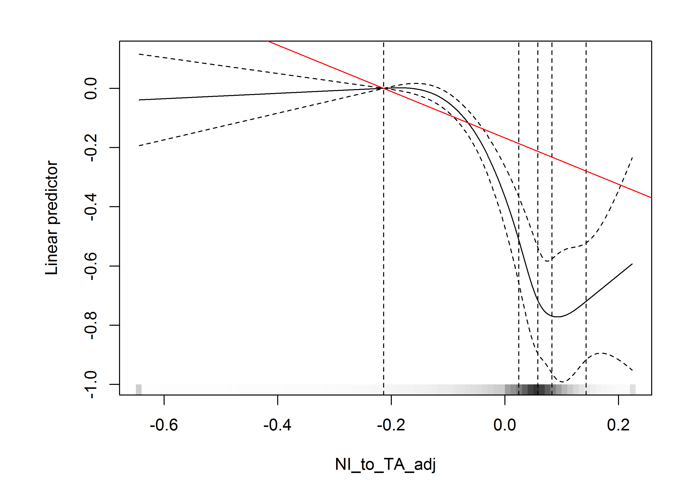

Use splines
========================================================

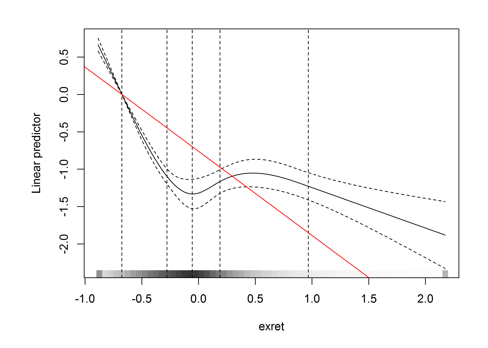

Use splines
========================================================

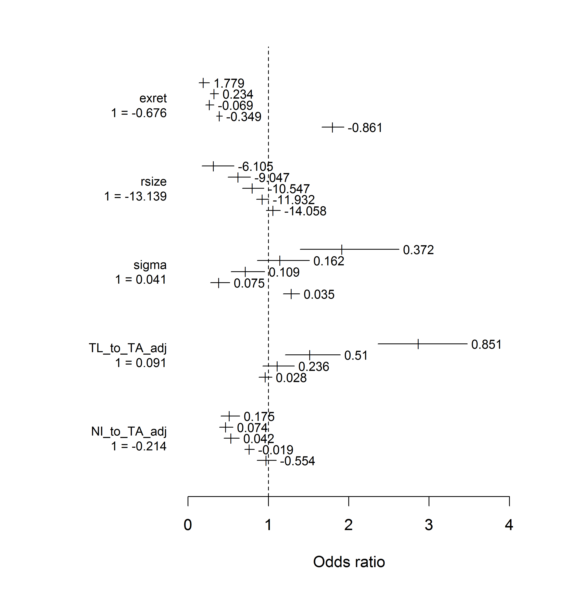

Performance
========================================================
transition: none

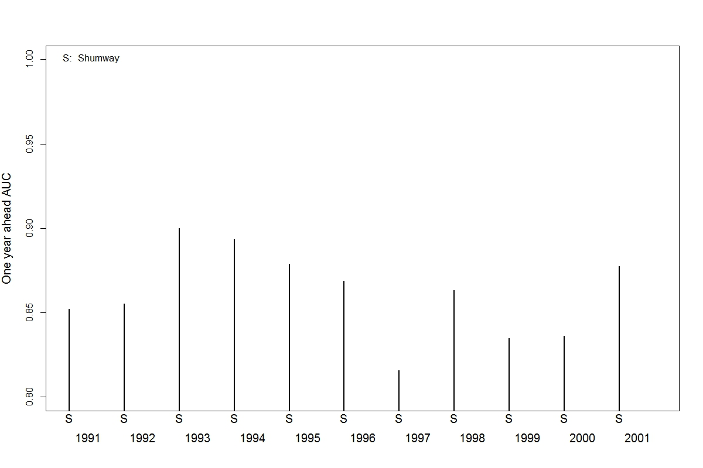

Performance
========================================================
transition: none

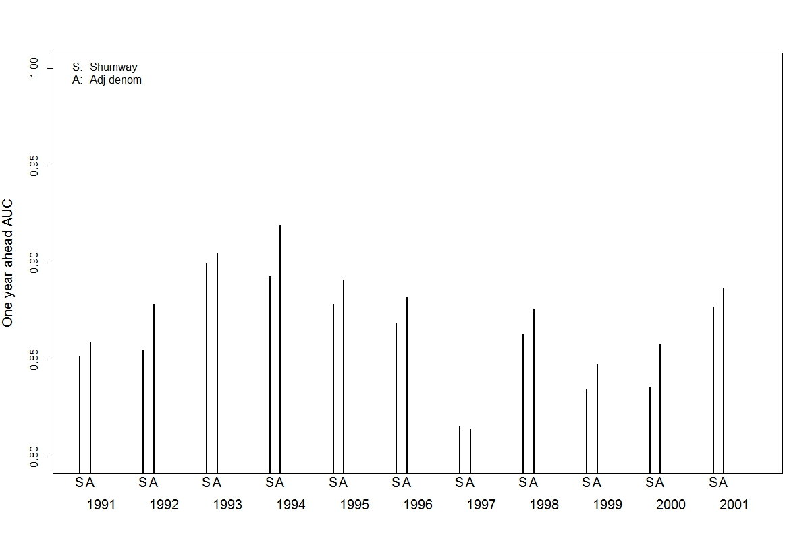

Performance
========================================================
transition: none

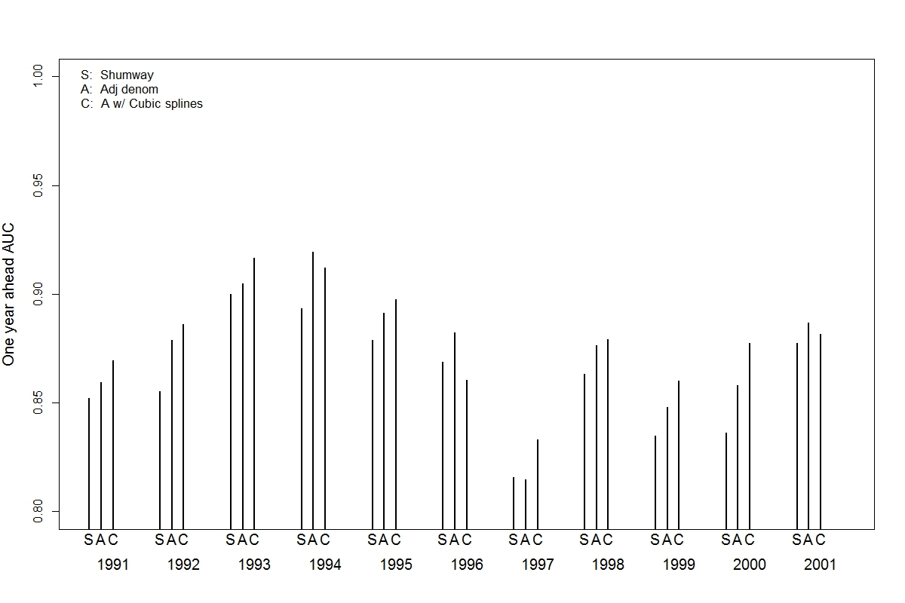

Performance
========================================================
transition: none

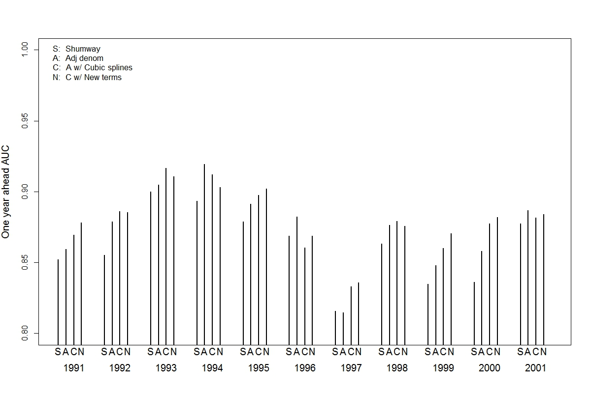

Performance
========================================================
transition: none

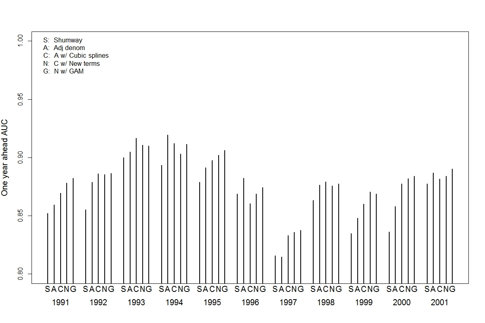

<small> `mgcv` package described in Wood (2006) </small>

Time-varying
========================================================

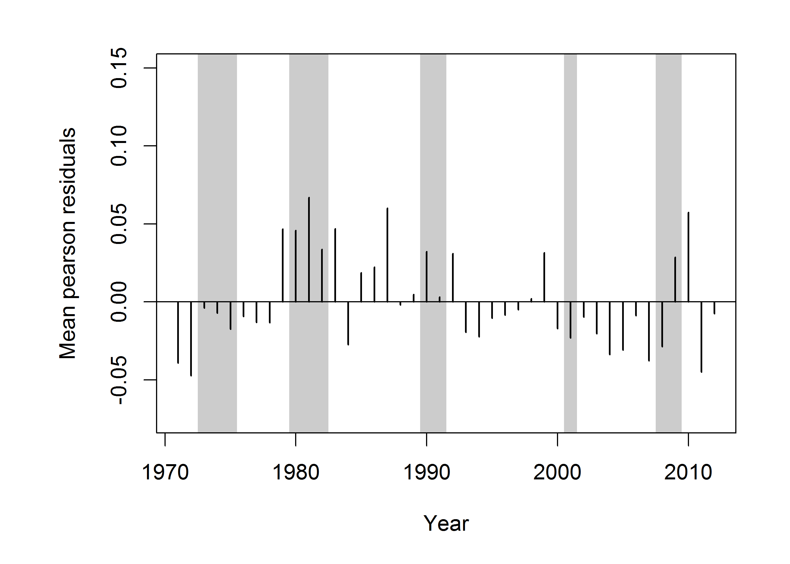

<!-- From Agresti: 
  When the model holds, Pearson and deviance residuals are less variable than standard normal because they compare y¡ to   the fitted mean, rather than the true mean ... 
  As explained in Section 4.5.6,  these and the [Pearson] resdiauls are  less  variable  than  N(0,1) 
  
  I guess there is some caveat though when logistic regression with n = 1 ...
-->
 
Time-varying
========================================================

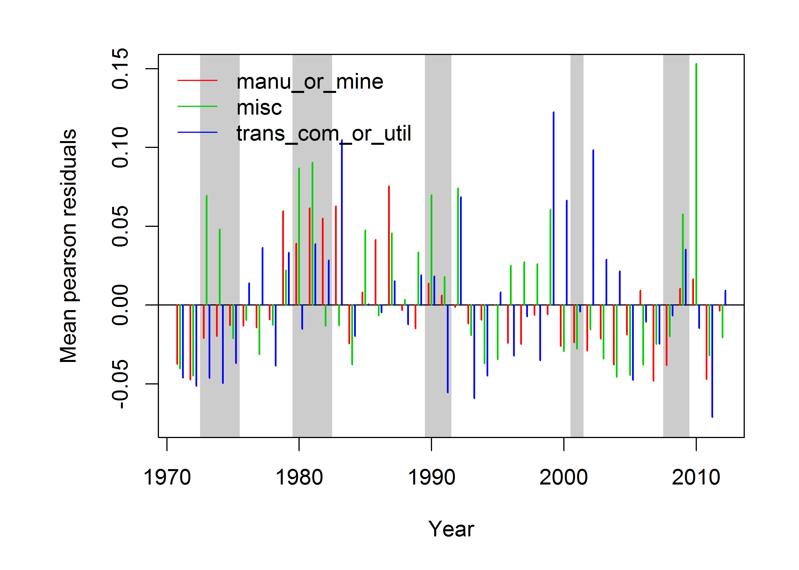

<small> Chava and Jarrow (2004) </small>

Time-varying
========================================================

Additive Hazards Models
<small> Lando, Medhat, Nielsen, and Nielsen (2013) using `timereg` package described in Martinussen and Scheike (2007)</small> 

Semiparametric Cox Model
<small> Grambsch and Therneau (1994) scaled schoenfeld residuals</small> 

ddhazard demo
========================================================
incremental: true

Dynamic discrete logistic regression: 

- Discrete random walk 
- State space model 
- `C++` & Parallel
- On CRAN*: `dynamichazard`

<small> * The Comprehensive R Archive Network </small>

Future work
========================================================
incremental: true

- Dynamic regression models
- Ensamble methods   <small style="margin-top: -10px;">E.g. Zikeba, Tomczak, and Tomczak (2016)</small>
- English data set 

References
========================================================

<small> 
[1] J. Y. Campbell, J. Hilscher and J. Szilagyi. "In search of
distress risk". In: _The Journal of Finance_ 63.6 (2008), pp.
2899-2939.

[2] S. Chava and R. A. Jarrow. "Bankruptcy prediction with
industry effects". In: _Review of Finance_ 8.4 (2004), pp.
537-569.

[3] P. M. Grambsch and T. M. Therneau. "Proportional hazards tests
and diagnostics based on weighted residuals". In: _Biometrika_
(1994), pp. 515-526.

[4] D. Lando, M. Medhat, M. S. Nielsen, et al. "Additive intensity
regression models in corporate default analysis". In: _Journal of
Financial Econometrics_ 11.3 (2013), pp. 443-485.

[5] T. Martinussen and T. H. Scheike. _Dynamic regression models
for survival data_. Springer Science \& Business Media, 2007.

[6] T. Shumway. "Forecasting bankruptcy more accurately: A simple
hazard model*". In: _The Journal of Business_ 74.1 (2001), pp.
101-124.

[7] S. Wood. _Generalized additive models: an introduction with
R_. CRC press, 2006.

[8] M. Zikeba, S. K. Tomczak and J. M. Tomczak. "Ensemble boosted
trees with synthetic features generation in application to
bankruptcy prediction". In: _Expert Systems with Applications_ 58
(2016), pp. 93-101.

</small>
