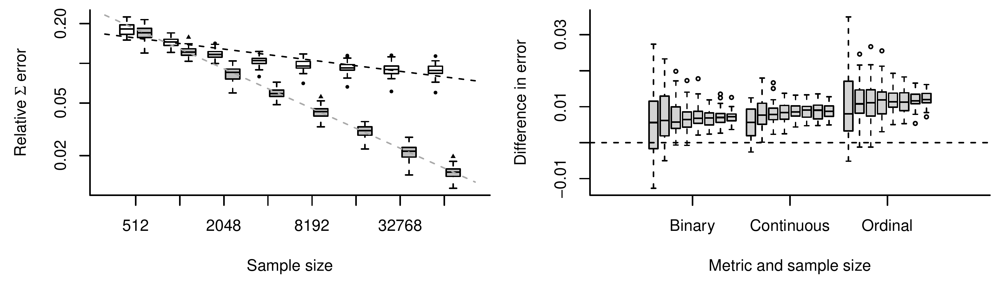
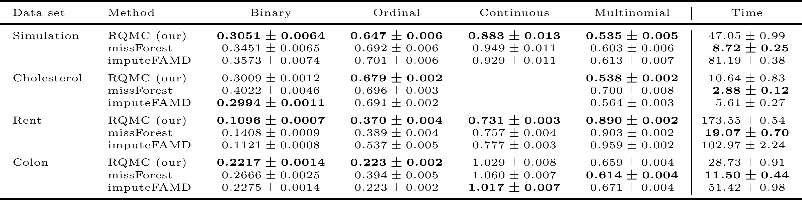

## dummy slide

```{r setup, include=FALSE}
knitr::opts_chunk$set(echo = FALSE, fig.height = 5, cache.path = "cache/", 
                      message = FALSE, error = FALSE, warning = FALSE)
.par_use <- list(cex = 1.33, cex.lab = 1.2)
options(digits = 3, knitr.kable.NA = '')
```

<!--html_preserve-->
<script>
(function() {
  document.getElementById("dummy-slide").remove(); 
  
  var front_div = document.getElementsByTagName("section")[0];
  front_div.classList.add("front");
  front_div.classList.add("center");
  
  // conference/where this is at
  var where_at = document.createElement("p");
  var where_at_text = document.createElement("i");
  var node = document.createTextNode("ACML 2021");
  where_at_text.appendChild(node);
  where_at.appendChild(where_at_text);
  where_at.style.margin = "0.1em";
  where_at.style.fontSize = "75%";
  front_div.appendChild(where_at);
  
  // add author 
  var credit_div = document.createElement('div');
  credit_div.innerHTML += "<div class='w-small'><p>Benjamin Christoffersen, Mark Clements, Keith Humphreys, and Hedvig Kjellström</p><p class='smallish'>KI, Department of Medical Epidemiology and Biostatistics, <a href='mailto:benjamin.christoffersen@ki.se'>benjamin.christoffersen@ki.se</a></p><p class='smallish'>KTH, Division of Robotics, Perception and Learning, <a href='mailto:benchr@kth.se'>benchr@kth.se</a></p></div>";
  credit_div.classList.add("authors");
  front_div.appendChild(credit_div);
})();
</script>
<!--end dummy slide-->

</section>

<section>
<section class="large-first center slide level2">
<h1>Motivation & Method</h1>
<!--/html_preserve-->

<div style="display: none;">
$$
\renewcommand\vec{\boldsymbol}
\def\bigO#1{\mathcal{O}(#1)}
\def\Cond#1#2{\left(#1\,\middle|\, #2\right)}
\def\mat#1{\boldsymbol{#1}}
\def\der{{\mathop{}\!\mathrm{d}}}
\def\argmax{\text{arg}\,\text{max}}
\def\Prob{\text{P}}
\def\Expec{\text{E}}
\def\logit{\text{logit}}
\def\diag{\text{diag}}
$$
</div>

## Previous Work

<div class = "w-small">
Missing values of mixed data types is a common problem. 
<p class = "smallish">
Multinomial, ordinal, binary, and continuous. Examples: surveys and 
medical records.</p>
</div>

<div class = "fragment w-small">
Copula models can be used for imputation and have flexible
marginal distributions. 
<p class = "smallish">
Mostly assumptions about the dependence between variables. 
</p></div>

<div class = "fragment w-small">
Gaussian copula models have been suggested for imputation
<p class = "smallish">
with an approximate expectation maximization (AEM) algorithm 
[@zhao20;@zhao20Mat].</p></div>

<p class = "fragment">
Fast but may be biased and inefficient.</p>

</section>
<section class="center-horiz" data-transition="slide-in slide-out">
<h2>Example of a Gaussian Copula</h2>

```{r copula_illustration, cache = 1, fig.width=15, fig.keep='last'}
library(mvtnorm)
library(sn)
p_mix <- function(x)
  .1 * pnorm(x, -3, .5) + .6 * pnorm(x, -.5) +
  .3 * pst(x, xi = 1.5, alpha = 8, nu = 3)
q_mix <- local({
  eps <- 1e-7
  us <- seq(eps, 1 - eps, length.out = 100000)

  cdfs <- sapply(us, function(u) uniroot(function(x) p_mix(x) - u,
                                         c(-10000, 10000))$root)

  approxfun(us, cdfs, yleft = -Inf, yright = Inf)
})

cor <- .85
lims <- c(.2, .7)

par(mfcol = c(1, 3), xaxt = "n", yaxt = "n", bty = "n",
    xaxs = "i", yaxs = "i", mar = c(3.5, 3.5, .5, .5), mgp = c(1, 1, 0), 
    cex = 1.2)

# draw the contours
local({
  sig <- diag(2)
  sig[1, 2] <- sig[2, 1] <- cor

  n_points <- 200
  xy <- cbind(sin(seq(0, 2 * pi, length.out = n_points)),
              cos(seq(0, 2 * pi, length.out = n_points)))

  ev <- eigen(sig)
  xy[, 1] <- xy[, 1] * 1
  xy[, 2] <- xy[, 2] * sqrt(min(ev$values) / max(ev$values))

  phi <- atan(ev$vectors[2, 1] / ev$vectors[1, 1])
  R <- matrix(c(cos(phi), sin(phi), -sin(phi), cos(phi)), 2)
  xy <- tcrossprod(R, xy)

  qs <- c(.05, .4, .8, .95)
  chi_vals <- qchisq(qs, df = 2) * max(ev$values)

  lim <- 3.5
  plot(c(-lim, lim), c(-lim, lim), type = "n", xlab = expression(z[1]),
       ylab = expression(z[2]))
  for(r in sqrt(chi_vals))
    lines(r * xy[1, ], r * xy[2, ], lty = 1)

 text(sqrt(chi_vals) * max(xy[1, ]), sqrt(chi_vals) * max(xy[2, ]) + .15,
      adj = 0, paste0(qs * 100, "%"), cex = .8)

  abline(v = qnorm(lims), lty = 3)

  deltas <- c(-lim, qnorm(lims), lim)
  text((deltas[-1] + head(deltas, -1)) / 2, c(3, 3, 3),
       labels = c("A", "B", "C"), adj = 0.5)
})

set.seed(1)
rngs <- rmvnorm(10000000, sigma = matrix(c(1, cor, cor, 1), 2))
cat_first <- cut(rngs[, 1], breaks = c(-Inf, qnorm(lims), Inf))
con_two <- q_mix(pnorm(rngs[, 2]))

dens <- tapply(rngs[, 2], cat_first, density, n = 5000)
plot(c(-5, 5), xlab = expression(z[2]), 
      ylab = "Conditional density",
     range(sapply(dens, `[[`, "y")), type = "n")
for(i in seq_along(dens))
  with(dens[[i]], lines(x, y, lty = i))
legend("topright", bty = "n", legend = LETTERS[1:3], lty = 1:3)

dens <- lapply(1:3, function(i)
  density(con_two[as.integer(cat_first) == i], n = 5000))
plot(c(-6, 10), xlab = expression(x[2]), ylab = "Conditional density",
     range(sapply(dens, `[[`, "y")), type = "n")
for(i in seq_along(dens))
  with(dens[[i]], lines(x, y, lty = i))
legend("topright", bty = "n", legend = LETTERS[1:3], lty = 1:3)

rm(list = ls())
```

<div style="width:100%; text-align: left;">
<p class = "smallish">
Latent $Z_1,Z_2$ are joint normal distributed. We observe $X_2 = f(Z_2)$ and 
$X_1 \in\{A,B,C\}$. The illustration is contours of possible conditional 
densities of the continuous variable on the latent and observed scale.</p>
</div>

## Contributions

<div class = "w-small">
An efficient importance sampler to estimate the model and impute the missing 
variables.
<p class = "smallish">
An extension of @Genz02.</p>
</div>

<div class = "fragment w-small">
Added support for multinomial variables 
<p class = "smallish">
in addition the existing binary, ordinal, and continuous variables.
</p></div>


<!--html_preserve-->
</section>
<!-- need extra end tag before next section -->
</section>


<section>
<section class="large-first center slide level2">
<h1>Experimental Results</h1>
<!--/html_preserve-->

</section>
<section class="center-horiz" data-transition="slide-in slide-out">
<h2>Comparison with the AEM Algorithm</h2>



<div style="width:100%; text-align: left;">
<p class = "smallish">
Simulation study comparing our method with the AEM algorithm. 
Left: relative error
of the estimated correlation matrix versus the sample size 
(gray: our method; white: the AEM algorithm).
Right: differences in imputation error between our method and the AEM
algorithm for each data type versus the sample size.</p>
</div>

</section>
<section class="center-horiz" data-transition="slide-in fade-out">
<h2>With Multinomial Variables</h2>

 

<div style="width:100%; text-align: left;">
<p class = "smallish">
Average imputation error and computation time with simulated and 
observational data sets. We compare with the random forest based
missForest [@Stekhoven12] and the PCA-like imputeFAMD 
[@Audigier14;@Josse16].</p>
</div>

</section>
<section class="center-horiz" data-transition="fade-in fade-out">
<h2>With Multinomial Variables</h2>

 

<div style="width:100%; text-align: left;">
<p class = "smallish">
Average imputation error and computation time with simulated and 
observational data sets. We compare with the random forest based
missForest [@Stekhoven12] and the PCA-like imputeFAMD 
[@Audigier14;@Josse16].</p>
</div>

</section>
<section class="center-horiz" data-transition="fade-in slide-out">
<h2>With Multinomial Variables</h2>

 

<div style="width:100%; text-align: left;">
<p class = "smallish">
Average imputation error and computation time with simulated and 
observational data sets. We compare with the random forest based
missForest [@Stekhoven12] and the PCA-like imputeFAMD 
[@Audigier14;@Josse16].</p>
</div>


<!--html_preserve-->
</section>
<!-- need extra end tag before next section -->
</section>


<section>
<section class="center final">
<h1>Thank You!</h1>

<div class="w-small">
<p class="smallish">The mdgc package is on CRAN and at 
<a href="https://github.com/boennecd/mdgc">github.com/boennecd/mdgc</a>.</p>
<p class="smallish">The presentation is at
<a href="https://rpubs.com/boennecd/mdgc-ACML">rpubs.com/boennecd/mdgc-ACML</a>.</p>
<p class="smallish">The markdown is at
<a href="https://github.com/boennecd/Talks">github.com/boennecd/Talks</a>.</p>
<p class="smallish">References are on the next slide.</p>
</div>

</section>
<!-- need extra end tag before next section -->
</section>

<section>
<h1>References</h1>

<!--/html_preserve-->
