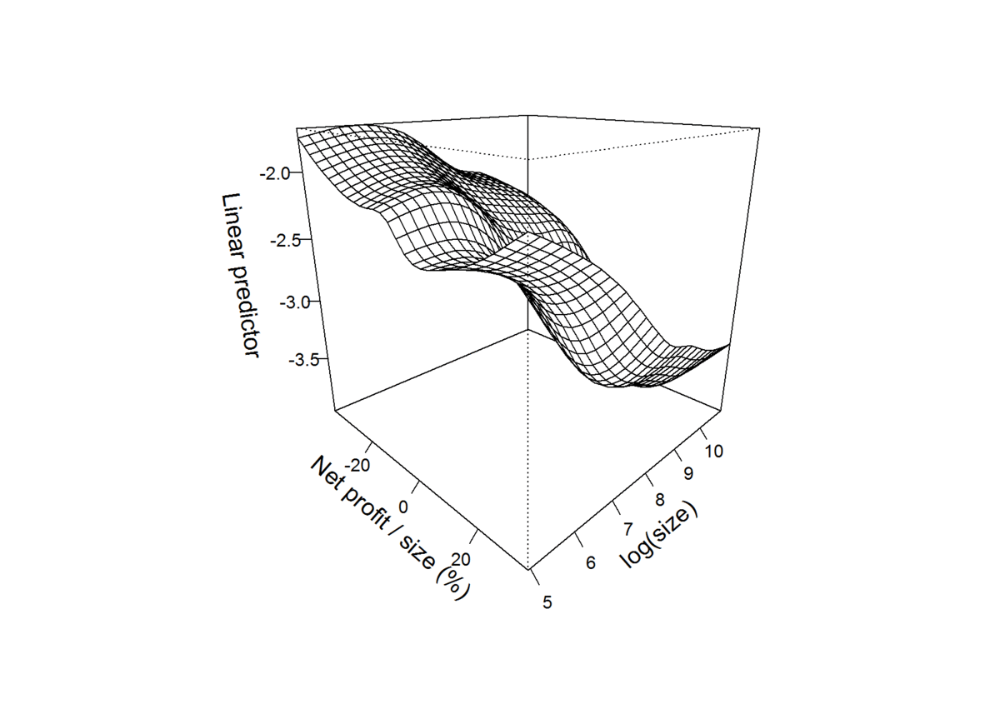
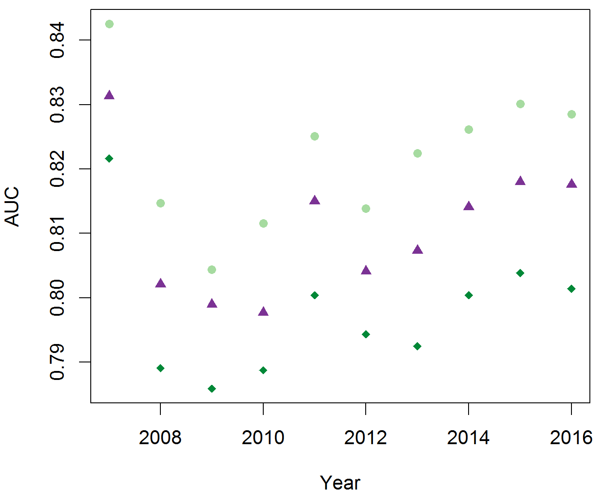
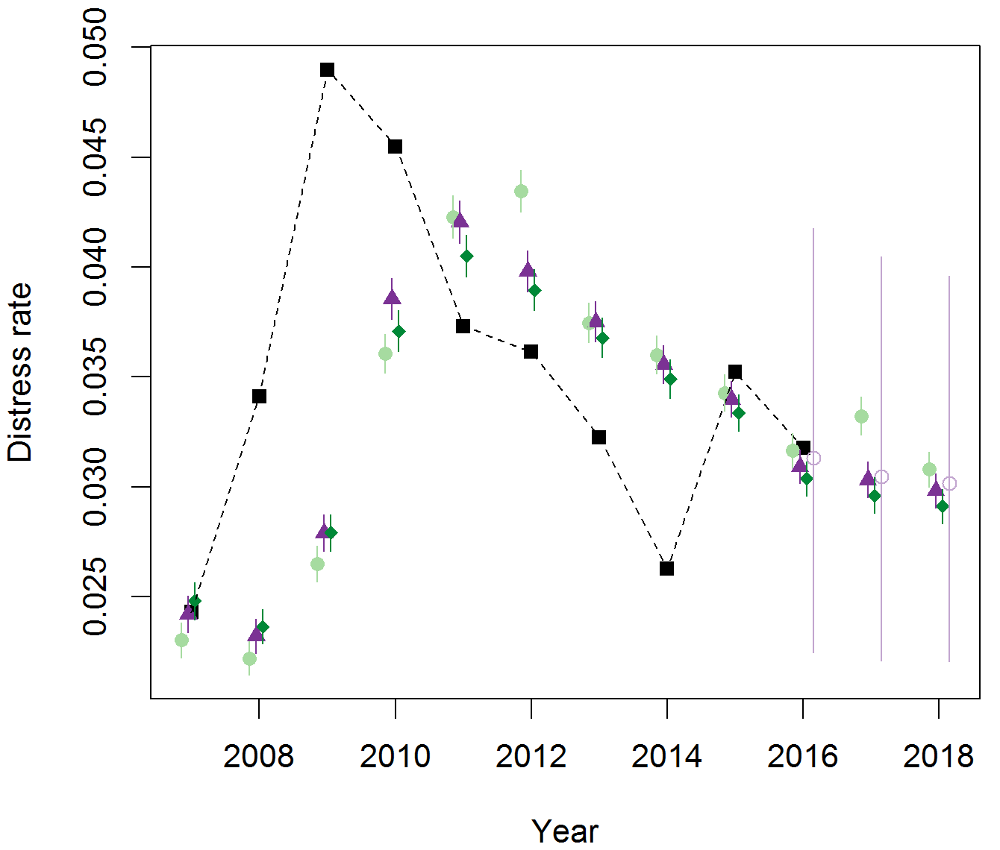
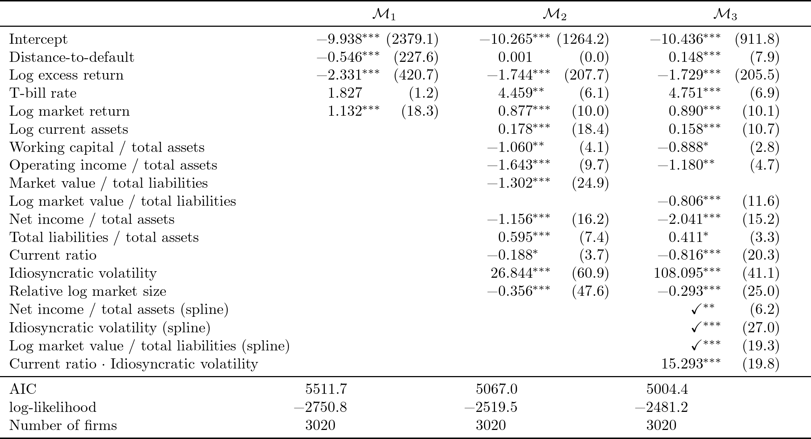
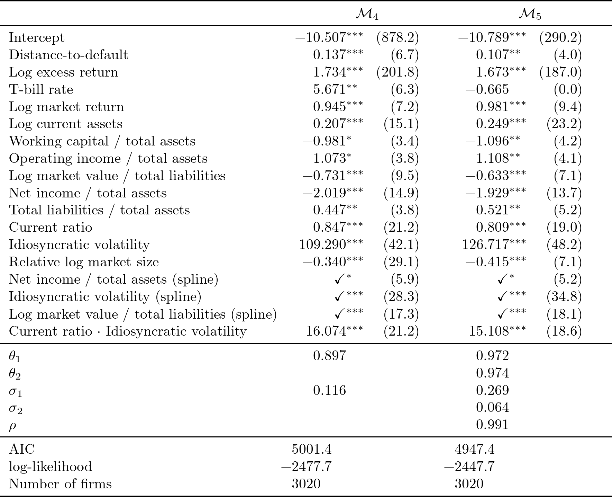
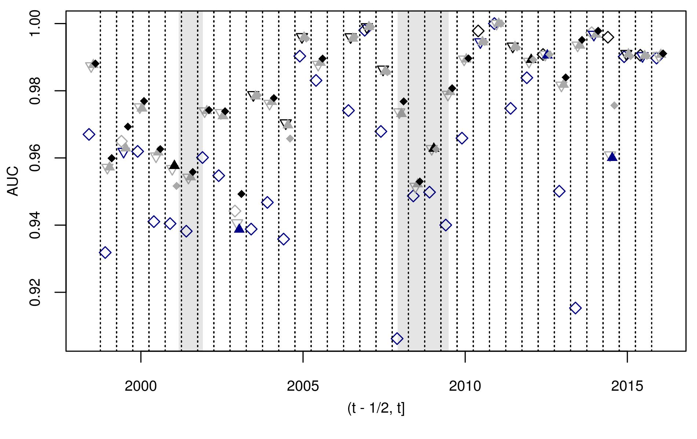
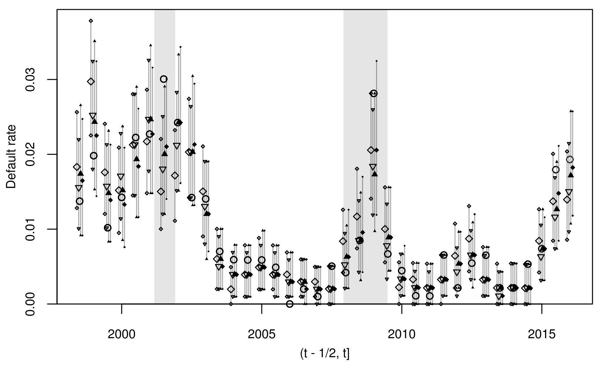

```{r setup, include=FALSE}
knitr::opts_chunk$set(echo = TRUE)
```

## dummy slide

<!--html_preserve-->
<script>
(function() {
  document.getElementById("dummy-slide").remove(); 
  
  var front_div = document.getElementsByTagName("section")[0];
  front_div.classList.add("front");
  front_div.classList.add("center");
  
  // add author 
  var credit_div = document.createElement('div');
  credit_div.innerHTML += "<div class='w-small'><p>Benjamin Christoffersen</p><p class='smallish'>Copenhagen Business School, Department of Finance, Center for Statistics, <a href='mailto:bch.fi@cbs.dk'>bch.fi@cbs.dk</p></div>";
  credit_div.classList.add("authors");
  front_div.appendChild(credit_div);
})();
</script>
<!--end dummy slide-->

</section>

<section>
<section class="large-first center slide level2">
<h1>Why?</h1>

<!--/html_preserve-->

<div style="display: none;">
$$
\definecolor{gray}{RGB}{192,192,192}
\def\vect#1{\boldsymbol #1}
\def\bigO#1{\mathcal{O}(#1)}
\def\Cond#1#2{\left(#1 \mid #2\right)}
\def\diff{{\mathop{}\!\mathrm{d}}}
$$
</div>

<!-- there is a end tag from the previous slide -->
<!-- </section> -->

## Motivation

<div class="w-small">
Want to model loss distribution for a corporate debt portfolio. 
<p class="smallish">E.g., a bank that provides loans to firms.
</p></div>

<p class="fragment">
Important for both regulators and holders of the portfolio.</p>

<div class="w-small fragment">
Will focus on whether the lenders default. 
<p class="smallish">A component in bottom-up models.
</p></div>

## Motivation: Concrete

The portfolio consists of $n_t$ loans to firms 
$R_t = \{i_{1t}, i_{2t}, \dots i_{n_{t}t}\}$. 

<div class="w-small fragment">
The exposure to each firm in interval $t$ is $E_{it}\in(0,\infty)$. 
<p class="smallish">E.g., the current amount outstanding.
</p></div>

<p class="fragment">
The default indicator $Y_{it}\in \{0,1\}$ is 1 if firm $i$ defaults in 
interval $t$.<p>

<div class="w-small fragment">
If the firm defaults then $G_{it}\in [0,1]$ fraction of $E_{it}$ is lost. 
<p class="smallish">That is, $G_{it}E_{it}$ is lost.
</p></div>

## Motivation: Concrete  {data-transition="slide-in fade-out"}

The loss in interval $t$ is

<div class="w-small">
$$L_t = \sum_{i \in R_t}E_{it}G_{it}Y_{it}$$
<p class="smallish">$E_{it}\in(0,\infty)$: exposure, $G_{it}\in [0,1]$
loss-given-default, and $Y_{it}\in \{0,1\}$ is the default indicator.
</p></div>

## Motivation: Concrete  {data-transition="fade-in slide-out"}

The loss in interval $t$ is

<div class="w-small">
$$L_t = \sum_{i \in R_t}\color{gray}{E_{it}G_{it}}Y_{it}$$
<p class="smallish"><span class="gray">$E_{it}\in(0,\infty)$: exposure, $G_{it}\in [0,1]$
loss-given-default, and</span> $Y_{it}\in \{0,1\}$ is the default indicator.
</p></div>

Focus on default indicators. 

<div class="w-small fragment">
Need accurate joint model of $Y_{it}$ for $i\in R_t$.
<p class="smallish">Particularly to model the tail of $L_t$.
</p></div>


<!--html_preserve-->
</section>
<!-- need extra end tag before next section -->
</section>


<section>
<section class="large-first center slide level2">
<h1>Contributions</h1>
<!--/html_preserve-->

## Typical Model 
<p>Given firm variables $\vec x_{it}$ 
and macro variables $\vec m_t$<span class="fragment" data-fragment-index="1">
one models the probability of default as</span></p>

<div class="fragment" data-fragment-index="1">
$$g(P(Y_{it} = 1 \mid \vec x_{it}, \vec m_t)) = 
  \vec \beta^\top \vec x_{it} + \vec\gamma^\top\vec m_t $$

<div class="w-small">
where $g$ is a link function
<p class="smallish">e.g., logit function. See e.g., @Shumway01, @Chava04, 
@Duffie07, and @Campbell08.
</p></div></div>

<p class="fragment" data-fragment-index="2">
I.e., firms are only correlated through observable firm variables and 
macro variables.</p>

## Add Random Effects
<div class="w-small">
May observe excess clustering of defaults. 
<p class="smallish">E.g., an omitted macro variable.
</p></div>

<div class="fragment">
Thus, the model is extended to 

<div class="w-small">
$$\begin{aligned}
g(P(Y_{it} = 1 \mid \vec x_{it}, \vec m_t, \alpha_t)) &= 
  \vec \beta^\top \vec x_{it} + \vec\gamma^\top\vec m_t + \alpha_t \\
  \alpha_t &= \theta \alpha_{t-1} + \epsilon_t \\ 
  \epsilon_t & \sim N(0, \sigma^2)
\end{aligned}$$
<p class="smallish">See e.g., @Duffie09, @Chen14, and @Qi14. @Koopman11, 
@Koopman12, and @Schwaab16 use a similar model with group specific 
$\alpha_t$s or where groups load differently on $\alpha_t$. 
</p></div>
</div>

## Contributions
<div class="w-small">
Linearity and additivity are not obvious. 
<p class="smallish">Though, we may expect a monotone partial effect.
</p></div>

$$g(P(Y_{it} = 1 \mid \vec x_{it}, \vec m_t,\alpha_t)) = 
  \underbrace{\vec \beta^\top \vec f(\vec x_{it})}_? + \vec\gamma^\top\vec m_t + \alpha_t$$

<div class="w-small fragment">
Some suggestions that the assumptions are violated. 
<p class="smallish">@Min05, @Berg07, @Alfaro08, @Kim10, and @Jones17.
</p></div>

<p class="fragment">
Relax assumptions and focus on the firm-level and aggregate performance.</p>

## Contributions
<div class="w-small">
Assumption of constant coefficients may be violated.
<p class="smallish">See e.g., @David13, @Filipe16, and @Jensen17. 
</p></div>

$$g(P(Y_{it} = 1 \mid \vec x_{it}, \vec m_t, \alpha_t)) = 
  \underbrace{\vec \beta^\top_t}_? \vec f(\vec x_{it}) + \vec\gamma^\top\vec m_t + \alpha_t$$

<p class="fragment">
Relax assumptions with a model that can be directly used for forecasting.</p>

<!--html_preserve-->
</section>
<!-- need extra end tag before next section -->
</section>


<section>
<section class = "center">
<h1>Chapters</h1>

<div class="w-small">
dynamichazard: Dynamic Hazard Models using State Space Models
<p class="smallish">
Implementations of fast approximation methods to estimate discrete time 
survival models.
</p></div>

<div class="w-small fragment">
Can Machine Learning Models Capture Correlations in Corporate Distresses?
<p class="smallish">
Focus on non-linear effects with tall and narrow sample of limited liability 
companies.
</p></div>

<div class="w-small fragment">
Modeling Frailty Correlated Defaults with Multivariate Latent Factors
<p class="smallish">
Focus on time-varying effects with short and wide sample of US public companies.
</p></div>

</section>
</section>

<section>
<section class="center">

<h1>Chapter 1<br>
<div class="chapter">
dynamichazard: Dynamic Hazard Models using State Space Models
</div></h1>
<div style="height: 5.5em;"></div>

<!--/html_preserve-->

## R Packages

One of six open source R packages I have authored or co-authored: 
**dynamichazard**, **pre**, **mssm**, **rollRegres**, **parglm**, and **DtD**.

<p class="fragment">
Covers implementations of fast approximation methods to estimate discrete time 
survival models.</p>

## Alternatives

Interested in 

$$P(Y_{it} = 1 \mid \vec x_{it}, Y_{i1} = \cdots = Y_{it-1} = 0)
 = h_t(\vec x_{it})$$

<!--html_preserve-->
<div class="sline fragment">
  <div class="srow">
    <div class="tcell">
      <div style="float: left;  text-align: left">Diagnosis (Time zero)</div>
      <div style="float: right;  text-align: right">End of followup</div>
    </div>
    <div class="tcell"></div>
  </div>
  <div class="srow" style="height: .5em;">
    <div class="sobs" style="width: 75%;"></div>
    <div class="snobs" style="width: 25%;"></div>
  </div>
</div>
<!--/html_preserve-->

<p class="fragment">Can use non-parametric method.</p>

<!--html_preserve-->
<div class="sline fragment">
  <div class="srow">
    <div class="tcell">
      <div style="float: left;  text-align: left">First cross-section (Time zero)</div>
      <div style="float: right;  text-align: right">Now</div>
    </div>
    <div class="tcell">Period of interest</div>
  </div>
  <div class="srow" style="height: .5em;">
    <div class="sobs" style="width: 75%;"></div>
    <div class="snobs" style="width: 25%;"></div>
  </div>
</div>
<!--/html_preserve-->

<p class="fragment">Use parametric model for $h_t$.</p>

## State-Space Model

$$\begin{aligned}
g(P(Y_{it} = 1 \mid \vec x_{it}, \vec m_t, \vec u_{it}, \vec\alpha_t)) &= 
  \vec \beta^\top \vec x_{it} + \vec\gamma^\top\vec m_t + \vec\alpha_t^\top \vec u_{it} \\
  \vec\alpha_t &= F \vec\alpha_{t-1} + \vec\epsilon_t \\ 
  \vec\epsilon_t & \sim N(\vec 0, \Sigma)
\end{aligned}$$

Yields intractable integral. 

## Approximations

<div class="w-small">
Contains implementations of extended Kalman filters and an unscented Kalman filter.
<p class="smallish">The former is suggested by @Fahrmeir92 and @Fahrmeir94
and for the latter see e.g., @Julier97 and @Wan00. 
</p></div>

<p class="fragment">
The approximations are commonly used in engineering.</p>

<p class="fragment">
The implementations are in C++, very fast, and support parallel computing.</p>

## Monte Carlo Methods
The package also support 

 - some of the particle filters suggested by @Pitt99 and @Lin05. 
 - the particle smoothers suggested by @Briers2009 and @Fearnhead10.  
 - approximations methods suggested by @Cappe05 and @Poyiadjis11.
 
<p class="fragment">The **mssm** contains a new implementation of some of the 
above methods.</p>

<!--html_preserve-->
</section>
</section>


<section>
<section class="center">
<h1>Chapter 2<br>
<div class="chapter">
Can Machine Learning Models Capture Correlations in Corporate Distresses?
</div></h1>
<div style="height: 5.5em;">
<div class="w-small">
Rastin Matin 
<p class="smallish">Danmarks Nationalbank</p></div>

<div class="w-small">
Pia Mølgaard
<p class="smallish">Danmarks Nationalbank</p></div>
</div>

<!--/html_preserve-->

## Motivation

Recent papers suggest that "machine learning" models perform better on the 
firm-level. 

<p class="fragment">Suggests that previous model may be misspecified.</p>

<div class="w-small fragment">
Maybe some of the evidence of random effects is due to invalid assumptions of 
partial associations. 
<p class="smallish">
E.g., due to co-movements in covariates.
</p></div>

## Findings 
Find better firm-level performance with more complex models.

<p class="fragment">
Smaller difference in firm-level performance.</p>

<p class="fragment">
Suggest a model to easily account non-linear effects and 
with time-varying effects.</p>

## Sample

Danish limited liability companies. 

<p class="fragment">Tall sample: 198&thinsp;929 firms.</p>

<div class="w-small fragment">
Narrow sample: 14 years with annual time periods.
<p class="smallish">
Limits ability to model changes through time.
</p></div>

## Models 
<div class="w-small">
Generalized linear model.
<p class="smallish">
Assumptions: linearity, additivity, and conditional independence.
</p></div>

<div class="w-small fragment">
Generalized additive model.
<p class="smallish">
Assumptions: conditional independence.
</p></div>

<div class="w-small fragment">
Gradient boosted tree model.
<p class="smallish">
Assumptions: conditional independence.
</p></div>

<div class="w-small fragment">
Generalized linear mixed model with splines.
<p class="smallish">
Assumptions: conditional independence given the random effect.
</p></div>

<!--html_preserve-->
</section>
<section class="center-horiz" data-transition="fade-out">
<h2>Example of Partial Effects</h2>

<!--/html_preserve-->

<p class="smallish" style="text-align: left;">
Estimated partial effect in the generalized additive model 
of log of the size and net profit to 
a size measure of the firm.</p>

<!--html_preserve-->
</section>
<section class="center-horiz">
<h2>Firm-Level Performance (AUC)</h2>
<!--/html_preserve-->



<p class="smallish" style="text-align: left">
<span class="larger" style="color: rgb(0,136,55);">◆</span>: Generalized linear model, 
<span style="color: rgb(123,50,148);">▲</span>: Generalized additive model, 
and <span style="color: rgb(166,219,60);">●</span>: Gradient boosted tree model.
</p>

<!--html_preserve-->
</section>
<section class="center-horiz">
<h2>Aggregate Performance (Distress Rate)</h2>
<!--/html_preserve-->


<p class="smallish" style="text-align: left">
<span class="larger" style="color: rgb(0,136,55)">◆</span>: Generalized linear model, 
<span style="color: rgb(123,50,148); font-size:120%;">▲</span>: Generalized additive model, 
<span style="color: rgb(166,219,60);">●</span>: Gradient boosted tree model,
<span class="larger">■</span>: realized rate,
and <span style="color: rgb(194,165,207);">○</span>: Generalized linear mixed model.
Bars are 90 pct. prediction intervals.
</p>

<!--html_preserve-->
</section>
</section>


<section>
<section class="center">
<h1>Chapter 3<br>
<div class="chapter">
Modeling Frailty Correlated Defaults with Multivariate Latent Factors
</div></h1>
<div style="height: 5.5em;">
<div class="w-small">
Rastin Matin 
<p class="smallish">Danmarks Nationalbank</p></div>
</div>

<!--/html_preserve-->

## Motivation

<div class="w-small">
Add variables to model in @Duffie07 and @Duffie09. 
<p class="smallish">
Due to evidence provided by @Lando10. 
</p></div>

<p class="fragment">Relax linearity and additivity.</p>

<div class="w-small fragment">
Add additional random effects in a model that can directly be 
used for forecasting. 
<p class="smallish">
Due to evidence provided by e.g., @David13. 
</p></div>

## Findings
<div class="w-small">
Non-linear effect for
<p class="smallish">
the idiosyncratic stock volatility of the firm, the net income over total assets, and log market value over total liabilities.
</p></div>

<div class="w-small fragment">
Weaker evidence of random baseline in the model
<p class="smallish">
with additional variables and non-linear effects.
</p></div>

<p class="fragment">
Time-varying relative market size effect.</p>

## Sample
US public firms. 

<p class="fragment">Short sample: 3&thinsp;020 firms.</p>

<p class="fragment">Wide sample: 1980 to 2016 with monthly time intervals.</p>

<!--html_preserve-->
</section>
<section class="center-horiz" data-transition="fade-out">
<h2>Estimates without Random Effects</h2>

<!--/html_preserve-->

<p class="smallish" style="text-align: left;">The figures in the parentheses are Wald $\chi^2$ 
statistics. $\mathcal{M_1}$: model similar to @Duffie07, 
$\mathcal{M_2}$: model with additional variables, and 
$\mathcal{M_3}$: model with non-linear effects and an interaction.</p>

<!--html_preserve-->
</section>
<section class="center-horiz slide level2" data-transition="fade-in">
<h2>Estimates without Random Effects</h2>

<!--/html_preserve-->

<div class="w-small" style="text-align: left;">
<p>Large difference in log-likelihood.</p>
<p class="smallish">Similar to evidence by @Lando10 and @Bharath08.</p>

## Adding Time-Varying Coefficient {data-transition="slide-in fade-out"}

$$\begin{aligned}
\vec z_{it} &= (\vec x_{it}^\top, \vec m_t^\top, u_{it}, \alpha_t, b_t)^\top \\
g(P(Y_{it} = 1 \mid \vec z_{it})) &= 
  \vec \beta^\top \vec x_{it} + \vec\gamma^\top\vec m_t + \alpha_t + b_tu_{it} \\
  \begin{pmatrix}\alpha_t \\ b_t \end{pmatrix} &= 
    \begin{pmatrix}\theta_1 & 0 \\ 0 & \theta_2 \end{pmatrix} 
    \begin{pmatrix}\alpha_{t-1} \\ b_{t-1} \end{pmatrix} + \vec\epsilon_t \\ 
  \vec\epsilon_t & \sim N\left(\vec 0, \begin{pmatrix}
    \sigma_1^2 & \rho\sigma_1\sigma_2 \\
    \rho\sigma_1\sigma_2 & \sigma_2^2
  \end{pmatrix}\right)
\end{aligned}$$

## Adding Time-Varying Coefficient {data-transition="fade-in slide-out"}

$$\begin{aligned}
\color{gray}{\vec z_{it}} &
  \color{gray}= \color{gray}{(\vec x_{it}^\top, \vec m_t^\top, u_{it}, \alpha_t, b_t)^\top} \\
\color{gray}{g(P(Y_{it} = 1 \mid \vec z_{it}))} & \color{gray}= 
  \color{gray}{\vec \beta^\top \vec x_{it} + \vec\gamma^\top\vec m_t} + \alpha_t + b_tu_{it} \\
  \begin{pmatrix}\alpha_t \\ b_t \end{pmatrix} &= 
    \begin{pmatrix}\theta_1 & 0 \\ 0 & \theta_2 \end{pmatrix} 
    \begin{pmatrix}\alpha_{t-1} \\ b_{t-1} \end{pmatrix} + \vec\epsilon_t \\ 
  \vec\epsilon_t & \sim N\left(\vec 0, \begin{pmatrix}
    \sigma_1^2 & \rho\sigma_1\sigma_2 \\
    \rho\sigma_1\sigma_2 & \sigma_2^2
  \end{pmatrix}\right)
\end{aligned}$$

<!--html_preserve-->
</section>
<section class="center-horiz" data-transition="fade-out">
<h2>Estimates with Random Effects</h2>

<!--/html_preserve-->

<p class="smallish" style="text-align: left;">The figures in the parentheses are Wald $\chi^2$ 
statistics. $\mathcal{M_4}$: model with non-linear effects, an interaction, 
and a random intercept and $\mathcal{M_5}$: same as $\mathcal{M_4}$ with a 
random relative market size slope.</p>

<!--html_preserve-->
</section>
<section class="center-horiz"  data-transition="fade-in">
<h2>Estimates with Random Effects</h2>
<!--/html_preserve-->


<p class="smallish" style="text-align: left;">The figures in the parentheses are Wald $\chi^2$ 
statistics. $\mathcal{M_4}$: model with non-linear effects, an interaction, 
and a random intercept and $\mathcal{M_5}$: same as $\mathcal{M_4}$ with a 
random relative market size slope.</p>

<!--html_preserve-->
</section>
<section class="center-horiz" data-transition="slide-in fade-out">
<h2>Firm-Level Performance (AUC)</h2>
<!--/html_preserve-->



<p class="smallish" style="text-align: left;">
Blue: lowest, black: highest. 
◇: model as in @Duffie07, 
▽: + covariates and non-linear effects, 
▲: + random intercept, and
<span class="larger">◆</span>: + random size slope.
</p>

<!--html_preserve-->
</section>
<section class="center-horiz" data-transition="fade-in slide-out">
<h2>Firm-Level Performance (AUC)</h2>
<!--/html_preserve-->


<p class="smallish" style="text-align: left;">
Blue: lowest, black: highest. 
◇: model as in @Duffie07, 
▽: + covariates and non-linear effects, 
▲: + random intercept, and
<span class="larger">◆</span>: + random size slope.
</p>

<!--html_preserve-->
</section>
<section class="center-horiz" data-transition="slide-in fade-out">
<h2>Aggregate Performance (Default Rate)</h2>
<!--/html_preserve-->



<p class="smallish" style="text-align: left;">
Bars: 90% prediction interval. ○:  realized rate,
◇: model as in @Duffie07, 
▽: + covariates and non-linear effects, 
▲: + random intercept, and
<span class="larger">◆</span>: + random size slope.
</p>

<!--html_preserve-->
</section>
<section class="center-horiz" data-transition="fade-in slide-out">
<h2>Aggregate Performance (Default Rate)</h2>
<!--/html_preserve-->


<p class="smallish" style="text-align: left;">
Bars: 90% prediction interval. ○:  realized rate,
◇: model as in @Duffie07, 
▽: + covariates and non-linear effects, 
▲: + random intercept, and
<span class="larger">◆</span>: + random size slope.
</p>

<!--html_preserve-->
</section>
<!-- need extra end tag before next section -->
</section>


<section>
<section class="center final">
<h1>Thank You!</h1>

<div class="w-small">
<p class="smallish">The presentation is at  
<a href="https://github.com/boennecd/Talks">github.com/boennecd/Talks</a>.</p>
<p class="smallish">References on next slide.</p>
</div>

</section>
<!-- need extra end tag before next section -->
</section>


<section>
<h1>References</h1>

<!--/html_preserve-->
