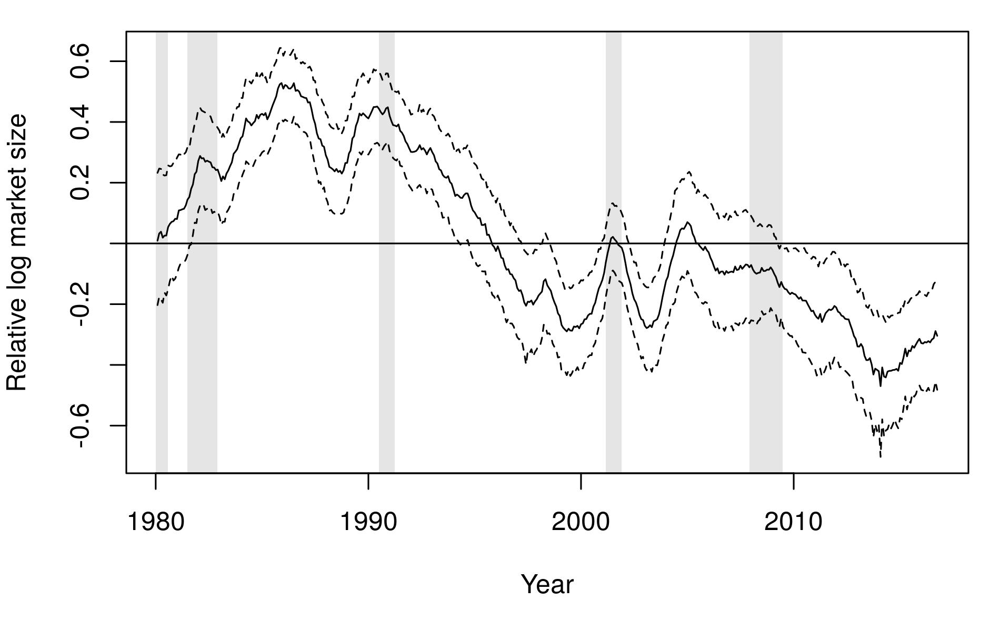

```{r setup, include=FALSE}
knitr::opts_chunk$set(echo = TRUE)
```

## dummy slide

<!--html_preserve-->
<script>
(function() {
  document.getElementById("dummy-slide").remove(); 
  
  var credit_div = document.createElement('div');
  credit_div.innerHTML += "<div class='w-small'><p>Benjamin Christoffersen</p><p class='smallish'>Copenhagen Business School, Department of Finance, Center for Statistics, <a href='mailto:bch.fi@cbs.dk'>bch.fi@cbs.dk</p></div>";
  credit_div.innerHTML +=  "<div class='w-small'><p>Rastin Matin</p><p class='smallish'>Danmarks Nationalbank</p></div>";
  credit_div.classList.add("authors");
  document.getElementsByTagName("section")[0].appendChild(credit_div);
  document.getElementsByTagName("section")[0].classList.add("front");
  document.getElementsByTagName("section")[0].classList.add("center");
})();
</script>
<!--end dummy slide-->
</section>

<section>
<section class="titleslide slide level1 center">
<h1>Introduction</h1>
<p>Goal: assess risk of a portfolio with loans to a number of 
firms.</p>

<p class="fragment">Use firm-level data and aggregate up.</p>

<p class="fragment">Need good model on the firm-level and on the aggregate 
level.</p>

<!-- there is a end tag from the previous slide -->
<!-- </section> -->
<!--/html_preserve-->


## Findings 

<div class="w-small">
<p>Additional variables are needed in hazard model in @Duffie07 and @Duffie09.</p>
<p class="smallish">Similar to @Lando10 finding.</p>
</div>

<p class="fragment">Assumption of linearity on the log-hazard scale is too strong.</p>

<div class="w-small fragment">
<p>Evidence of additional time-varying latent factors.</p>
<p class="smallish">Similar to @David13 and @Jensen17 but our model can directly be 
used for forecasting.</p>
</div>

</section>
<!-- need extra end tag before next section -->
</section>


<!--html_preserve-->
<section>
<section class="center">
<h1>Data set</h1>
<!--/html_preserve-->

Use US rated firms as is common.

## Data set

Market data from CRSP and financial statement variables from Compustat. 

<div class="w-small">
<p>Default events from Moodys Default Risk Service Database.</p>
<p class="smallish">Mainly missed interest payment and chapter 11 bankruptcy.</p>
<div>

<p>Include rated firms with an SIC code outside 6000-6999 range and less than 
9000.</p>

<p>Sample is from January 1980 to October 2016.</p>

<!--html_preserve-->
</section>

<section class="center-horiz">
<h2>Monthly default rate</h1>

<!--/html_preserve-->

<!--html_preserve-->

<p class="smallish">Blue line is a generalized additive model. Gray areas are 
recession periods from the National Bureau of Economic Research.</p>

</section>
<!-- need extra end tag before next section -->
</section>


<section>
<section class="center">
<h1>Base models</h1>
<!--/html_preserve-->

Start with hazard models as in @Duffie07 and @Duffie09.

## Base models
<div>
We model the instantaneous hazard rate of firm $i$ at time $t$ 

$$
\lambda_i(t) = \lim_{h\rightarrow 0^+}\frac{P\left(T_i \leq t + h\mid T_i \geq t\right)}{h}
$$
</div>
<div class="fragment">

as a piecewise constant function of firm variables $\vec x_{ik}$ 
and macro variables $\vec m_k$

$$
\lambda_i(t) = \lambda_{ik}=
  \exp\left(\alpha+\vec\beta^\top\vec x_{ik} + \vec\gamma^\top\vec m_k\right), \quad
  k - 1 < t \leq k
$$
</div>

## Base models

Similar model in @Duffie07.

Firm variables: distance-to-default and past one year excess return. 

Macro variables: market return and one year T-bill rate.

## Base models

Conditional independence assumption may be violated.

@Duffie09 suggest to use a so-called frailty variable

$$
\begin{aligned}
\lambda_{ik} &=
  \exp\left(\alpha+\vec\beta^\top\vec x_{ik} + \vec\gamma^\top\vec m_k
  +A_k\right) \\
A_k &= \theta A_{k-1}+\epsilon_k & \epsilon_k\sim N\left(0,\sigma^2\right)
\end{aligned}
$$

<!--html_preserve-->
</section>
<!-- need extra end tag before next section -->
</section>


<section>
<section class="center">
<h1>Additions</h1>
<!--/html_preserve-->

Add additional covariates and non-linear effects to model in @Duffie07.

## Additions

* Working capital to size.
* Operating income / size.
* Market value / total liabilities.
* Net income / size.
* Total liabilities / size.
* Current ratio.
* Log relative market size.
* Idiosyncratic volatility.

<div class="w-small">
<p>All have been used previously. </p>
<p class="smallish">E.g., see @Shumway01 and @Chava04. Size is defined as 50 
pct. total assets and 50 pct. market value.</p>
</div>

## Add splines

Add non-linear effect to the idiosyncratic volatility and net income / size.

<!--html_preserve-->
</section>
<section class="center-horiz" data-transition="fade-out">
<h2>Estimates</h2>

<!--/html_preserve-->

<p class="smallish">The figures in the parentheses are $Z$-scores except for the splines
which are likelihood-ratio test statistics.</p>

<!--html_preserve-->
</section>
<section class="center-horiz slide level2" data-transition="fade-in">
<h2>Estimates</h2>

<!--/html_preserve-->

<div class="w-small" style="text-align: left;">
<p>Large difference in log-likelihood.</p>
<p class="smallish">Similar to evidence by @Lando10 and @Bharath08.</p>
</div>


<!--html_preserve-->
</section>
<section class="center-horiz">
<h2>Splines</h2>

<!--/html_preserve-->

<p class="smallish">
Partial effect on log-hazard scale. Lines are 95 pct. confidence intervals.
Effect is similar to @Christoffersen18.</p>

<!--html_preserve-->
</section>
<section class="center-horiz">
<h2>Splines</h2>

<!--/html_preserve-->

<!--html_preserve-->
<p class="smallish">
Partial effect on log-hazard scale. Lines are 95 pct. confidence intervals.</p>

</section>
<!-- need extra end tag before next section -->
</section>


<section>
<section class="center">
<h1>Add frailty</h1>
<!--/html_preserve-->

First random intercept and then a random slope.

## Additional frailty variable

Add frailty as in @Duffie09

$$
\begin{aligned}
\lambda_{ik} &=
  \exp\left(\alpha+\vec\beta^\top\vec x_{ik} + \vec\gamma^\top\vec m_k
  + A_k\right) \\
A_k &= \theta A_{k-1}+\epsilon_k & \epsilon_k\sim N\left(0,\sigma^2\right)
\end{aligned}
$$
<div class="w-small">
<p>Capture excess clustering defaults.</p>
<p class="smallish">All hazard are multiplied $\exp A_k$.</p>
</div>

<p class="fragment">Firms are conditionally more <em>frail</em> in some years.</p>

## Estimation

Use Monte Carlo expectation maximization algorithm. 

Use `dynamichazard` package [@Christoffersen18B] in R [@R2018]. 

`dynamichazard` contains an implement of the particle smoother suggested by 
@Fearnhead10.

<!--html_preserve-->
</section>
<section class="center-horiz">
<h2>Estimates</h2>

<!--/html_preserve-->


## Weak evidence

Twice the difference in log-likelihood is 3.4.

<div class="w-small">
@Duffie09 find 22.6. Difference between $\mathcal M_1$ with and without 
frailty is 14.5.
<p class="smallish">Similar to @Lando10 finding.</p>
</div>

## Multivariate frailty

Extend to random slope

$$
\begin{aligned}
\lambda_{ik} &=
  \exp\left(\alpha+\vec\beta^\top\vec x_{ik} + \vec\gamma^\top\vec m_k
  +A_k + B_k z_{ik}\right) \\
\begin{pmatrix} A_k \\ B_k \end{pmatrix} &= 
\begin{pmatrix} \theta_1 & 0 \\ 0 & \theta_2\end{pmatrix}
\begin{pmatrix} A_{k - 1} \\ B_{k - 1}\end{pmatrix}
+\vec \epsilon_k \\
\epsilon_k&\sim N\left(\vec 0, Q\right)
\end{aligned}
$$

## Multivariate frailty

Add random slope to log relative market value.

<div class="fragment">
Two firms $i$ and $j$ differ only by log relative market value with 
$x_{jkl} = x_{ikl} + \Delta x$. Then the relative hazards is

$$
\frac{\lambda_{jk}}{\lambda_{ik}} = 
  \exp\left((\beta_l + B_k)\Delta x\right)
$$

<p class="smallish">Index $l$ corresponds to the log relative market value.</p>
</div>

## Evidence from the literature

@David13 find a time-varying effect of log pledgeable assets.

@Filipe16 find a non-constant log total assets coefficient in 
their robustness check.

<div class="w-small">
@Jensen17 find that small firms may be less or more cyclical than large 
firms
<p class="smallish">depending on which other variables are in the model.</p>
</div>

@Azizpour18 find that periods of large amount of defaulted debt is followed by 
higher <em>aggregate</em> default levels.

<!--html_preserve-->
</section>
<section class="center-horiz" data-transition="fade-out">
<h2>Estimates</h2>

<!--/html_preserve-->

<!--html_preserve-->

</section>
<section class="center-horiz" data-transition="fade-in fade-out">
<h2>Estimates</h2>

<!--/html_preserve-->

<!--html_preserve-->

</section>
<section class="center-horiz" data-transition="fade-in">
<h2>Estimates</h2>

<!--/html_preserve-->


## Predicted random effects

<!--html_preserve-->
<div class="split-section">
<div class="column">
<!--/html_preserve-->
 
<!--html_preserve-->
</div>
<div class="column">
<!--/html_preserve-->

<!--html_preserve-->
</div>
</div>
<!--/html_preserve-->
<p class="smallish">Predicted values of $A_k$, left, and $B_k$, right. 
Dashed lines are 68.3% point-wise prediction intervals.</p>

```{r plot_ests, echo=FALSE, eval=FALSE}
x <- seq(-13, -6, length.out = 1000)
z <- x - mean(x)
y1 <- 2 + z * (.5 - .245)
y2 <- -1 + z * (0 - .245)

matplot(x, cbind(y1, y2), lty = 1:2, col = "black", type = "l", 
        xlab = "log relative market size", ylab = "log-hazard term")
```


<!--html_preserve-->
</section>
<!-- need extra end tag before next section -->
</section>


<section>
<section class="center">
<h1>Out-of-sample</h1>
<!--/html_preserve-->

Goal: model both firm-level and aggregate level accurately.

## Options

Use monthly frailty model and make models for covariates.  

<p class="fragment">Estimation error or poor model for covariates can yield 
bad performance.</p>

<p class="fragment">@Duan12 find inferior performance.</p>

## Setup 

Estimate yearly models using data up to October and make one 
year ahead forecast. 

## Concordance index

<div class="w-small">
<p>Fraction of correctly ordered event times.</p>
<p class="smallish">Equivalent to area under the receiver operating characteristic curve if we 
only have one discrete period.</p>
<p>
</div>

<p class="fragment">0.5 is random chance and 1 is a perfect ordering.</p>

<!--html_preserve-->
</section>
<section class="center-horiz">
<h2>Concordance index</h2>

<!--/html_preserve-->

<p class="smallish" style="text-align: left;">Open diamonds: model as in @Duffie07, open triangles: model 
with splines and the interaction, closed triangles: same as open triangles with 
a random intercept, and closed diamonds: same as before with a random log relative 
market value slope.</p>

## Concordance index

Sometimes more than 5 pct. higher fraction of correctly ordered event 
times.

## Predicted hazard rates

Look at predicted distribution of the average hazard rate. 

<!--html_preserve-->
</section>
<section class="center-horiz">
<h2>Predicted hazard rates</h2>

<!--/html_preserve-->

<p class="smallish">Bars are 90 pct. prediction 
intervals. Crosses are realized hazard rates.</p>

<!--html_preserve-->
</section>
<!-- need extra end tag before next section -->
</section>


<section>
<section class = "center">
<h1>Conclusions</h1>
<!--/html_preserve-->

<div class="w-small">
<p>Additional variables are needed in hazard model in @Duffie07 and @Duffie09.</p>
<p class="smallish">Similar to @Lando10 finding.</p>
</div>

<p class="fragment">Assumption of linearity on the log-hazard scale is too strong.</p>

<div class="w-small fragment">
<p>Evidence of additional time-varying latent factors.</p>
<p class="smallish">Similar to @David13 and @Jensen17 but our model can directly be 
used for forecasting.</p>
</div>

<!--html_preserve-->
</section>
<!-- need extra end tag before next section -->
</section>


<section>
<section class = "center">
<h1>Next steps</h1>
<!--/html_preserve-->

Performance on quarter or half-year forecasts. 

<p class="fragment">Non-listed and/or non-rated firms could yield better estimate 
of frailty variable.</p>

<p class="fragment">Out-of-sample test with monthly hazard models.</p>


<!--html_preserve-->
</section>
<!-- need extra end tag before next section -->
</section>


<section>
<section class = "center">
<h1>Thank you!</h1>

<div class="w-small">
<p class="smallish">Slides are on 
<a href="http://rpubs.com/boennecd/PhD-wipt-19">rpubs.com/boennecd/PhD-wipt-19</a>.</p>
<p class="smallish">Paper is at 
<a href="https://ssrn.com/abstract=3339981">ssrn.com/abstract=3339981</a>.</p>
<p class="smallish">Code is at 
<a href="https://bit.ly/github-US_PD_data">bit.ly/github-US_PD_data</a> and
<a href="https://bit.ly/github-US_PD_models">bit.ly/github-US_PD_models</a>.</p>
</div>

</section>
<!-- need extra end tag before next section -->
</section>


<section>
<section class = "center">
<h1>Extra slides</h1>
<p>Slides with coefficient estimates in annual models, more predicted random 
effects, and marginal effect of log relative market value.</p>

</section>
<section class="center-horiz">
<h2>Estimates -- annual models</h2>

<!--/html_preserve-->

<!--html_preserve-->
</section>

<section class="center-horiz">
<h2>Predicted random effect in random intercept model</h2>
<!--/html_preserve-->

<!--html_preserve-->
</section>

<section class="center-horiz">
<h2>Predicted random effects in annual models</h2>

<div class="split-section">
<div class="column">
<!--/html_preserve-->
 
<!--html_preserve-->
</div>
<div class="column">
<!--/html_preserve-->

<!--html_preserve-->
</div>
</div>
</section>

<section class="center-horiz">
<h2>Marginal effect of log relative market value</h2>

<!--/html_preserve-->

<p class="smallish" style="text-align: left;">Generalized additive model
with tensor product spline on time and the log relative market value only. 
The $z$-axis is the log hazard.</p>

<!--html_preserve-->
</section>
<!-- need extra end tag before next section -->
</section>

<section class="titleslide slide level1">
<h1>References</h1>

<!--/html_preserve-->
