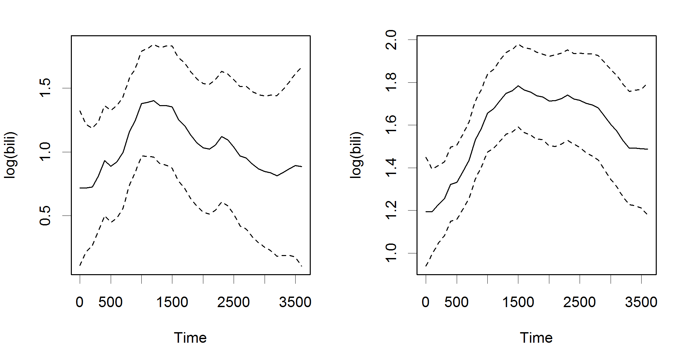

dynamichazard Dynamic Hazard Models using State Space Models
========================================================
author: Benjamin Christoffersen
date: 16/03/2017
autosize: true
css: custom.css

<script>
var h1s = document.getElementsByTagName("h1");
h1s[0].outerHTML = "<h1 style='margin-bottom: 0;'>dynamichazard</h1><h2 style='margin-top: 0;'>Dynamic Hazard Models <br /> using State Space Models</h2>";
//(function($){ 
//  $( "h1" ).html( "Dynamic Hazard Models <br /> using State Space Models: dynamichazard" ); 
// })(jQuery); 
</script>  


$$\newcommand{\mat}[1]{\mathbf{#1}}
%
\newcommand{\Lparen}[1]{\left( #1\right)} 
\newcommand{\Lbrack}[1]{\left[ #1\right]} 
\newcommand{\Lbrace}[1]{\left \{ #1\right \}} 
\newcommand{\Lceil}[1]{\left \lceil #1\right \rceil}
\newcommand{\Lfloor}[1]{\left \lfloor #1\right \rfloor}
%
\newcommand{\propp}[1]{P\Lparen{#1}}
\newcommand{\proppCond}[2]{P\Lparen{\left. #1 \right\vert  #2}}
%
\newcommand{\expecp}[1]{E\Lparen{#1}}
\newcommand{\expecpCond}[2]{E\Lparen{\left. #1  \right\vert  #2}}
%
\newcommand{\varp}[1]{\textrm{Var}\Lparen{#1}}
\newcommand{\varpCond}[2]{\textrm{Var} \Lparen{\left. #1 \right\vert  #2}}
%
\newcommand{\corpCond}[2]{\textrm{Cor} \Lparen{\left. #1 \right\vert  #2}}
%
\newcommand{\covp}[1]{\textrm{Cov} \Lparen{#1}}
\newcommand{\covpCond}[2]{\textrm{Cov} \Lparen{\left. #1 \right\vert  #2}}
%
\newcommand{\emNotee}[3]{#1_{\left. #2 \right\vert #3}}
\newcommand{\emNote}[4]{#1_{\left. #2 \right\vert #3}^{(#4)}} 
%
\newcommand{\ukfNote}[2]{\mat{P}_{\vec{#1}, \vec{#2}}}
\newcommand{\ukfNotee}[3]{\mat{P}_{\vec{#1}_{#3}, \vec{#2}_{#3}}}
%
\newcommand{\diag}[1]{\text{diag}{\Lparen{#1}}}
\newcommand{\wvec}[1]{\widehat{\vec{#1}}}
\newcommand{\wmat}[1]{\widehat{\mat{#1}}}
\newcommand{\wtvec}[1]{\widetilde{\vec{#1}}}
\newcommand{\bvec}[1]{\bar{\vec{#1}}}
%
\newcommand{\deter}[1]{\left| #1 \right|}
%
\newcommand{\MyInd}[2]{\Lparen{#1}_{#2}}
% 
\newcommand{\xyzp}[2]{#1\Lparen{#2}}
\newcommand{\xyzpCond}[3]{#1\Lparen{\left. #2  \right\vert  #3}}
%
\newcommand{\argmax}[1]{\underset{#1}{\text{argmax}\,}}$$

Content
========================================================

- Why and when to use
- Extended Kalman Filter
- Unscented Kalman filter
- Continuous time model
- Constant effects
- Future work

The problem
========================================================

$$\begin{aligned} 
  &y_{it} =\left\{ \begin{matrix} 1 & \text{Firm }i\text{ defaults at time }t \\ 0 & \text{otherwise} \end{matrix} \right. \\
  &\vec{x}_{it}: \text{Firm }i\text{'s covariate vector at time }t \\ 
  &\pi_{it}: \text{Likelihood that firm }i\text{ defaults at time }t
\end{aligned}$$

Multi-period logit model
========================================================

$$\begin{aligned}
  &R_t:~\text{Indices of indvididuals at risk in interval }t\\
  &\mathcal{L}(\vec{\alpha}) = \sum_{t = 1}^d \sum_{i \in R_t} l_{it}({\vec{\alpha}}) \\
  &l_{it}(\vec{\alpha}) = y_{it} \log h(\vec{x}_{it}^T \vec{\alpha}) + (1 - y_{it}) 
	\log \Lparen{1 - h(\vec{x}_{it}^T \vec{\alpha})} \\
  &h(x) = 1/(1 + \exp(-x))
\end{aligned}$$

<small>Shumway (2001), Chava and Jarrow (2004), Campbell, Hilscher, and Szilagyi (2008)</small>

Time-varying
========================================================


Time-varying
========================================================


  
<small>Similar industry definitions as Chava and Jarrow (2004) </small>

Time-varying
========================================================

Additive Hazards Models
<small> Lando, Medhat, Nielsen, and Nielsen (2013) using `timereg` package described in Martinussen and Scheike (2007)</small> 

Semiparametric Cox Model
<small> Grambsch and Therneau (1994) scaled schoenfeld residuals</small> 

Dynamic binary regression models
========================================================

$$\begin{aligned}
  &\vec{\alpha}_t = \mat{F}\vec{\alpha}_{t-1} + \mat{R}\vec{\epsilon}_t, \qquad \vec{\epsilon}_t \sim N(\vec{0}, \mat{Q}) \\
  &\mat{F} = \mat{R} = \mat{I}
\end{aligned}$$

$$\begin{aligned}
  &\expecpCond{\vec{y}_t}{\vec{\alpha}_t} = \vec{z}_t(\vec{\alpha}_t) \\
  &\varpCond{\vec{y}_t}{\vec{\alpha}_t} = \mat{H}_t(\vec{\alpha}_t)
\end{aligned}$$

$$\begin{aligned}
  &z_{it}(\vec{\alpha}_t)  =\expecpCond{Y_{it}}{\vec{\alpha}_t} = h(\vec{\alpha}_t^T \vec{x}_{it}) \\
  &H_{ijt}(\vec{\alpha}_t) =\left\{\begin{matrix}
    z_{it}(\vec{\alpha}_t)(1 - z_{it}(\vec{\alpha}_t)) & i = j \\ 0 & \textrm{otherwise}
  \end{matrix}\right.
\end{aligned}$$

Dynamic binary regression models
========================================================

$$\begin{aligned}
	\mathcal{L}\Lparen{\vec{\alpha}_0, \dots, \vec{\alpha}_{d}} =&    
		\log L \Lparen{\vec{\alpha}_0, \dots, \vec{\alpha}_{d}} \\
 =&  -\frac{1}{2} \Lparen{\vec{\alpha}_0 - \vec{a}_0}^T \mat{Q}^{-1}_0\Lparen{\vec{\alpha}_0 - \vec{a}_0} \\
	&  - \frac{1}{2} \sum_{t = 1}^d \Lparen{\vec{\alpha}_t - \mat{F}\vec{\alpha}_{t - 1}}^T\mat{R}\mat{Q}^{-1}\mat{R}^\top \Lparen{\vec{\alpha}_t - \mat{F}\vec{\alpha}_{t - 1}} \\ 
	&  - \frac{1}{2} \log \deter{\mat{Q}_0} - \frac{1}{2d} \log \deter{\mat{Q}} \\
	&  + \sum_{t = 1}^d \sum_{i \in R_t} l_{it}({\vec{\alpha}_t})
\end{aligned}$$

$$l_{it}(\vec{\alpha}_t) = y_{it} \log h(\vec{x}_{it}^T \vec{\alpha}_t) + (1 - y_{it}) 
	\log \Lparen{1 - h(\vec{x}_{it}^T \vec{\alpha}_t)}$$

Extended Kalman Filter
========================================================

$$\emNotee{\vec{a}}{t}{s} = \expecpCond{\vec{\alpha}_t}{\vec{y}_1,\dots,\vec{y}_s},  \qquad
\emNotee{\mat{V}}{t}{s} = \expecpCond{\mat{V}_t}{\vec{y}_1,\dots,\vec{y}_s}$$

<p> Prediction step </p> 
$$\emNotee{\vec{a}}{t}{t - 1} = \mat{F} \emNotee{\vec{a}}{t - 1}{t - 1}, \qquad
  \emNotee{\mat{V}}{t}{t - 1} = \mat{F}\emNotee{\mat{V}}{t - 1}{t - 1}\mat{F}^T + \mat{R}\mat{Q}\mat{R}^T$$

<p> Correction step </p>
$$\emNotee{\mat{V}}{t}{t} = \left( \emNotee{\mat{V}}{t}{t - 1}^{-1} + \mat{U}_t (\emNotee{\vec{a}}{t}{t - 1})\right)^{-1}, \qquad
  \emNotee{\vec{a}}{t}{t} = \emNotee{\vec{a}}{t}{t - 1} + \emNotee{\mat{V}}{t}{t}\vec{u}_t (\emNotee{\vec{a}}{t}{t - 1})$$

$$\begin{aligned}
  & \vec{u}_t (\vec{\alpha}_t) = \sum_{i \in R_t} \vec{u}_{it} (\vec{\alpha}_t), \quad\vec{u}_{it} (\vec{\alpha}_t)= \left. \vec{x}_{it} \frac{\partial h(\eta)/ \partial \eta}{H_{iit}(\vec{\alpha}_t)} \Lparen{y_{it} - h(\eta)} \right\vert_{\eta = \vec{x}_{it}^T \vec{\alpha}_t} \\
	& \mat{U}_t (\vec{\alpha}_t) = \sum_{i \in R_t} \mat{U}_{it} (\vec{\alpha}_t), \quad \mat{U}_{it} (\vec{\alpha}_t) = \left. \vec{x}_{it} \vec{x}_{it}^T 
		 \frac{\left( \partial h(\eta)/ \partial \eta \right)^2}{H_{iit}(\vec{\alpha}_t)} \right\vert_{\eta = \vec{x}_{it}^T \vec{\alpha}_t}
\end{aligned}$$

Smoother and M-step
========================================================

Smoother

$$\begin{aligned}
  & \mat{B}_t^{(k)} = \emNotee{\mat{V}}{t - 1}{t - 1} \mat{F} \emNotee{\mat{V}}{t}{t - 1}^{-1} \\
  & \emNote{\vec{a}}{t - 1}{d}{k} = \emNotee{\vec{a}}{t - 1}{t - 1} + \mat{B}_t (
    \emNote{\vec{a}}{t}{d}{k} - \emNotee{\vec{a}}{t}{t - 1}) \\
  & \emNote{\mat{V}}{t - 1}{d}{k} = \emNotee{\mat{V}}{t - 1}{t - 1} + \mat{B}_t (
    \emNote{\mat{V}}{t}{d}{k} - \emNotee{\mat{V}}{t}{t - 1}) \mat{B}_t^T
\end{aligned} \qquad t = d,d-1,\dots, 1$$

M-step

$$\begin{aligned}
\widehat{\vec{\alpha}}_0^{(k)} &= \emNote{\vec{a}}{0}{d}{k} \\
  \widehat{\mat{Q}}^{(k)} &= \frac{1}{d}	\sum_{t = 1}^d \mat{R}^T\left( 
      \left( \emNote{\vec{a}}{t}{d}{k} - \mat{F}\emNote{\vec{a}}{t - 1}{d}{k} \right)
      \left( \emNote{\vec{a}}{t}{d}{k} - \mat{F}\emNote{\vec{a}}{t - 1}{d}{k} \right)^T \right. \\
    &\hspace{57pt} + \emNote{\mat{V}}{t}{d}{k} - \mat{F}\mat{B}_t^{(k)}\emNote{\mat{V}}{t}{d}{k} - 
      \left( \mat{F}\mat{B}_t^{(k)}\emNote{\mat{V}}{t}{d}{k} \right) ^T + 
      \mat{F}\emNote{\mat{V}}{t - 1}{d}{k}\mat{F}^T
      \left. \vphantom{\left( \emNote{\vec{a}}{t}{d}{k} - \mat{F}\emNote{\vec{a}}{t - 1}{d}{k} \right)^T} \right)\mat{R}
\end{aligned}$$

<small>Fahrmeir (1992) and Fahrmeir (1994) </small>

Example: PBC
========================================================

- Mayo Clinic trial in primary biliary cirrhosis (PBC) of the liver
- Randomized placebo controlled trial
- Both time-varying and time-invariant covariates

Example: PBC
========================================================


<small>

| id| tstart| tstop| death| trt|sex | protime| bili|
|--:|------:|-----:|-----:|---:|:---|-------:|----:|
|  1|      0|   192|     0|   1|f   |    12.2| 14.5|
|  1|    192|   400|     2|   1|f   |    11.2| 21.3|
|  2|      0|   182|     0|   1|f   |    10.6|  1.1|
|  2|    182|   365|     0|   1|f   |    11.0|  0.8|
|  2|    365|   768|     0|   1|f   |    11.6|  1.0|
|  2|    768|  1790|     0|   1|f   |    10.6|  1.9|
|  2|   1790|  2151|     0|   1|f   |    11.3|  2.6|
|  2|   2151|  2515|     0|   1|f   |    11.5|  3.6|
|  2|   2515|  2882|     0|   1|f   |    11.5|  4.2|
|  2|   2882|  3226|     0|   1|f   |    11.5|  3.6|
|  2|   3226|  4500|     0|   1|f   |    11.5|  4.6|
|  3|      0|   176|     0|   1|m   |    12.0|  1.4|
|  3|    176|   364|     0|   1|m   |    12.0|  1.1|
|  3|    364|   743|     0|   1|m   |    12.0|  1.5|
|  3|    743|  1012|     2|   1|m   |    13.3|  1.8|
</small>


Example: PBC
========================================================
     

```r
library(dynamichazard)
dd_fit <- ddhazard(
  Surv(tstart, tstop, death == 2) ~ age + edema + trt +
       log(albumin) + log(protime) + log(bili), pbc2,
  id = pbc2$id, by = 100, max_T = 3600, 
  Q_0 = diag(rep(100000, 7)), Q = diag(rep(0.1, 7)))

head(dd_fit$state_vecs)
```

```
     (Intercept)    age edema    trt log(albumin) log(protime) log(bili)
[1,]       -15.1 0.0491  1.40 -0.504        -3.95         4.95     0.715
[2,]       -15.1 0.0491  1.40 -0.504        -3.95         4.95     0.715
[3,]       -15.1 0.0514  1.62 -0.470        -4.07         4.93     0.725
[4,]       -14.4 0.0516  1.58 -0.404        -4.16         4.67     0.809
[5,]       -13.5 0.0534  1.69 -0.275        -4.36         4.25     0.930
[6,]       -13.0 0.0502  1.47 -0.322        -4.15         4.10     0.887
```
 
Example: PBC
========================================================
 

```r
indx <- c("(Intercept)", "age",  "log(bili)" )
dd_fit$state_vars[indx, indx, 1:3]
```

```
, , 1

            (Intercept)       age log(bili)
(Intercept)     19.6937 -0.033733  0.192556
age             -0.0337  0.000438  0.000903
log(bili)        0.1926  0.000903  0.095701

, , 2

            (Intercept)       age log(bili)
(Intercept)     16.4838 -0.030800  0.071646
age             -0.0308  0.000373  0.000608
log(bili)        0.0716  0.000608  0.065431

, , 3

            (Intercept)       age log(bili)
(Intercept)     14.1543 -0.028558  0.022379
age             -0.0286  0.000339  0.000594
log(bili)        0.0224  0.000594  0.054981
```

Example: PBC
========================================================
        

```r
plot(dd_fit, cov_index = c(4, 7))
```


Advantages
========================================================
incremental: true

- Linear complexity in time and observations
- Extrapolation
- `C++`, `Armadillo` and in parallel

Unscented Kalman filter
========================================================
incremental: true
    
- Deterministically select *sigma points*
- Derivative free
- Nonlinearities

<small> Julier and Uhlmann (1997), Wan and Merwe (2000), Julier and Uhlmann (2004) and Menegaz (2016) </small>  
 
Unscented Kalman filter
========================================================

<p> Prediction step </p>

$$\begin{aligned}
  &\emNotee{\vec{a}}{t}{t - 1} = \mat{F} \emNotee{\vec{a}}{t - 1}{t - 1}, \quad \\
  &\emNotee{\mat{V}}{t}{t - 1} = \mat{F}\emNotee{\mat{V}}{t - 1}{t - 1}\mat{F}^T + \mat{R}\mat{Q}\mat{R}^T
\end{aligned}$$

Sigma points and weights

$$q=\text{dim}(\vec{a}), \qquad i = 1,\dots, 2q$$

$$\begin{aligned}
  \wvec{a}_0 &= \emNotee{\vec{a}}{t}{t-1} \\
  \wvec{a}_{i} &= \emNotee{\vec{a}}{t}{t-1} + \Lparen{1 - 2 \cdot 1_{\{i > q\}}}\sqrt{q + \lambda} \left(\sqrt{\emNotee{\mat{V}}{t}{t - 1}}\right)_i
\end{aligned} \qquad 
  \lambda = \alpha^2 (q + \kappa) - q$$

$$\begin{aligned}
  &W_0^{(m)} = \frac{\lambda}{q + \lambda}, \qquad
  W_0^{(c)} = \frac{\lambda}{q + \lambda} + 1 - \alpha^2 + \beta, \qquad
  W_0^{(cc)} = \frac{\lambda}{q + \lambda} + 1 - \alpha \\
  &W_i^{(m)} = W_i^{(c)} = \frac{1}{2(q+\lambda)}
\end{aligned}$$

Unscented Kalman filter
========================================================


Unscented Kalman filter
========================================================

Correction step

$$\begin{aligned}
  \emNotee{\vec{a}}{t}{t} &= \emNotee{\vec{a}}{t}{t - 1} + \ukfNotee{x}{y}{t}\ukfNotee{y}{y}{t}^{-1}(\vec{y}_t - \overline{\vec{y}}) \\
  \emNotee{\mat{V}}{t}{t} &= \emNotee{\mat{V}}{t}{t-1} - \ukfNotee{x}{y}{t}\ukfNotee{y}{y}{t}^{-1}\ukfNotee{x}{y}{t}^T
\end{aligned}$$

$$\begin{aligned}
  \wvec{y}_i &= \vec{z}_t \left(\wvec{a}_i \right), \qquad 
    \wmat{Y} = (\wvec{y}_0, \dots, \wvec{y}_{2q}) \\
  \overline{\vec{y}} &= \sum_{i = 0}^{2q} W_i^{(m)} \vec{y}_i, \qquad
  \Delta\wmat{Y} = \wmat{Y} - \overline{\vec{y}} \vec{1}^T, \qquad 
  \wmat{H} = \sum_{i=0}^q W_i^{(c)}\mat{H}_t(\wmat{a}_i) \\
%
  \Delta\wmat{A} &= (\wvec{a}_0, \dots, \wvec{a}_{2q}) - \emNotee{\vec{a}}{t}{t-1}\vec{1}^T \\
%
  \ukfNotee{y}{y}{t} &= \sum_{i=0}^{2q} W_i^{(c)} \left(
    (\wvec{y}_i - \overline{\vec{y}})(\wvec{y}_i - \overline{\vec{y}})^T + \wmat{H}\right)
  = \Delta\wmat{Y}\diag{\vec{W}^{(c)}}\Delta\wmat{Y}^T + \wmat{H} \\
  \ukfNotee{x}{y}{t} &= \sum_{i=0}^{2q} W_i^{(cc)} 
    (\wvec{a}_i - \emNotee{\vec{a}}{t}{t-1})(\wvec{y}_i - \overline{\vec{y}})^T
  = \Delta\wmat{A}\diag{\vec{W}^{(cc)}}\Delta\wmat{Y}^T
\end{aligned}$$

Unscented Kalman filter — Alternative
========================================================

<p> Correction step </p>
$$\begin{aligned}
  \tilde{\vec{y}} &= \Delta \wmat{Y}^T \widehat{\mat{H}}^{-1}(\vec{y}_t - \overline{\vec{y}}) \\ 
    \mat{G} &= \Delta\wmat{Y}^T\widehat{\mat{H}}^{-1}\Delta\wmat{Y} \\
  \vec{c} &= \tilde{\vec{y}} - \mat{G}\left( \diag{\vec{W}^{(m)}}^{-1} + \mat{G}\right)^{-1} \tilde{\vec{y}} \\ 
    \mat{L} &= \mat{G} - \mat{G}\left( \diag{\vec{W}^{(c)}}^{-1} + \mat{G}\right)^{-1} \mat{G} \\
  \emNotee{\vec{a}}{t}{t} &= \emNotee{\vec{a}}{t}{t - 1} + \Delta\wmat{A}\diag{\vec{W}^{(cc)}}\vec{c} \\
  \emNotee{\mat{V}}{t}{t} &= \emNotee{\mat{V}}{t}{t - 1} - 
    \Delta\wmat{A}\diag{\vec{W}^{(cc)}}\mat{L}\diag{\vec{W}^{(cc)}}\Delta\wmat{A}^T
\end{aligned}$$

Unscented Kalman filter — Cons
========================================================

- Hyperparameters $\alpha, \beta, \kappa$
- Sensitive to $\mat{Q}_0$
- Sensitive to starting value of $\mat{Q}$


Demo
========================================================


```r
dynamichazard::ddhazard_app()
```

Binning
========================================================


Continuous time model 
========================================================

1. Coefficients change discreetly
2. Covariates change discreetly
3. Piecewise constant instantaneous hazards $\exp(\vec{x}^\top\vec{\alpha})$

Continuous time model 
========================================================

$$\begin{aligned}
  &&T_i: &~\text{Event time of individual }i \\
  &&\vec{x}_{ij}: &~j\text{'th covariate vector for individual }i\text{ valid in period }(t_{i,j-1},t_{i,j}] \\
  &&l_i \in \{1, 2, \dots\}: &~\text{Number of destinct observed covariate vector for individual }i \\
  &&y_{ij} = 1_{\{T_i \in (t_{i,j-1}, t_{ij}]\}} :&~  \text{Individual }i\text{ has an event with the }j\text{'th covariate vector}\\
  &&\bar y_{ijs} = y_{ij} 1_{\{s-1 < t_{ij} \leq s\}} :&~\text{Individual }i\text{ has an event in interval }s
\end{aligned}$$

Continuous time model 
========================================================

$$\begin{aligned}
\mathcal{L}\Lparen{\vec{\alpha}_0, \dots, \vec{\alpha}_{d}} =&
  - \frac{1}{2} \Lparen{\vec{\alpha}_0 - \vec{a}_0}^T \mat{Q}^{-1}_0\Lparen{\vec{\alpha}_0 - \vec{a}_0} \\
	&  - \frac{1}{2} \sum_{t = 1}^d \Lparen{\vec{\alpha}_t - \mat{F}\vec{\alpha}_{t - 1}}^T \mat{Q}^{-1} \Lparen{\vec{\alpha}_t - \mat{F}\vec{\alpha}_{t - 1}} \\ 
	&  - \frac{1}{2} \log\deter{\mat{Q}_0} - \log\frac{1}{2d} \deter{\mat{Q}} \\
  &+ \sum_{s=1}^d\sum_{(i,j) \in \Lbrace{(i,j) \left\vert\begin{smallmatrix} t_{i,j-1} < s \\ t_{i,j} > s-1 \end{smallmatrix} \right.}}
  l_{i,j,s}(\vec{\alpha}_s) \\
%
  l_{i,j,s}(\vec{\alpha}_s) =& (\vec{x}_{i,j}^T\vec{\alpha}_s)^{y_{i,j,s}} -\exp\Lparen{\vec{x}_{i,j}^T\vec{\alpha}_s}
  \Lparen{\min\{ s, t_{i,j} \} - \max\{ s - 1, t_{i,j-1} \}}
\end{aligned}$$

Right clipped with jump
========================================================

$$\begin{aligned}
\delta_{i,j} &= t_{i,j} - t_{i,j-1} \\
%
\Lambda_{ij} &= \delta_{i,j}1_{\{T_i > t_{i,j}\}} + (T_i - t_{i,j-1} - \delta_{i,j})1_{\{T_i \leq t_{i,j}\}} \\
  &= \delta_{i,j}1_{\{T_i > t_{i,j}\}} + (T_i - t_{i,j}) 1_{\{T_i \leq t_{i,j}\}}
  = \left\{\begin{matrix}T_i - t_{i,j} & T_i \leq t_{i,j} \\ \delta_{i,j} & T_i > t_{i,j}\end{matrix} \right.
\end{aligned}$$  

$$\Rightarrow \Lambda_{i,j}\in [-\delta_{i,j},0]\cup\{\delta_{i,j}\}$$

Right clipped with jump
========================================================

$$\begin{aligned}
\propp{T_i = t} &= \propp{T_i > 1} \proppCond{T_i > 2}{T_i > 1} \cdots \proppCond{T_i = t}{T_i > \lceil t \rceil - 1} \\
%
               &= \propp{\Lambda_{i,1} = 1} \proppCond{\Lambda_{i,2} = 1}{\Lambda_{i,2} = 1} \cdots  \proppCond{
	\Lambda_{i,\lceil t \rceil} =  (\lceil t \rceil - 1) - t}{\Lambda_{i,\lceil t \rceil - 1} = 1)} \\
%
\propp{T_i > t} &= \propp{T_i > 1} \proppCond{T_i > 2}{T_i > 1} \cdots \proppCond{T_i > t}{T_i > \lceil t \rceil - 1} \\
%
               &= \propp{\Lambda_{i,1} = 1} \proppCond{\Lambda_{i,2} = 1}{\Lambda_{i,2} = 1} \cdots  \proppCond{
	\Lambda_{i,\lceil t \rceil} > 0}{\Lambda_{i,\lceil t \rceil - 1} = 1)} \\
\end{aligned}$$

Example: PBC
========================================================


```r
dd_fit_exp <- 
  ddhazard(Surv(tstart, tstop, death == 2) ~ age + edema + trt +
                        log(albumin) + log(protime) + log(bili), pbc2,
           id = pbc2$id, by = 100, max_T = 3600,
           
           model = "exp_clip_time_w_jump",        # <-- added
           
           Q_0 = diag(rep(100000, 7)), 
           Q = diag(rep(0.1, 7)))
```

Example: PBC
========================================================


```r
plot(dd_fit, cov_index = 7)
plot(dd_fit_exp, cov_index = 7)
```





Constant effects: E-step
========================================================

- Include in state vector
- 0 entries in $\mat{Q}$
- Large diagonal entry in $\mat{Q}_0$
- Recursive Least Squares

<small> Harvey and Phillips (1979) </small>

Constant effects: M-step
========================================================

$$\vec{\alpha}_t= \begin{pmatrix}
  {\wtvec{\alpha}}_t \\ 
  \vec{\gamma}
\end{pmatrix}$$

Offsets in M-step:
$$\expecpCond{\mathcal{L}\Lparen{\wtvec{\alpha}_0, \dots, \wtvec{\alpha}_{d}}}
    {\mat{Q}_0,\mat{Q}^{(k-1)},\wtvec{a}_0^{(k-1)},\vec{\gamma}^{(k-1)}}$$
    
Taylor expand in E-step:
$$\argmax{\vec{\gamma}} \expecpCond{ \sum_{t = 1}^d \sum_{i \in R_t} l_{it}({\vec{\gamma},\wtvec{\alpha}_t})}{
    \emNote{\wtvec{a}}{0}{d}{k}, \emNote{\mat{V}}{0}{d}{k}, \dots, \emNote{\mat{V}}{d}{d}{k}}
  \approx \argmax{\vec{\gamma}} \sum_{t = 1}^d \sum_{i \in R_t} l_{it}(\vec{\gamma},\emNote{\wtvec{a}}{t}{d}{k})$$

Demo
========================================================


```r
dynamichazard::ddhazard_app()
```


Future work
========================================================

<table class="WIT">
<tbody>
<tr>
<td>Influential observation</td>
<td>Cumulating hat values, Pearson residuals or squared deviance residuals?</td>
</tr>
<tr>
<td>Posterior</td>
<td>Taylor expand at the posterior</td>
</tr>
<tr>
<td>Other processes</td>
<td>Replace Random walk with e.g. ARMA and parameters estimated as in `MARSS` library</td>
</tr>
<tr>
<td>Ensamble methods</td>
<td>Promising results (E.g. Zikeba, Tomczak, and Tomczak (2016)</td>
</tr>
<tr>
<td>Data sets</td>
<td>US, English and Danish data sets</td>
</tr>
</tbody>
</table>  


References
========================================================
<small><div class="scrollable">
[1] J. Y. Campbell, J. Hilscher and J. Szilagyi. "In search of distress risk". In: _The Journal of Finance_ 63.6 (2008), pp. 2899-2939.

[2] S. Chava and R. A. Jarrow. "Bankruptcy prediction with industry effects". In: _Review of Finance_ 8.4 (2004), pp. 537-569.

[3] L. Fahrmeir. "Dynamic modelling and penalized likelihood estimation for discrete time survival data". In: _Biometrika_ 81.2 (1994), pp. 317-330.

[4] L. Fahrmeir. "Posterior mode estimation by extended Kalman filtering for multivariate dynamic generalized linear models". In: _Journal of the American Statistical Association_
87.418 (1992), pp. 501-509.

[5] P. M. Grambsch and T. M. Therneau. "Proportional hazards tests and diagnostics based on weighted residuals". In: _Biometrika_ (1994), pp. 515-526.

[6] A. C. Harvey and G. D. Phillips. "Maximum likelihood estimation of regression models with autoregressive-moving average disturbances". In: _Biometrika_ 66.1 (1979), pp. 49-58.

[7] I. Kadar, ed. _New extension of the Kalman filter to nonlinear systems_. Vol. 3068. 1997, pp. 182-193. DOI: 10.1117/12.280797. <URL: http://dx.doi.org/10.1117/12.280797>.

[8] S. J. Julier and J. K. Uhlmann. "Unscented filtering and nonlinear estimation". In: _Proceedings of the IEEE_ 92.3 (2004), pp. 401-422.

[9] D. Lando, M. Medhat, M. S. Nielsen, et al. "Additive intensity regression models in corporate default analysis". In: _Journal of Financial Econometrics_ 11.3 (2013), pp.
443-485.

[10] T. Martinussen and T. H. Scheike. _Dynamic regression models for survival data_. Springer Science \& Business Media, 2007.

[11] H. M. T. Menegaz. "Unscented kalman filtering on euclidean and riemannian manifolds". http://repositorio.unb.br/handle/10482/21617. 2016.

[12] T. Shumway. "Forecasting bankruptcy more accurately: A simple hazard model*". In: _The Journal of Business_ 74.1 (2001), pp. 101-124.

[13] T. Naito, K. Hidaka, J. Xin, et al., ed. _The unscented Kalman filter for nonlinear estimation_. 2000, pp. 153-158. DOI: 10.1109/ASSPCC.2000.882463.

[14] M. Zikeba, S. K. Tomczak and J. M. Tomczak. "Ensemble boosted trees with synthetic features generation in application to bankruptcy prediction". In: _Expert Systems with
Applications_ 58 (2016), pp. 93-101.
</div></small>
